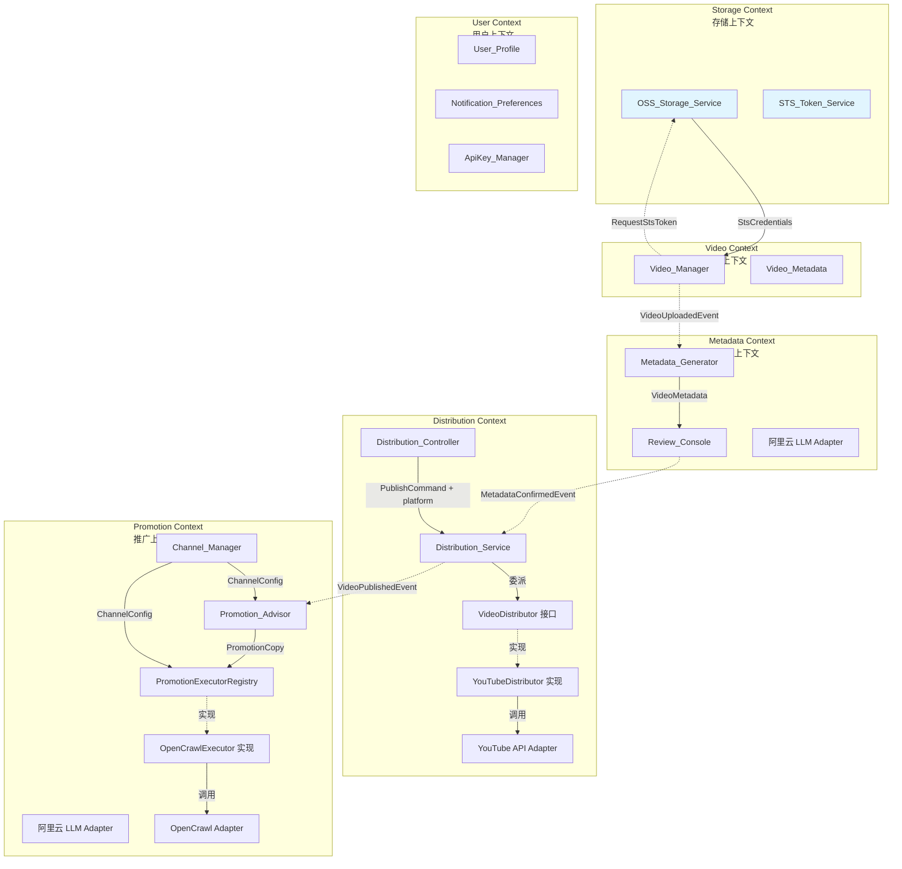
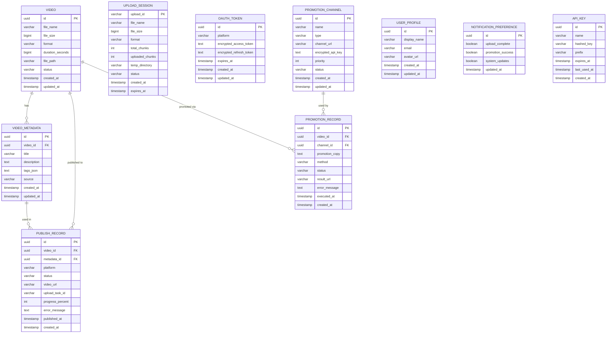

# 技术设计文档：视频分发与推广平台

## Overview

本设计文档描述视频分发与推广平台的技术架构和实现方案。平台为美食博主提供从视频上传、AI 元数据生成、YouTube 发布到社区推广的完整工作流。

### 核心工作流

1. 用户上传本地视频 → Video_Manager 提取文件信息并持久化

2. Metadata_Generator 调用阿里云 LLM 生成标题/描述/标签

3. 用户在 Review_Console 审核、编辑元数据

4. 用户选择目标平台 → Distribution_Service 通过对应平台适配器发布视频

5. 用户选择推广渠道 → Promotion_Advisor 生成推广文案

6. 用户确认后 → Promotion_Executor 通过 OpenCrawl 执行推广

### 技术选型

| 层次 | 技术 |
|------|------|
| 后端框架 | Java 21 + Spring Boot 3.x |
| 架构风格 | DDD（领域驱动设计） |
| 视频存储 | 阿里云 OSS（前端直传） |
| 临时凭证 | 阿里云 STS |
| LLM 服务 | 阿里云通义千问 API |
| 视频分发 | YouTube Data API v3（MVP，可扩展其他平台） |
| 推广执行 | OpenCrawl Agentic API |
| 数据库 | MySQL |
| API Key 加密 | AES-256-GCM |
| 认证 | OAuth 2.0（YouTube）|

## Architecture

### DDD 限界上下文划分

系统划分为 5 个限界上下文（Bounded Context），每个上下文拥有独立的领域模型和职责边界：



### 分层架构

每个限界上下文内部采用经典 DDD 分层：

```
├── interfaces/        # 接口层（REST Controller）
├── application/       # 应用层（Application Service、DTO）
├── domain/           # 领域层（Entity、Value Object、Domain Service、Repository 接口）
└── infrastructure/   # 基础设施层（Repository 实现、外部 API Adapter）
```

### 上下文间通信

上下文之间通过领域事件进行通信。MVP 阶段使用 Spring ApplicationEvent 实现同步事件分发，未来可替换为消息队列实现异步解耦。

#### 领域事件定义

| 事件 | 发布方 | 订阅方 | 触发条件 |
|------|--------|--------|---------|
| VideoUploadedEvent | Video Context | Metadata Context | 视频上传完成（completeUpload） |
| MetadataConfirmedEvent | Metadata Context | Distribution Context | 用户确认元数据 |
| VideoPublishedEvent | Distribution Context | Promotion Context | 视频发布成功 |

#### 事件基类

```java
public abstract class DomainEvent {
    private final String eventId;
    private final LocalDateTime occurredAt;

    protected DomainEvent() {
        this.eventId = UUID.randomUUID().toString();
        this.occurredAt = LocalDateTime.now();
    }
}

public class VideoUploadedEvent extends DomainEvent {
    private final VideoId videoId;
    private final String fileName;
}

public class MetadataConfirmedEvent extends DomainEvent {
    private final VideoId videoId;
    private final MetadataId metadataId;
}

public class VideoPublishedEvent extends DomainEvent {
    private final VideoId videoId;
    private final String platform;
    private final String videoUrl;
}
```

MVP 阶段使用 Spring `ApplicationEventPublisher` 发布事件，`@EventListener` 订阅事件。

## Storage Architecture（存储架构）

### 阿里云 OSS 直传方案

系统采用阿里云 OSS 作为视频存储，前端直传 OSS，后端通过回调接收上传完成通知。

#### 架构优势

| 优势 | 说明 |
|------|------|
| **降低服务器带宽** | 视频上传不走服务器，直接到 OSS |
| **多平台分发优化** | YouTube 等平台可直接从 OSS URL 拉取视频 |
| **高可用存储** | OSS 提供 99.995% 可用性 SLA |
| **成本优化** | 按量付费，无需预留大量磁盘 |

#### 上传流程

```
用户 → 获取 STS 凭证 → 直传 OSS → OSS 回调后端 → 保存 URL → 触发元数据生成
```

#### 安全设计

- **STS 临时凭证**：前端使用临时凭证上传，有效期 1 小时
- **最小权限原则**：STS 角色仅允许 PutObject/GetObject
- **回调签名验证**：OSS 回调请求验证签名防篡改

## Components and Interfaces

### 1. Video Context（视频上下文）

#### VideoUploadController（接口层）

```java
@RestController
@RequestMapping("/api/videos")
public class VideoUploadController {
// POST /api/videos/upload/init - 初始化上传（校验格式和大小，返回 STS 凭证和 OSS 配置）
    @PostMapping("/upload/init")
ResponseEntity<UploadInitResponse> initUpload(@RequestBody UploadInitRequest request);
// UploadInitResponse 包含 uploadId, stsCredentials, storageKey, ossBucket

// POST /api/videos/upload/{uploadId}/callback - OSS 上传完成回调（原 complete 改为回调）
    @PostMapping("/upload/{uploadId}/callback")
ResponseEntity<VideoInfoResponse> handleOssCallback(@PathVariable String uploadId, @RequestBody OssCallbackRequest callback);

// GET /api/videos/upload/{uploadId}/status - 查询上传状态
    @GetMapping("/upload/{uploadId}/status")
ResponseEntity<UploadStatusResponse> getUploadStatus(@PathVariable String uploadId);

// GET /api/videos - 分页查询视频列表（支持关键词搜索、状态筛选、日期范围）
    @GetMapping
ResponseEntity<PageResponse<VideoListItemResponse>> listVideos(
    @RequestParam(required = false) String keyword,
    @RequestParam(required = false) String status,
    @RequestParam(required = false) String startDate,
    @RequestParam(required = false) String endDate,
    @RequestParam(defaultValue = "1") int page,
    @RequestParam(defaultValue = "20") int pageSize);

// GET /api/videos/{videoId} - 获取视频详情（含关联元数据和发布记录）
    @GetMapping("/{videoId}")
ResponseEntity<VideoDetailResponse> getVideoDetail(@PathVariable String videoId);
}
```

#### VideoApplicationService（应用层）

```java
public class VideoApplicationService {
// 初始化上传：校验格式和大小，创建上传会话，返回 STS 凭证
UploadInitDTO initUpload(UploadInitCommand command);
// OSS 上传完成回调：验证回调，保存视频记录，触发元数据生成
VideoInfoDTO handleOssCallback(String uploadId, OssCallbackRequest callback);
// 查询上传状态
UploadStatusDTO getUploadStatus(String uploadId);
// 查询视频信息
VideoInfoDTO getVideo(VideoId videoId);
// 分页查询视频列表
PageDTO<VideoListItemDTO> listVideos(VideoQueryCommand command);
// 获取视频详情（含元数据和发布记录）
VideoDetailDTO getVideoDetail(VideoId videoId);
}
```

#### 领域层核心接口

```java
// 视频文件信息提取（从 OSS URL 或本地路径）
public interface VideoFileInspector {
VideoFileInfo inspect(String storageUrl);
}

// 视频仓储
public interface VideoRepository {
Video save(Video video);
Optional<Video> findById(VideoId id);
List<Video> findAll();
Page<Video> findByCondition(String keyword, List<VideoStatus> statuses, LocalDate startDate, LocalDate endDate, Pageable pageable);
}
```

### 2. Metadata Context（元数据上下文）

#### MetadataController（接口层）

```java
@RestController
@RequestMapping("/api/metadata")
public class MetadataController {
// POST /api/metadata/generate - 根据视频信息生成元数据
    @PostMapping("/generate")
ResponseEntity<VideoMetadataResponse> generateMetadata(@RequestBody GenerateMetadataRequest request);

// PUT /api/metadata/{id} - 更新元数据（用户编辑）
    @PutMapping("/{id}")
ResponseEntity<VideoMetadataResponse> updateMetadata(@PathVariable String id, @RequestBody UpdateMetadataRequest request);

// POST /api/metadata/{id}/regenerate - 重新生成元数据
    @PostMapping("/{id}/regenerate")
ResponseEntity<VideoMetadataResponse> regenerateMetadata(@PathVariable String id);

// POST /api/metadata/{id}/confirm - 确认元数据（视频状态变为 READY_TO_PUBLISH，发布 MetadataConfirmedEvent）
    @PostMapping("/{id}/confirm")
ResponseEntity<VideoMetadataResponse> confirmMetadata(@PathVariable String id);

// GET /api/metadata/video/{videoId} - 根据视频 ID 获取关联的最新元数据
    @GetMapping("/video/{videoId}")
ResponseEntity<VideoMetadataResponse> getMetadataByVideoId(@PathVariable String videoId);
}
```

#### MetadataApplicationService（应用层）

```java
public class MetadataApplicationService {
VideoMetadataDTO generateMetadata(VideoId videoId);
VideoMetadataDTO updateMetadata(MetadataId id, UpdateMetadataCommand command);
VideoMetadataDTO regenerateMetadata(MetadataId id);
// 确认元数据：校验元数据完整性，将视频状态更新为 READY_TO_PUBLISH，发布 MetadataConfirmedEvent
VideoMetadataDTO confirmMetadata(MetadataId id);
// 根据视频 ID 获取关联的最新元数据
VideoMetadataDTO getMetadataByVideoId(VideoId videoId);
}
```

#### LLM 适配层接口

```java
// 统一 LLM 服务接口（适配层，支持未来切换 LLM 提供商）
public interface LlmService {
LlmResponse complete(LlmRequest request);
}

// 元数据生成领域服务
public interface MetadataGenerationService {
VideoMetadata generate(VideoFileInfo videoInfo, List<VideoMetadata> historicalMetadata);
}
```

### 3. Distribution Context（分发上下文）

#### 设计理念

Distribution Context 采用策略模式实现平台解耦。Controller 层只接收通用的发布请求（携带目标平台参数），不感知具体平台实现。上传逻辑通过 `VideoDistributor` 接口抽象，各平台（如 YouTube）作为该接口的具体实现。新增平台只需实现接口并注册，无需修改 Controller 和 Application Service。

#### DistributionController（接口层）

Controller 不绑定任何具体平台，只接收通用的分发请求，通过请求参数中的 `platform` 字段路由到对应的平台实现。

```java
@RestController
@RequestMapping("/api/distribution")
public class DistributionController {

    // POST /api/distribution/publish - 发布视频到指定平台
    @PostMapping("/publish")
    ResponseEntity<PublishResultResponse> publish(@RequestBody PublishRequest request);
    // PublishRequest 包含 videoId, metadataId, platform（如 "youtube"）

    // GET /api/distribution/status/{taskId} - 查询上传状态
    @GetMapping("/status/{taskId}")
    ResponseEntity<UploadStatusResponse> getUploadStatus(@PathVariable String taskId);

    // POST /api/distribution/auth/{platform} - 平台 OAuth 授权
    @PostMapping("/auth/{platform}")
    ResponseEntity<AuthUrlResponse> initiateAuth(@PathVariable String platform);

    // GET /api/distribution/auth/{platform}/callback - OAuth 授权回调
    @GetMapping("/auth/{platform}/callback")
    ResponseEntity<Void> handleAuthCallback(@PathVariable String platform, @RequestParam String code, @RequestParam String state);

    // GET /api/distribution/platforms - 获取所有可用平台列表及 OAuth 授权状态
    @GetMapping("/platforms")
    ResponseEntity<List<PlatformInfoResponse>> listPlatforms();

    // GET /api/distribution/records/{videoId} - 获取指定视频的所有发布记录
    @GetMapping("/records/{videoId}")
    ResponseEntity<List<PublishRecordResponse>> getPublishRecords(@PathVariable String videoId);
}
```

#### PublishRequest（请求 DTO）

```java
public record PublishRequest(
    String videoId,
    String metadataId,
    String platform       // 目标平台标识，如 "youtube"
) {}
```

#### DistributionApplicationService（应用层）

应用服务通过 `VideoDistributorRegistry` 根据平台标识查找对应的 `VideoDistributor` 实现，委派执行发布逻辑。

```java
public class DistributionApplicationService {

    private final VideoDistributorRegistry distributorRegistry;

    // 根据 platform 参数查找对应的 Distributor 实现并执行发布
    PublishResultDTO publish(PublishCommand command) {
        VideoDistributor distributor = distributorRegistry.getDistributor(command.platform());
        return distributor.publish(command.videoFile(), command.metadata());
    }

    UploadStatusDTO getUploadStatus(String taskId);
}
```

#### VideoDistributor 接口（领域层）

统一的视频分发接口，所有平台实现此接口。新增平台只需实现该接口并注册到 Registry。

```java
// 核心视频分发接口
public interface VideoDistributor {
    String platform();  // 返回平台标识，如 "youtube"
    PublishResult publish(VideoFile videoFile, VideoMetadata metadata);
    UploadStatus getUploadStatus(String taskId);
}

// 可选扩展：支持断点续传的分发器
public interface ResumableVideoDistributor extends VideoDistributor {
    PublishResult resumeUpload(String taskId);
}
```

#### VideoDistributorRegistry（领域层）

管理所有 VideoDistributor 实现的注册表，根据平台标识查找对应实现。

```java
public class VideoDistributorRegistry {
    private final Map<String, VideoDistributor> distributors;

    public VideoDistributorRegistry(List<VideoDistributor> distributorList) {
        this.distributors = distributorList.stream()
            .collect(Collectors.toMap(VideoDistributor::platform, Function.identity()));
    }

    public VideoDistributor getDistributor(String platform) {
        VideoDistributor distributor = distributors.get(platform);
        if (distributor == null) {
            throw new UnsupportedPlatformException("不支持的分发平台: " + platform);
        }
        return distributor;
    }
}
```

#### YouTubeDistributor（基础设施层 - YouTube 实现）

YouTube 平台的具体实现，封装 YouTube Data API v3 的调用逻辑。

```java
@Component
public class YouTubeDistributor implements ResumableVideoDistributor {

    private final YouTubeApiAdapter youTubeApiAdapter;

    @Override
    public String platform() {
        return "youtube";
    }

    @Override
    public PublishResult publish(VideoFile videoFile, VideoMetadata metadata) {
        // 调用 YouTube Data API v3 上传视频
        // 支持断点续传
    }

    @Override
    public UploadStatus getUploadStatus(String taskId) {
        // 查询 YouTube 上传进度
    }

    @Override
    public PublishResult resumeUpload(String taskId) {
        // 从中断位置恢复上传
    }
}
```

### 4. Promotion Context（推广上下文）

#### ChannelController（接口层）

```java
@RestController
@RequestMapping("/api/channels")
public class ChannelController {
    @PostMapping
ResponseEntity<ChannelResponse> createChannel(@RequestBody CreateChannelRequest request);
    @PutMapping("/{id}")
ResponseEntity<ChannelResponse> updateChannel(@PathVariable String id, @RequestBody UpdateChannelRequest request);
    @DeleteMapping("/{id}")
ResponseEntity<Void> deleteChannel(@PathVariable String id);
    @GetMapping
ResponseEntity<List<ChannelResponse>> listChannels();
    @GetMapping("/{id}")
ResponseEntity<ChannelResponse> getChannel(@PathVariable String id);
}
```

#### PromotionController（接口层）

```java
@RestController
@RequestMapping("/api/promotions")
public class PromotionController {
// POST /api/promotions/generate-copy - 生成推广文案
    @PostMapping("/generate-copy")
ResponseEntity<PromotionCopyResponse> generateCopy(@RequestBody GenerateCopyRequest request);

// POST /api/promotions/execute - 执行推广
    @PostMapping("/execute")
ResponseEntity<PromotionResultResponse> executePromotion(@RequestBody ExecutePromotionRequest request);

// GET /api/promotions/history/{videoId} - 查询推广历史
    @GetMapping("/history/{videoId}")
ResponseEntity<List<PromotionRecordResponse>> getPromotionHistory(@PathVariable String videoId);

// GET /api/promotions/report/{videoId} - 获取推广执行报告（各渠道执行状态汇总）
    @GetMapping("/report/{videoId}")
ResponseEntity<PromotionReportResponse> getPromotionReport(@PathVariable String videoId);

// POST /api/promotions/{promotionRecordId}/retry - 重试单条失败的推广记录
    @PostMapping("/{promotionRecordId}/retry")
ResponseEntity<PromotionResultResponse> retryPromotion(@PathVariable String promotionRecordId, @RequestBody(required = false) RetryPromotionRequest request);
}
```

#### 推广相关领域接口

```java
// 推广渠道仓储
public interface PromotionChannelRepository {
PromotionChannel save(PromotionChannel channel);
Optional<PromotionChannel> findById(ChannelId id);
List<PromotionChannel> findAll();
void deleteById(ChannelId id);
}

// 推广文案生成服务
public interface PromotionCopyGenerationService {
PromotionCopy generate(VideoMetadata metadata, PromotionChannel channel, String videoUrl);
}

// OpenCrawl 推广执行适配器接口
public interface PromotionExecutor {
    String channelType();  // 返回渠道类型标识，如 "opencrawl"
    PromotionResult execute(PromotionCopy copy, PromotionChannel channel);
}

// 推广执行注册中心（与分发层 VideoDistributorRegistry 对称）
public class PromotionExecutorRegistry {
    private final Map<String, PromotionExecutor> executors;

    public PromotionExecutorRegistry(List<PromotionExecutor> executorList) {
        this.executors = executorList.stream()
            .collect(Collectors.toMap(PromotionExecutor::channelType, Function.identity()));
    }

    public PromotionExecutor getExecutor(String channelType) {
        PromotionExecutor executor = executors.get(channelType);
        if (executor == null) {
            throw new UnsupportedChannelTypeException("不支持的推广渠道类型: " + channelType);
        }
        return executor;
    }
}

// 推广记录仓储
public interface PromotionRecordRepository {
PromotionRecord save(PromotionRecord record);
List<PromotionRecord> findByVideoId(VideoId videoId);
}

// 推广执行报告（值对象）
public record PromotionReport(
    VideoId videoId,
    int totalChannels,
    int successCount,
    int failedCount,
    List<ChannelExecutionSummary> channelSummaries
) {}

public record ChannelExecutionSummary(
    ChannelId channelId,
    String channelName,
    PromotionStatus status,
    String resultUrl,
    String errorMessage
) {}
```

#### OpenCrawlPromotionExecutor（基础设施层 - OpenCrawl 实现）

OpenCrawl 推广渠道的具体实现，封装 OpenCrawl Agentic API 的调用逻辑。新增推广方式（如微博原生 API）只需实现 PromotionExecutor 接口并加 @Component 注解。

```java
@Component
public class OpenCrawlPromotionExecutor implements PromotionExecutor {

    private final OpenCrawlAdapter openCrawlAdapter;

    @Override
    public String channelType() {
        return "opencrawl";
    }

    @Override
    public PromotionResult execute(PromotionCopy copy, PromotionChannel channel) {
        // 调用 OpenCrawl Agentic API 执行推广
    }
}
```

### 5. Dashboard（跨上下文聚合查询）

#### DashboardController（接口层）

Dashboard 为跨上下文的只读聚合查询，不属于任何单一限界上下文。在应用层通过 `DashboardQueryService` 注入多个 Repository 实现数据聚合。

```java
@RestController
@RequestMapping("/api/dashboard")
public class DashboardController {

    // GET /api/dashboard/overview - 获取仪表盘全部概览数据
    @GetMapping("/overview")
    ResponseEntity<DashboardOverviewResponse> getOverview(@RequestParam(defaultValue = "30d") String dateRange);
}
```

#### DashboardQueryService（应用层）

```java
public class DashboardQueryService {
    private final VideoRepository videoRepository;
    private final PublishRecordRepository publishRecordRepository;
    private final PromotionRecordRepository promotionRecordRepository;
    private final PromotionChannelRepository promotionChannelRepository;

    // 聚合查询：视频统计、最近上传、发布分布、推广概览
    DashboardOverviewDTO getOverview(String dateRange);
}
```

### 6. User Context（用户上下文）

#### SettingsController（接口层）

MVP 阶段为单用户模式，不含登录/注册。设置接口直接操作全局配置。

```java
@RestController
@RequestMapping("/api/settings")
public class SettingsController {

    // GET /api/settings/profile - 获取当前用户资料
    @GetMapping("/profile")
    ResponseEntity<UserProfileResponse> getProfile();

    // PUT /api/settings/profile - 更新用户资料
    @PutMapping("/profile")
    ResponseEntity<UserProfileResponse> updateProfile(@RequestBody UpdateProfileRequest request);

    // POST /api/settings/profile/avatar - 上传用户头像
    @PostMapping("/profile/avatar")
    ResponseEntity<AvatarResponse> uploadAvatar(@RequestParam MultipartFile avatar);

    // GET /api/settings/connected-accounts - 获取已连接的第三方平台账户列表
    @GetMapping("/connected-accounts")
    ResponseEntity<List<ConnectedAccountResponse>> listConnectedAccounts();

    // DELETE /api/settings/connected-accounts/{platform} - 断开与指定平台的 OAuth 连接
    @DeleteMapping("/connected-accounts/{platform}")
    ResponseEntity<Void> disconnectAccount(@PathVariable String platform);

    // GET /api/settings/notifications - 获取通知偏好
    @GetMapping("/notifications")
    ResponseEntity<NotificationPreferenceResponse> getNotificationPreferences();

    // PUT /api/settings/notifications - 更新通知偏好
    @PutMapping("/notifications")
    ResponseEntity<NotificationPreferenceResponse> updateNotificationPreferences(@RequestBody UpdateNotificationRequest request);

    // POST /api/settings/api-keys - 创建 API Key（密钥仅创建时返回一次明文）
    @PostMapping("/api-keys")
    ResponseEntity<ApiKeyCreateResponse> createApiKey(@RequestBody CreateApiKeyRequest request);

    // GET /api/settings/api-keys - 列出所有 API Key（不含明文）
    @GetMapping("/api-keys")
    ResponseEntity<List<ApiKeyInfoResponse>> listApiKeys();

    // DELETE /api/settings/api-keys/{apiKeyId} - 撤销 API Key
    @DeleteMapping("/api-keys/{apiKeyId}")
    ResponseEntity<Void> revokeApiKey(@PathVariable String apiKeyId);
}
```

#### 领域层核心接口

```java
// 用户资料仓储
public interface UserProfileRepository {
    UserProfile findDefault();
    UserProfile save(UserProfile profile);
}

// 通知偏好仓储
public interface NotificationPreferenceRepository {
    NotificationPreference findDefault();
    NotificationPreference save(NotificationPreference preference);
}

// API Key 仓储
public interface ApiKeyRepository {
    ApiKey save(ApiKey apiKey);
    Optional<ApiKey> findById(ApiKeyId id);
    List<ApiKey> findAll();
    void deleteById(ApiKeyId id);
}
```

## Data Models

### Video Context

```java
// 聚合根
public class Video {
private VideoId id;
private String fileName;
private long fileSize;          // 字节
private VideoFormat format;     // MP4, MOV, AVI, MKV
private Duration duration;
private Path filePath;
private VideoStatus status;     // UPLOADED, METADATA_GENERATED, READY_TO_PUBLISH, PUBLISHING, PUBLISHED, PUBLISH_FAILED, PROMOTION_DONE
private LocalDateTime createdAt;
private LocalDateTime updatedAt;
}

public enum VideoFormat {
    MP4, MOV, AVI, MKV
}

public enum VideoStatus {
    UPLOADED,
    METADATA_GENERATED,
    READY_TO_PUBLISH,
    PUBLISHING,
    PUBLISHED,
    PUBLISH_FAILED,
    PROMOTION_DONE
}

// 值对象
public record VideoId(String value) {}

public record VideoFileInfo(
String fileName,
long fileSize,
VideoFormat format,
Duration duration
) {}

// 分片上传会话
public class UploadSession {
    private String uploadId;
    private String fileName;
    private long fileSize;
    private VideoFormat format;
    private int totalChunks;
    private int uploadedChunks;
    private Path tempDirectory;            // 分片临时存储目录
    private UploadSessionStatus status;    // ACTIVE, COMPLETED, EXPIRED
    private LocalDateTime createdAt;
    private LocalDateTime expiresAt;       // 会话过期时间
}

public enum UploadSessionStatus {
    ACTIVE, COMPLETED, EXPIRED
}
```

### Metadata Context

```java
// 聚合根
public class VideoMetadata {
private MetadataId id;
private VideoId videoId;
private String title;           // 最长 100 字符
private String description;     // 最长 5000 字符
private List<String> tags;      // 5-15 个标签
private MetadataSource source;  // AI_GENERATED, MANUAL, AI_EDITED
private LocalDateTime createdAt;
private LocalDateTime updatedAt;

// 领域校验
public void validate() {
if (title == null || title.length() > 100) throw new InvalidMetadataException("标题不能为空且不超过100字符");
if (description != null && description.length() > 5000) throw new InvalidMetadataException("描述不超过5000字符");
if (tags == null || tags.size() < 5 || tags.size() > 15) throw new InvalidMetadataException("标签数量需在5-15之间");
    }
}

public enum MetadataSource {
    AI_GENERATED, MANUAL, AI_EDITED
}

public record MetadataId(String value) {}
```

### Distribution Context

```java
// 聚合根
public class PublishRecord {
private PublishRecordId id;
private VideoId videoId;
private MetadataId metadataId;      // 关联发布时使用的元数据版本
private String platform;        // 平台标识，如 "youtube"（通过 VideoDistributor.platform() 获取）
private PublishStatus status;
private String videoUrl;        // 发布后的视频链接
private String uploadTaskId;    // 用于断点续传
private int progressPercent;
private String errorMessage;
private LocalDateTime publishedAt;
private LocalDateTime createdAt;
}

public enum PublishStatus {
    PENDING,
    UPLOADING,
    COMPLETED,
    FAILED,
    QUOTA_EXCEEDED
}

public record PublishRecordId(String value) {}

// OAuth 令牌
public class OAuthToken {
    private OAuthTokenId id;
    private String platform;           // 平台标识，如 "youtube"
    private String accessToken;        // 加密存储
    private String refreshToken;       // 加密存储
    private LocalDateTime expiresAt;
    private LocalDateTime createdAt;
    private LocalDateTime updatedAt;

    public boolean isExpired() {
        return LocalDateTime.now().isAfter(expiresAt);
    }
}

public record OAuthTokenId(String value) {}
```

### Promotion Context

```java
// 聚合根：推广渠道
public class PromotionChannel {
private ChannelId id;
private String name;
private ChannelType type;       // SOCIAL_MEDIA, FORUM, BLOG, OTHER
private String channelUrl;      // 渠道 URL
private String encryptedApiKey; // AES-256-GCM 加密存储
private int priority;           // 推广优先级（数值越小优先级越高）
private ChannelStatus status;   // ENABLED, DISABLED
private LocalDateTime createdAt;
private LocalDateTime updatedAt;
}

public enum ChannelType {
    SOCIAL_MEDIA, FORUM, BLOG, OTHER
}

public enum ChannelStatus {
    ENABLED, DISABLED
}

public record ChannelId(String value) {}

// 聚合根：推广记录
public class PromotionRecord {
private PromotionRecordId id;
private VideoId videoId;
private ChannelId channelId;
private String promotionCopy;       // 推广文案
private PromotionMethod method;     // POST, COMMENT, SHARE
private PromotionStatus status;     // PENDING, EXECUTING, COMPLETED, FAILED
private String resultUrl;           // 推广发布链接
private String errorMessage;
private LocalDateTime executedAt;
private LocalDateTime createdAt;
}

public enum PromotionMethod {
    POST, COMMENT, SHARE
}

public enum PromotionStatus {
    PENDING, EXECUTING, COMPLETED, FAILED
}

public record PromotionRecordId(String value) {}
```

### LLM 适配层模型

```java
// 通用 LLM 请求/响应（适配层）
public record LlmRequest(
String model,
String systemPrompt,
String userPrompt,
double temperature,
int maxTokens
) {}

public record LlmResponse(
String content,
int promptTokens,
int completionTokens
) {}
```

### User Context

```java
// 聚合根：用户资料
public class UserProfile {
    private UserProfileId id;
    private String displayName;
    private String email;
    private String avatarUrl;
    private LocalDateTime createdAt;
    private LocalDateTime updatedAt;
}

public record UserProfileId(String value) {}

// 聚合根：通知偏好
public class NotificationPreference {
    private NotificationPreferenceId id;
    private boolean uploadComplete;       // 上传完成时通知
    private boolean promotionSuccess;     // 推广成功时通知
    private boolean systemUpdates;        // 系统更新通知
    private LocalDateTime updatedAt;
}

public record NotificationPreferenceId(String value) {}

// 聚合根：API Key
public class ApiKey {
    private ApiKeyId id;
    private String name;                  // 用途描述
    private String hashedKey;             // BCrypt 哈希存储
    private String prefix;                // 密钥前缀（如 "grc_a1b2...o5p6"），用于识别
    private LocalDateTime expiresAt;
    private LocalDateTime lastUsedAt;
    private LocalDateTime createdAt;
}

public record ApiKeyId(String value) {}
```

### 数据库 ER 图



## Correctness Properties

*A property is a characteristic or behavior that should hold true across all valid executions of a system—essentially, a formal statement about what the system should do. Properties serve as the bridge between human-readable specifications and machine-verifiable correctness guarantees.*

### Property 1: 视频文件信息提取正确性

*For any* 有效的视频文件（格式为 MP4/MOV/AVI/MKV，大小 ≤ 5GB），VideoFileInspector 提取的 VideoFileInfo 中的文件名、文件大小、格式和时长应与实际文件属性一致。

**Validates: Requirements 1.1**

### Property 2: 视频格式验证边界

*For any* 文件扩展名，当且仅当该扩展名属于 {MP4, MOV, AVI, MKV} 时，Video_Manager 应接受该文件；否则应拒绝并返回包含支持格式列表的错误信息。

**Validates: Requirements 1.3, 1.5**

### Property 3: 视频信息持久化往返

*For any* 有效的 Video 实体，通过 VideoRepository 保存后再通过 ID 查询，返回的 Video 应与原始实体在所有字段上相等。

**Validates: Requirements 1.7**

### Property 4: 元数据字段约束不变量

*For any* 由 MetadataGenerationService 生成的 VideoMetadata，以下约束必须同时成立：标题非空且长度 ≤ 100 字符，描述长度 ≤ 5000 字符，标签数量 ≥ 5 且 ≤ 15。

**Validates: Requirements 2.2, 2.3, 2.4**

### Property 5: 元数据编辑往返

*For any* 已存在的 VideoMetadata 和任意合法的字段更新（修改标题、描述、添加/删除标签），执行更新后再查询，返回的元数据应反映所有更新内容。

**Validates: Requirements 3.2, 3.3**

### Property 6: 平台路由正确性

*For any* 已注册的平台标识（如 "youtube"），通过 VideoDistributorRegistry 查找应返回对应的 VideoDistributor 实现，且该实现的 `platform()` 返回值应与请求的平台标识一致。对于未注册的平台标识，应抛出 UnsupportedPlatformException。

**Validates: Requirements 4.1**

### Property 7: 发布结果包含有效视频 URL

*For any* 成功的发布操作，返回的 PublishRecord 中的 videoUrl 应为非空的有效 URL 格式。当平台为 YouTube 时，URL 应匹配 `https://www.youtube.com/watch?v=` 或 `https://youtu.be/` 前缀。

**Validates: Requirements 4.3**

### Property 8: 发布记录持久化往返

*For any* PublishRecord 实体，通过 Repository 保存后再通过 videoId 查询，返回的记录列表应包含该记录，且所有字段（平台、状态、视频链接、发布时间）与原始记录一致。

**Validates: Requirements 4.7**

### Property 9: 推广渠道 CRUD 往返

*For any* PromotionChannel 实体，创建后通过 ID 查询应返回相同数据；更新后查询应反映更新内容；删除后查询应返回空。

**Validates: Requirements 5.1**

### Property 10: API Key 加密存储

*For any* PromotionChannel，持久化存储后数据库中的 encryptedApiKey 字段值不应等于原始明文 API Key，且通过解密应能还原为原始 API Key。

**Validates: Requirements 5.3**

### Property 11: 推广文案结构不变量

*For any* 由 PromotionCopyGenerationService 生成的推广文案，文案内容必须包含对应的视频发布链接，且生成结果必须包含推荐的推广方式（POST/COMMENT/SHARE）和推荐理由。

**Validates: Requirements 6.1, 6.3, 6.4**

### Property 12: 推广记录持久化往返

*For any* PromotionRecord 实体，通过 Repository 保存后再通过 videoId 查询，返回的记录列表应包含该记录，且渠道、文案、执行结果和时间戳字段与原始记录一致。

**Validates: Requirements 7.3, 7.5**

## Error Handling

### 错误处理策略

系统采用分层错误处理机制，每层有明确的错误处理职责：

### 1. 领域层错误

| 错误类型 | 触发条件 | 处理方式 |
|---------|---------|---------|
| `UnsupportedVideoFormatException` | 文件格式不在 MP4/MOV/AVI/MKV 中 | 返回 400，附带支持格式列表 |
| `VideoFileSizeExceededException` | 文件大小 > 5GB | 返回 400，提示文件超限 |
| `InvalidMetadataException` | 元数据不满足字段约束 | 返回 400，附带具体违反的约束 |
| `UnsupportedPlatformException` | 请求的分发平台未注册 | 返回 400，附带当前支持的平台列表 |
| `ChannelNotFoundException` | 查询不存在的推广渠道 | 返回 404 |
| `InvalidApiKeyException` | API Key 验证失败 | 返回 400，提示 API Key 无效 |
| `UnsupportedChannelTypeException` | 请求的推广渠道类型未注册 | 返回 400，附带当前支持的渠道类型列表 |
| `ProfileNotFoundException` | 用户资料不存在 | 返回 404 |
| `ApiKeyNotFoundException` | API Key 不存在 | 返回 404 |

### 2. 基础设施层错误

| 错误类型 | 触发条件 | 处理方式 |
|---------|---------|---------|
| `LlmServiceException` | 阿里云 LLM 调用失败 | 返回 503，允许用户手动填写（需求 2.6, 6.5）|
| `PlatformApiException` | 平台 API 错误（如 YouTube API 异常） | 返回具体错误码，提供重试选项（需求 4.5）|
| `PlatformAuthExpiredException` | 平台 OAuth token 过期 | 返回 401，引导重新授权 |
| `PlatformQuotaExceededException` | 平台 API 配额超限 | 返回 429，提示等待配额重置 |
| `OpenCrawlExecutionException` | OpenCrawl 推广执行失败 | 记录失败原因，提供重试选项（需求 7.4）|
| `ApiKeyEncryptionException` | 加密/解密失败 | 返回 500，记录日志 |

### 3. 全局异常处理

```java
@RestControllerAdvice
public class GlobalExceptionHandler {
// 领域异常 → 4xx
// 基础设施异常 → 5xx
// 未知异常 → 500 + 日志告警
}
```

### 4. 重试策略

- 视频上传：支持断点续传（需求 4.6），网络中断后自动从中断位置恢复（由各平台 Distributor 实现决定是否支持）
- LLM 调用：最多重试 3 次，指数退避（1s, 2s, 4s）
- OpenCrawl 执行：失败后记录状态为 FAILED，由用户手动触发重试
- YouTube 配额超限：发布任务状态标记为 QUOTA_EXCEEDED，使用 Spring `@Scheduled` 定时任务（每 30 分钟）扫描该状态的任务，调用 YouTube API 检查配额是否恢复，恢复后自动重新提交发布
- YouTube 配额超限重试上限：最多重试 5 次，超过后将任务状态标记为 FAILED 并通知用户
- 并发控制：定时任务使用 `@Scheduled(fixedDelay)` 确保上一次扫描完成后再开始下一次

## Testing Strategy

### 测试框架选型

| 类型 | 框架 |
|------|------|
| 单元测试 | JUnit 5 |
| 属性测试 | jqwik（Java 属性测试库）|
| Mock | Mockito |
| 集成测试 | Spring Boot Test + Testcontainers |

### 属性测试（Property-Based Testing）

使用 jqwik 库实现属性测试，每个属性测试至少运行 100 次迭代。每个测试必须通过注释引用设计文档中的属性编号。

标签格式：`Feature: video-distribution-platform, Property {number}: {property_text}`

属性测试覆盖的属性：

- Property 1: 视频文件信息提取正确性
- Property 2: 视频格式验证边界
- Property 3: 视频信息持久化往返
- Property 4: 元数据字段约束不变量
- Property 5: 元数据编辑往返
- Property 6: 平台路由正确性
- Property 7: 发布结果包含有效视频 URL
- Property 8: 发布记录持久化往返
- Property 9: 推广渠道 CRUD 往返
- Property 10: API Key 加密存储
- Property 11: 推广文案结构不变量
- Property 12: 推广记录持久化往返

每个 Correctness Property 由一个 jqwik 属性测试实现，使用 `@Property(tries = 100)` 配置最少迭代次数。

### 单元测试

单元测试聚焦于具体示例、边界条件和错误处理场景：

- 不支持的视频格式返回正确错误信息（需求 1.3）
- 文件大小恰好等于 5GB 的边界情况（需求 1.4）
- LLM 服务调用失败时的降级处理（需求 2.6, 6.6）
- 平台 API 各类错误码的处理（需求 4.5）
- 不支持的平台标识返回 UnsupportedPlatformException
- API Key 验证失败阻止保存（需求 5.5）
- OpenCrawl 执行失败的错误记录（需求 7.4）
- 推广渠道必填字段缺失时的校验（需求 5.2）

### 集成测试

- 使用 Testcontainers 启动 MySQL 容器进行数据库集成测试
- Mock 外部服务（阿里云 LLM、YouTube API、OpenCrawl API）进行端到端流程测试
- 测试完整工作流：上传 → 生成元数据 → 审核 → 发布（通过通用分发接口）→ 推广
