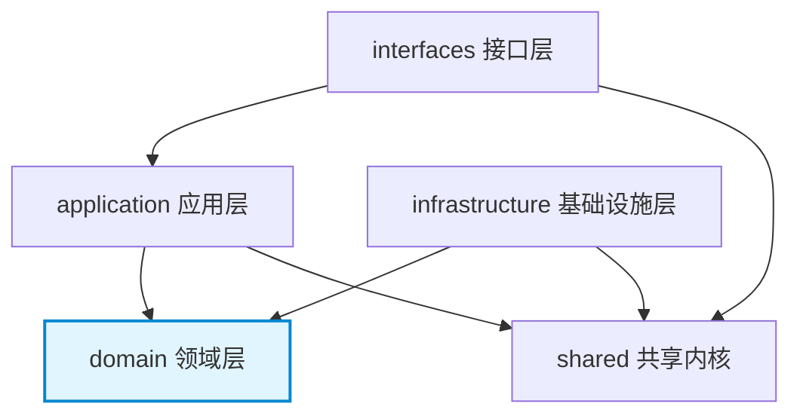

# 项目脚手架

> 依赖文档：无（本文件为首个实施文档）
> 被依赖：所有后续文档 02-10

本文档定义 Grace 平台后端项目的 Maven 配置、Java 21 设置、DDD 包结构、应用配置和基础 Spring Boot 配置。AI 编码代理应按本文档从零创建项目骨架。

---

## 1. Maven 项目初始化

### 1.1 pom.xml 核心配置

```xml
<?xml version="1.0" encoding="UTF-8"?>
<project xmlns="http://maven.apache.org/POM/4.0.0"
         xmlns:xsi="http://www.w3.org/2001/XMLSchema-instance"
         xsi:schemaLocation="http://maven.apache.org/POM/4.0.0 https://maven.apache.org/xsd/maven-4.0.0.xsd">
    <modelVersion>4.0.0</modelVersion>

    <parent>
        <groupId>org.springframework.boot</groupId>
        <artifactId>spring-boot-starter-parent</artifactId>
        <version>3.4.1</version>
        <relativePath/>
    </parent>

    <groupId>com.grace</groupId>
    <artifactId>grace-platform</artifactId>
    <version>0.1.0-SNAPSHOT</version>
    <name>Grace Platform</name>
    <description>Video Distribution and Promotion Platform for Food Bloggers</description>

    <properties>
        <java.version>21</java.version>
        <jqwik.version>1.9.1</jqwik.version>
        <testcontainers.version>1.20.4</testcontainers.version>
    </properties>

    <dependencies>
        <!-- 参见 §1.2 依赖清单表 -->
    </dependencies>

    <build>
        <plugins>
            <plugin>
                <groupId>org.springframework.boot</groupId>
                <artifactId>spring-boot-maven-plugin</artifactId>
            </plugin>
            <!-- 参见 §1.3 编译器配置 -->
        </plugins>
    </build>
</project>
```

### 1.2 依赖清单表

| groupId | artifactId | 用途 | scope |
|---------|-----------|------|-------|
| org.springframework.boot | spring-boot-starter-web | REST API、嵌入式 Tomcat | compile |
| org.mybatis.spring.boot | mybatis-spring-boot-starter | MyBatis ORM 集成 | compile |
| org.springframework.boot | spring-boot-starter-validation | Bean Validation (Jakarta) | compile |
| com.mysql | mysql-connector-j | MySQL JDBC 驱动 | runtime |
| com.fasterxml.jackson.datatype | jackson-datatype-jsr310 | Java 8+ 时间类型 JSON 序列化 | compile |
| com.alibaba | dashscope-sdk-java | 阿里云通义千问 LLM SDK | compile |
| com.google.apis | google-api-services-youtube | YouTube Data API v3 Java Client | compile |
| com.google.oauth-client | google-oauth-client-jetty | Google OAuth 2.0 客户端 | compile |
| org.springframework.boot | spring-boot-starter-test | JUnit 5、Mockito、Spring Test | test |
| net.jqwik | jqwik | 属性测试框架 | test |
| org.testcontainers | testcontainers | Testcontainers 核心 | test |
| org.testcontainers | mysql | Testcontainers MySQL 模块 | test |
| org.testcontainers | junit-jupiter | Testcontainers JUnit 5 集成 | test |
| org.springframework.security | spring-security-crypto | BCrypt 哈希工具 | compile |
| org.flywaydb | flyway-core | 数据库版本管理 | compile |
| org.flywaydb | flyway-mysql | Flyway MySQL 方言支持 | compile |

### 1.3 Java 21 编译器配置

```xml
<plugin>
    <groupId>org.apache.maven.plugins</groupId>
    <artifactId>maven-compiler-plugin</artifactId>
    <configuration>
        <source>21</source>
        <target>21</target>
        <compilerArgs>
            <arg>--enable-preview</arg>
        </compilerArgs>
    </configuration>
</plugin>
```

启用 Java 21 Preview Features（Record Patterns、Pattern Matching for switch）以简化领域模型代码。

---

## 2. 包结构（DDD 分层）

### 2.1 顶层包组织

```
src/main/java/com/grace/platform/
├── GracePlatformApplication.java          # Spring Boot 启动类
│
├── shared/                                # 共享内核（02-shared-kernel.md）
│   ├── domain/
│   │   ├── DomainEvent.java               # 领域事件基类
│   │   ├── DomainEventPublisher.java       # 事件发布器接口
│   │   └── id/                            # 类型化 ID 值对象
│   │       ├── VideoId.java
│   │       ├── MetadataId.java
│   │       ├── PublishRecordId.java
│   │       ├── ChannelId.java
│   │       ├── PromotionRecordId.java
│   │       ├── OAuthTokenId.java
│   │       ├── UserProfileId.java
│   │       ├── NotificationPreferenceId.java
│   │       └── ApiKeyId.java
│   ├── application/
│   │   └── dto/
│   │       ├── ApiResponse.java           # 统一响应信封
│   │       └── PageResponse.java          # 分页响应信封
│   ├── infrastructure/
│   │   ├── exception/                     # 异常体系
│   │   │   ├── DomainException.java
│   │   │   ├── EntityNotFoundException.java
│   │   │   ├── BusinessRuleViolationException.java
│   │   │   ├── InfrastructureException.java
│   │   │   └── ExternalServiceException.java
│   │   ├── config/                        # 全局配置
│   │   │   ├── GlobalExceptionHandler.java
│   │   │   ├── WebConfig.java             # CORS
│   │   │   └── JacksonConfig.java         # 序列化
│   │   ├── web/                           # Web 基础设施（参见 log-design.md）
│   │   │   ├── TraceIdFilter.java         # Trace ID 链路追踪
│   │   │   ├── CachedBodyFilter.java      # Request Body 缓存
│   │   │   ├── RequestResponseLoggingInterceptor.java  # 出入参日志
│   │   │   └── WebMvcConfig.java          # Interceptor 注册
│   │   ├── async/                         # 异步基础设施（参见 log-design.md）
│   │   │   ├── AsyncConfig.java           # 异步线程池配置
│   │   │   └── MdcTaskDecorator.java      # MDC 上下文传递
│   │   ├── encryption/                    # 加密服务
│   │   │   ├── EncryptionService.java
│   │   │   ├── AesGcmEncryptionService.java
│   │   │   ├── ApiKeyHashService.java
│   │   │   └── BcryptApiKeyHashService.java
│   │   ├── event/                         # 事件基础设施
│   │   │   └── SpringDomainEventPublisher.java
│   │   └── persistence/                   # MyBatis 通用 TypeHandler
│   │       └── typehandler/
│   │           ├── VideoIdTypeHandler.java
│   │           ├── MetadataIdTypeHandler.java
│   │           └── ...
│   └── ErrorCode.java                     # 错误码常量
│
├── video/                                 # 视频限界上下文（03-context-video.md）
│   ├── interfaces/
│   │   ├── VideoUploadController.java
│   │   └── dto/
│   │       ├── request/
│   │       └── response/
│   ├── application/
│   │   ├── VideoApplicationService.java
│   │   ├── command/
│   │   └── dto/
│   ├── domain/
│   │   ├── Video.java                     # 聚合根
│   │   ├── UploadSession.java             # 实体
│   │   ├── VideoFileInfo.java             # 值对象
│   │   ├── VideoFormat.java               # 枚举
│   │   ├── VideoStatus.java               # 枚举
│   │   ├── UploadSessionStatus.java       # 枚举
│   │   ├── VideoFileInspector.java        # 领域服务接口
│   │   ├── ChunkMergeService.java         # 领域服务接口
│   │   ├── VideoRepository.java           # 仓储接口
│   │   ├── UploadSessionRepository.java   # 仓储接口
│   │   └── event/
│   │       └── VideoUploadedEvent.java
│   └── infrastructure/
│       ├── persistence/
│       │   ├── VideoMapper.java             # MyBatis Mapper 接口
│       │   ├── VideoRepositoryImpl.java
│       │   ├── UploadSessionMapper.java
│       │   └── UploadSessionRepositoryImpl.java
│       └── file/
│           ├── VideoFileInspectorImpl.java
│           └── ChunkMergeServiceImpl.java
│
├── metadata/                              # 元数据限界上下文（04-context-metadata.md）
│   ├── interfaces/
│   ├── application/
│   ├── domain/
│   └── infrastructure/
│       └── llm/
│           ├── LlmService.java            # 通用 LLM 接口
│           ├── LlmRequest.java
│           ├── LlmResponse.java
│           ├── QwenLlmServiceAdapter.java  # 阿里云实现
│           └── MetadataGenerationServiceImpl.java
│
├── distribution/                          # 分发限界上下文（05-context-distribution.md）
│   ├── interfaces/
│   ├── application/
│   ├── domain/
│   │   ├── VideoDistributor.java          # Strategy 接口
│   │   ├── ResumableVideoDistributor.java # 扩展接口
│   │   ├── VideoDistributorRegistry.java  # Registry
│   │   └── ...
│   └── infrastructure/
│       ├── youtube/
│       │   ├── YouTubeDistributor.java    # YouTube 实现
│       │   ├── YouTubeApiAdapter.java
│       │   └── YouTubeOAuthService.java
│       └── persistence/
│
├── promotion/                             # 推广限界上下文（06-context-promotion.md）
│   ├── interfaces/
│   │   ├── ChannelController.java
│   │   └── PromotionController.java
│   ├── application/
│   │   ├── ChannelApplicationService.java
│   │   └── PromotionApplicationService.java
│   ├── domain/
│   │   ├── PromotionExecutor.java         # Strategy 接口
│   │   ├── PromotionExecutorRegistry.java # Registry
│   │   └── ...
│   └── infrastructure/
│       └── opencrawl/
│           ├── OpenCrawlPromotionExecutor.java
│           └── OpenCrawlAdapter.java
│
├── user/                                  # 用户设置限界上下文（07-context-user-settings.md）
│   ├── interfaces/
│   ├── application/
│   ├── domain/
│   └── infrastructure/
│
└── dashboard/                             # 仪表盘聚合查询（08-dashboard-query.md）
    ├── interfaces/
    │   └── DashboardController.java
    └── application/
        └── DashboardQueryService.java
```

### 2.2 DDD 四层职责说明

| 层 | 包 | 包含内容 | 命名约定 | 依赖规则 |
|----|---|---------|---------|---------|
| 接口层 | `interfaces/` | REST Controller、Request/Response DTO | `XxxController`、`XxxRequest`、`XxxResponse` | 可依赖 application、shared |
| 应用层 | `application/` | Application Service、Command、DTO | `XxxApplicationService`、`XxxCommand`、`XxxDTO` | 可依赖 domain、shared |
| 领域层 | `domain/` | Entity、Value Object、Domain Service 接口、Repository 接口、Domain Event | `Xxx`(实体)、`XxxId`(值对象)、`XxxRepository`(接口)、`XxxEvent` | **不依赖任何其他层** |
| 基础设施层 | `infrastructure/` | MyBatis Mapper 接口、XML 映射文件、外部 API Adapter、配置 | `XxxMapper`、`XxxRepositoryImpl`、`XxxAdapter` | 可依赖 domain（实现其接口） |

### 2.3 DDD 分层依赖规则



**依赖矩阵（行依赖列）：**

| 依赖方 ↓ / 被依赖方 → | interfaces | application | domain | infrastructure | shared |
|----------------------|------------|-------------|--------|---------------|--------|
| interfaces | — | YES | NO | NO | YES |
| application | NO | — | YES | NO | YES |
| domain | NO | NO | — | NO | YES(仅ID) |
| infrastructure | NO | NO | YES | — | YES |

> domain 层对 shared 的依赖仅限于类型化 ID 值对象和 DomainEvent 基类。

### 2.4 命名约定

| 类型 | 命名规则 | 示例 |
|------|---------|------|
| REST Controller | `XxxController` | `VideoUploadController` |
| Application Service | `XxxApplicationService` | `VideoApplicationService` |
| 聚合根/实体 | `Xxx` (领域名词) | `Video`、`UploadSession` |
| 值对象 | `XxxId`、`XxxInfo` | `VideoId`、`VideoFileInfo` |
| 领域服务接口 | `XxxService`、`XxxInspector` | `MetadataGenerationService`、`VideoFileInspector` |
| Repository 接口 | `XxxRepository` | `VideoRepository` |
| 领域事件 | `XxxEvent` | `VideoUploadedEvent` |
| MyBatis Mapper | `XxxMapper` | `VideoMapper` |
| Repository 实现 | `XxxRepositoryImpl` | `VideoRepositoryImpl` |
| 外部 API Adapter | `XxxAdapter` | `YouTubeApiAdapter`、`OpenCrawlAdapter` |
| Strategy 实现 | 平台/渠道名 + 角色名 | `YouTubeDistributor`、`OpenCrawlPromotionExecutor` |
| Request DTO | `XxxRequest` | `UploadInitRequest` |
| Response DTO | `XxxResponse` | `VideoInfoResponse` |
| Command | `XxxCommand` | `UploadInitCommand` |

---

## 3. application.yml 配置

### 3.1 主配置文件

```yaml
spring:
  application:
    name: grace-platform

  datasource:
    url: jdbc:mysql://${DB_HOST:localhost}:${DB_PORT:3306}/${DB_NAME:grace}?useUnicode=true&characterEncoding=utf8mb4&serverTimezone=UTC
    username: ${DB_USERNAME:root}
    password: ${DB_PASSWORD:}
    driver-class-name: com.mysql.cj.jdbc.Driver
    hikari:
      maximum-pool-size: 20
      minimum-idle: 5
      idle-timeout: 300000
      connection-timeout: 20000
      max-lifetime: 1200000

  servlet:
    multipart:
      max-file-size: 5GB
      max-request-size: 5GB

  jackson:
    serialization:
      write-dates-as-timestamps: false
    deserialization:
      fail-on-unknown-properties: false
    default-property-inclusion: non_null

# MyBatis 配置
mybatis:
  mapper-locations: classpath:mapper/**/*.xml
  type-aliases-package: com.grace.platform
  type-handlers-package: com.grace.platform.shared.infrastructure.persistence.typehandler
  configuration:
    map-underscore-to-camel-case: true
    default-enum-type-handler: org.apache.ibatis.type.EnumTypeHandler
    log-impl: org.apache.ibatis.logging.slf4j.Slf4jImpl

# Flyway 数据库版本管理（详见 db-design.md §7）
spring:
  flyway:
    enabled: true
    locations: classpath:db/migration
    baseline-on-migrate: true
    baseline-version: 0

# Grace 自定义配置
grace:
  encryption:
    master-key: ${GRACE_ENCRYPTION_KEY}       # AES-256 密钥（32 字节 Base64 编码）

  storage:
    video-dir: ${GRACE_VIDEO_DIR:./data/videos}
    temp-dir: ${GRACE_TEMP_DIR:./data/temp}
    avatar-dir: ${GRACE_AVATAR_DIR:./data/avatars}

  upload:
    chunk-size: 16777216                       # 16MB 分片大小
    session-ttl: 86400                         # 上传会话 TTL 秒（24小时）
    max-file-size: 5368709120                  # 5GB

  llm:
    provider: qwen
    api-key: ${QWEN_API_KEY}
    model: qwen-max
    base-url: https://dashscope.aliyuncs.com/api/v1
    max-tokens: 2048
    temperature: 0.7
    retry:
      max-attempts: 3
      backoff-multiplier: 2                    # 指数退避：1s, 2s, 4s

  youtube:
    client-id: ${YOUTUBE_CLIENT_ID}
    client-secret: ${YOUTUBE_CLIENT_SECRET}
    redirect-uri: ${YOUTUBE_REDIRECT_URI:http://localhost:8080/api/distribution/auth/youtube/callback}
    scopes: https://www.googleapis.com/auth/youtube.upload,https://www.googleapis.com/auth/youtube.readonly

  opencrawl:
    base-url: ${OPENCRAWL_BASE_URL:https://api.opencrawl.io/v1}
    api-key: ${OPENCRAWL_API_KEY}
    timeout: 30000                             # 30 秒超时

  scheduler:
    quota-retry:
      fixed-delay: 1800000                     # 30 分钟
      max-retries: 5

server:
  port: ${SERVER_PORT:8080}

logging:
  level:
    com.grace.platform: DEBUG
  # 完整日志配置（Trace ID、按天滚动、出入参）参见 log-design.md
  # 生产环境使用 logback-spring.xml 而非此处配置
```

### 3.2 配置项说明表

| 配置路径 | 类型 | 默认值 | 说明 |
|---------|------|--------|------|
| `grace.encryption.master-key` | String | (必须) | AES-256-GCM 主密钥，32 字节 Base64 编码，从环境变量注入 |
| `grace.storage.video-dir` | String | `./data/videos` | 视频文件永久存储目录 |
| `grace.storage.temp-dir` | String | `./data/temp` | 分片上传临时目录 |
| `grace.storage.avatar-dir` | String | `./data/avatars` | 用户头像存储目录 |
| `grace.upload.chunk-size` | long | 16777216 | 分片大小（16MB） |
| `grace.upload.session-ttl` | int | 86400 | 上传会话有效期（秒） |
| `grace.upload.max-file-size` | long | 5368709120 | 最大文件大小（5GB） |
| `grace.llm.provider` | String | `qwen` | LLM 提供商标识 |
| `grace.llm.api-key` | String | (必须) | 通义千问 API Key |
| `grace.llm.model` | String | `qwen-max` | LLM 模型名称 |
| `grace.llm.max-tokens` | int | 2048 | 最大生成 token 数 |
| `grace.llm.temperature` | double | 0.7 | 生成温度 |
| `grace.llm.retry.max-attempts` | int | 3 | LLM 调用最大重试次数 |
| `grace.llm.retry.backoff-multiplier` | int | 2 | 退避倍数（1s, 2s, 4s） |
| `grace.youtube.client-id` | String | (必须) | Google OAuth Client ID |
| `grace.youtube.client-secret` | String | (必须) | Google OAuth Client Secret |
| `grace.youtube.redirect-uri` | String | (见默认值) | OAuth 回调 URI |
| `grace.youtube.scopes` | String | (见默认值) | OAuth 权限范围 |
| `grace.opencrawl.base-url` | String | (见默认值) | OpenCrawl API 基础 URL |
| `grace.opencrawl.api-key` | String | (必须) | OpenCrawl API Key |
| `grace.opencrawl.timeout` | int | 30000 | 请求超时（毫秒） |
| `grace.scheduler.quota-retry.fixed-delay` | long | 1800000 | 配额重试扫描间隔（毫秒） |
| `grace.scheduler.quota-retry.max-retries` | int | 5 | 配额超限最大重试次数 |

### 3.3 Resources 目录结构

```
src/main/resources/
├── application.yml                        # 主配置文件（§3.1）
├── application-dev.yml                    # 开发环境配置（.gitignore，参见 db-design.md §8）
├── logback-spring.xml                     # Logback 日志配置（参见 log-design.md §5）
├── mapper/                                # MyBatis XML 映射文件
│   ├── video/
│   │   └── VideoMapper.xml
│   ├── metadata/
│   │   └── VideoMetadataMapper.xml
│   ├── distribution/
│   │   ├── PublishRecordMapper.xml
│   │   └── OAuthTokenMapper.xml
│   ├── promotion/
│   │   ├── PromotionChannelMapper.xml
│   │   └── PromotionRecordMapper.xml
│   └── user/
│       ├── UserProfileMapper.xml
│       ├── NotificationPreferenceMapper.xml
│       └── ApiKeyMapper.xml
└── db/                                    # Flyway 数据库迁移（参见 db-design.md §7）
    └── migration/
        ├── V1__create_video_tables.sql
        ├── V2__create_metadata_tables.sql
        ├── V3__create_distribution_tables.sql
        ├── V4__create_promotion_tables.sql
        ├── V5__create_user_settings_tables.sql
        └── V6__add_indexes.sql
```

---

## 4. 入口类与 Spring Boot 配置

### 4.1 Application 启动类

```java
package com.grace.platform;

import org.springframework.boot.SpringApplication;
import org.springframework.boot.autoconfigure.SpringBootApplication;
import org.springframework.scheduling.annotation.EnableScheduling;

@SpringBootApplication
@EnableScheduling  // 启用定时任务（配额超限重试）
public class GracePlatformApplication {
    public static void main(String[] args) {
        SpringApplication.run(GracePlatformApplication.class, args);
    }
}
```

### 4.2 CORS 配置

```java
package com.grace.platform.shared.infrastructure.config;

import org.springframework.context.annotation.Configuration;
import org.springframework.web.servlet.config.annotation.CorsRegistry;
import org.springframework.web.servlet.config.annotation.WebMvcConfigurer;

@Configuration
public class WebConfig implements WebMvcConfigurer {
    @Override
    public void addCorsMappings(CorsRegistry registry) {
        registry.addMapping("/api/**")
                .allowedOrigins("http://localhost:5173")  // Vite 开发服务器
                .allowedMethods("GET", "POST", "PUT", "DELETE", "OPTIONS")
                .allowedHeaders("*")
                .allowCredentials(true)
                .maxAge(3600);
    }
}
```

### 4.3 Jackson 序列化配置

```java
package com.grace.platform.shared.infrastructure.config;

import com.fasterxml.jackson.databind.ObjectMapper;
import com.fasterxml.jackson.databind.SerializationFeature;
import com.fasterxml.jackson.datatype.jsr310.JavaTimeModule;
import org.springframework.context.annotation.Bean;
import org.springframework.context.annotation.Configuration;

@Configuration
public class JacksonConfig {
    @Bean
    public ObjectMapper objectMapper() {
        ObjectMapper mapper = new ObjectMapper();
        mapper.registerModule(new JavaTimeModule());
        mapper.disable(SerializationFeature.WRITE_DATES_AS_TIMESTAMPS);
        // LocalDateTime → "2024-01-15T10:30:00"
        // Duration → "PT12M34S" (ISO 8601)
        return mapper;
    }
}
```

### 4.4 环境变量清单

以下环境变量必须在部署时配置，不得硬编码在配置文件中：

| 环境变量 | 用途 | 是否必须 |
|---------|------|---------|
| `GRACE_ENCRYPTION_KEY` | AES-256-GCM 主密钥（Base64） | 是 |
| `QWEN_API_KEY` | 阿里云通义千问 API Key | 是 |
| `YOUTUBE_CLIENT_ID` | Google OAuth Client ID | 是 |
| `YOUTUBE_CLIENT_SECRET` | Google OAuth Client Secret | 是 |
| `YOUTUBE_REDIRECT_URI` | OAuth 回调 URI | 否（有默认值） |
| `OPENCRAWL_API_KEY` | OpenCrawl API Key | 是 |
| `OPENCRAWL_BASE_URL` | OpenCrawl API 基础 URL | 否（有默认值） |
| `DB_HOST` | MySQL 主机地址 | 否（默认 localhost） |
| `DB_PORT` | MySQL 端口 | 否（默认 3306） |
| `DB_NAME` | 数据库名 | 否（默认 grace） |
| `DB_USERNAME` | 数据库用户名 | 否（默认 root） |
| `DB_PASSWORD` | 数据库密码 | 否 |
| `SERVER_PORT` | 服务端口 | 否（默认 8080） |
