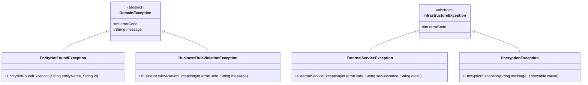

# 共享内核

> 依赖文档：[01-project-scaffolding.md](./01-project-scaffolding.md)
> 被依赖：所有上下文文档 03-08
> 包路径：`com.grace.platform.shared`

本文档定义所有限界上下文共享的基础构建块：领域事件基础设施、类型化 ID 值对象、统一 API 响应信封、异常体系、错误码常量、加密服务。

---

## 1. 领域事件基础设施

### 1.1 DomainEvent 抽象基类

```java
package com.grace.platform.shared.domain;

import java.time.LocalDateTime;
import java.util.UUID;

public abstract class DomainEvent {
    private final String eventId;
    private final LocalDateTime occurredAt;

    protected DomainEvent() {
        this.eventId = UUID.randomUUID().toString();
        this.occurredAt = LocalDateTime.now();
    }

    public String getEventId() { return eventId; }
    public LocalDateTime getOccurredAt() { return occurredAt; }
}
```

### 1.2 事件发布器

```java
package com.grace.platform.shared.domain;

public interface DomainEventPublisher {
    void publish(DomainEvent event);
}
```

```java
package com.grace.platform.shared.infrastructure.event;

import com.grace.platform.shared.domain.DomainEvent;
import com.grace.platform.shared.domain.DomainEventPublisher;
import org.springframework.context.ApplicationEventPublisher;
import org.springframework.stereotype.Component;

@Component
public class SpringDomainEventPublisher implements DomainEventPublisher {
    private final ApplicationEventPublisher publisher;

    public SpringDomainEventPublisher(ApplicationEventPublisher publisher) {
        this.publisher = publisher;
    }

    @Override
    public void publish(DomainEvent event) {
        publisher.publishEvent(event);
    }
}
```

### 1.3 事件监听约定

MVP 阶段使用 Spring `@EventListener` 实现同步事件分发。事件监听方法放在订阅方上下文的 `application/` 层。

**未来扩展**：可替换为 `@TransactionalEventListener(phase = AFTER_COMMIT)` 或消息队列（RabbitMQ/Kafka），只需替换 `SpringDomainEventPublisher` 实现，发布方代码不变。

### 1.4 事件全景表

| 事件 | 发布上下文 | 订阅上下文 | 触发条件 | 同步/异步 |
|------|----------|----------|---------|----------|
| `VideoUploadedEvent` | Video | Metadata | `completeUpload` 成功后 | 同步（MVP） |
| `MetadataConfirmedEvent` | Metadata | Distribution | `confirmMetadata` 成功后 | 同步（MVP） |
| `VideoPublishedEvent` | Distribution | Promotion | `publish` 成功后 | 同步（MVP） |

---

## 2. 类型化 ID 值对象

### 2.1 通用 ID 模式

所有实体 ID 使用 Java `record` 定义，携带类型安全和 UUID 生成能力：

```java
package com.grace.platform.shared.domain.id;

import java.util.UUID;

public record VideoId(String value) {
    public VideoId {
        if (value == null || value.isBlank()) {
            throw new IllegalArgumentException("VideoId value must not be blank");
        }
    }

    public static VideoId generate() {
        return new VideoId("vid_" + UUID.randomUUID().toString().replace("-", ""));
    }

    @Override
    public String toString() {
        return value;
    }
}
```

### 2.2 全部类型化 ID 清单

| ID 类型 | 前缀 | 所属上下文 | 示例值 |
|--------|------|----------|--------|
| `VideoId` | `vid_` | Video | `vid_a1b2c3d4e5f6...` |
| `MetadataId` | `meta_` | Metadata | `meta_a1b2c3d4e5f6...` |
| `PublishRecordId` | `pub_` | Distribution | `pub_a1b2c3d4e5f6...` |
| `OAuthTokenId` | `oauth_` | Distribution | `oauth_a1b2c3d4e5f6...` |
| `ChannelId` | `ch_` | Promotion | `ch_a1b2c3d4e5f6...` |
| `PromotionRecordId` | `promo_` | Promotion | `promo_a1b2c3d4e5f6...` |
| `UserProfileId` | `user_` | User/Settings | `user_a1b2c3d4e5f6...` |
| `NotificationPreferenceId` | `notif_` | User/Settings | `notif_a1b2c3d4e5f6...` |
| `ApiKeyId` | `key_` | User/Settings | `key_a1b2c3d4e5f6...` |

每个 ID 类型遵循与 `VideoId` 相同的 record 模式：非空校验 + `generate()` 静态工厂 + 前缀拼接。

### 2.3 MyBatis TypeHandler

每个类型化 ID 配套一个 `TypeHandler<XxxId>`，实现 ID 与数据库 `VARCHAR` 列的自动转换：

```java
package com.grace.platform.shared.infrastructure.persistence.typehandler;

import com.grace.platform.shared.domain.id.VideoId;
import org.apache.ibatis.type.BaseTypeHandler;
import org.apache.ibatis.type.JdbcType;
import org.apache.ibatis.type.MappedTypes;

import java.sql.*;

@MappedTypes(VideoId.class)
public class VideoIdTypeHandler extends BaseTypeHandler<VideoId> {
    @Override
    public void setNonNullParameter(PreparedStatement ps, int i, VideoId parameter, JdbcType jdbcType) throws SQLException {
        ps.setString(i, parameter.value());
    }

    @Override
    public VideoId getNullableResult(ResultSet rs, String columnName) throws SQLException {
        String value = rs.getString(columnName);
        return value == null ? null : new VideoId(value);
    }

    @Override
    public VideoId getNullableResult(ResultSet rs, int columnIndex) throws SQLException {
        String value = rs.getString(columnIndex);
        return value == null ? null : new VideoId(value);
    }

    @Override
    public VideoId getNullableResult(CallableStatement cs, int columnIndex) throws SQLException {
        String value = cs.getString(columnIndex);
        return value == null ? null : new VideoId(value);
    }
}
```

所有 ID 类型均需创建对应的 TypeHandler 类，命名为 `XxxIdTypeHandler`。通过 `mybatis.type-handlers-package` 配置自动扫描注册（见 01-project-scaffolding.md §3.1）。

---

## 3. 统一 API 响应信封

### 3.1 ApiResponse\<T\>

```java
package com.grace.platform.shared.application.dto;

import com.fasterxml.jackson.annotation.JsonInclude;
import java.time.LocalDateTime;
import java.util.List;

@JsonInclude(JsonInclude.Include.NON_NULL)
public record ApiResponse<T>(
    int code,
    String message,
    T data,
    List<FieldError> errors,
    LocalDateTime timestamp
) {
    public record FieldError(String field, String message) {}

    public static <T> ApiResponse<T> success(T data) {
        return new ApiResponse<>(0, "success", data, null, LocalDateTime.now());
    }

    public static <T> ApiResponse<T> success() {
        return new ApiResponse<>(0, "success", null, null, LocalDateTime.now());
    }

    public static <T> ApiResponse<T> error(int code, String message) {
        return new ApiResponse<>(code, message, null, null, LocalDateTime.now());
    }

    public static <T> ApiResponse<T> error(int code, String message, List<FieldError> errors) {
        return new ApiResponse<>(code, message, null, errors, LocalDateTime.now());
    }
}
```

### 3.2 PageResponse\<T\>

```java
package com.grace.platform.shared.application.dto;

import java.util.List;

public record PageResponse<T>(
    List<T> items,
    long total,
    int page,
    int pageSize,
    int totalPages
) {
    /**
     * 手动分页构造：传入当前页数据、总记录数、页码和每页条数
     */
    public static <T> PageResponse<T> of(List<T> items, long total, int page, int pageSize) {
        int totalPages = (int) Math.ceil((double) total / pageSize);
        return new PageResponse<>(items, total, page, pageSize, totalPages);
    }
}
```

---

## 4. 异常体系

### 4.1 异常继承结构



### 4.2 异常基类签名

```java
package com.grace.platform.shared.infrastructure.exception;

public abstract class DomainException extends RuntimeException {
    private final int errorCode;

    protected DomainException(int errorCode, String message) {
        super(message);
        this.errorCode = errorCode;
    }

    public int getErrorCode() { return errorCode; }
}

public class EntityNotFoundException extends DomainException {
    public EntityNotFoundException(int errorCode, String entityName, String id) {
        super(errorCode, entityName + " not found: " + id);
    }
}

public class BusinessRuleViolationException extends DomainException {
    public BusinessRuleViolationException(int errorCode, String message) {
        super(errorCode, message);
    }
}

public abstract class InfrastructureException extends RuntimeException {
    private final int errorCode;

    protected InfrastructureException(int errorCode, String message) {
        super(message);
        this.errorCode = errorCode;
    }

    protected InfrastructureException(int errorCode, String message, Throwable cause) {
        super(message, cause);
        this.errorCode = errorCode;
    }

    public int getErrorCode() { return errorCode; }
}

public class ExternalServiceException extends InfrastructureException {
    public ExternalServiceException(int errorCode, String serviceName, String detail) {
        super(errorCode, serviceName + " service error: " + detail);
    }
}

public class EncryptionException extends InfrastructureException {
    public EncryptionException(String message, Throwable cause) {
        super(ErrorCode.ENCRYPTION_ERROR, message, cause);
    }
}
```

### 4.3 GlobalExceptionHandler

```java
package com.grace.platform.shared.infrastructure.config;

import com.grace.platform.shared.application.dto.ApiResponse;
import com.grace.platform.shared.infrastructure.exception.*;
import org.springframework.http.HttpStatus;
import org.springframework.http.ResponseEntity;
import org.springframework.web.bind.MethodArgumentNotValidException;
import org.springframework.web.bind.annotation.ExceptionHandler;
import org.springframework.web.bind.annotation.RestControllerAdvice;

@RestControllerAdvice
public class GlobalExceptionHandler {

    @ExceptionHandler(EntityNotFoundException.class)
    public ResponseEntity<ApiResponse<Void>> handle(EntityNotFoundException e) {
        return ResponseEntity.status(HttpStatus.NOT_FOUND)
                .body(ApiResponse.error(e.getErrorCode(), e.getMessage()));
    }

    @ExceptionHandler(BusinessRuleViolationException.class)
    public ResponseEntity<ApiResponse<Void>> handle(BusinessRuleViolationException e) {
        return ResponseEntity.status(HttpStatus.BAD_REQUEST)
                .body(ApiResponse.error(e.getErrorCode(), e.getMessage()));
    }

    @ExceptionHandler(ExternalServiceException.class)
    public ResponseEntity<ApiResponse<Void>> handle(ExternalServiceException e) {
        HttpStatus status = resolveHttpStatus(e.getErrorCode());
        return ResponseEntity.status(status)
                .body(ApiResponse.error(e.getErrorCode(), e.getMessage()));
    }

    @ExceptionHandler(EncryptionException.class)
    public ResponseEntity<ApiResponse<Void>> handle(EncryptionException e) {
        return ResponseEntity.status(HttpStatus.INTERNAL_SERVER_ERROR)
                .body(ApiResponse.error(e.getErrorCode(), "Internal encryption error"));
    }

    @ExceptionHandler(MethodArgumentNotValidException.class)
    public ResponseEntity<ApiResponse<Void>> handle(MethodArgumentNotValidException e) {
        var fieldErrors = e.getBindingResult().getFieldErrors().stream()
                .map(f -> new ApiResponse.FieldError(f.getField(), f.getDefaultMessage()))
                .toList();
        return ResponseEntity.status(HttpStatus.BAD_REQUEST)
                .body(ApiResponse.error(ErrorCode.INVALID_METADATA, "Validation failed", fieldErrors));
    }

    @ExceptionHandler(Exception.class)
    public ResponseEntity<ApiResponse<Void>> handleUnknown(Exception e) {
        // 记录日志
        return ResponseEntity.status(HttpStatus.INTERNAL_SERVER_ERROR)
                .body(ApiResponse.error(ErrorCode.INTERNAL_SERVER_ERROR, "Internal server error"));
    }

    private HttpStatus resolveHttpStatus(int errorCode) {
        return switch (errorCode) {
            case ErrorCode.LLM_SERVICE_UNAVAILABLE -> HttpStatus.SERVICE_UNAVAILABLE;
            case ErrorCode.OPENCRAWL_EXECUTION_FAILED, ErrorCode.PLATFORM_API_ERROR -> HttpStatus.BAD_GATEWAY;
            case ErrorCode.PLATFORM_QUOTA_EXCEEDED -> HttpStatus.TOO_MANY_REQUESTS;
            case ErrorCode.PLATFORM_AUTH_EXPIRED -> HttpStatus.UNAUTHORIZED;
            default -> HttpStatus.INTERNAL_SERVER_ERROR;
        };
    }
}
```

### 4.4 异常 → HTTP 状态码映射表

| 异常类 | HTTP Status | 触发场景 |
|-------|-------------|---------|
| `EntityNotFoundException` | 404 | 实体 ID 不存在 |
| `BusinessRuleViolationException` | 400 | 领域规则违反（格式、大小、状态校验） |
| `ExternalServiceException` | 502/503/429/401 | 外部服务调用失败（根据错误码细分） |
| `EncryptionException` | 500 | AES 加解密失败 |
| `MethodArgumentNotValidException` | 400 | Bean Validation 校验失败 |
| `Exception` (fallback) | 500 | 未知内部错误 |

---

## 5. 错误码常量

### 5.1 ErrorCode 常量接口

```java
package com.grace.platform.shared;

public final class ErrorCode {
    private ErrorCode() {}

    // 成功
    public static final int SUCCESS = 0;

    // ===== 1001-1099: Video Context =====
    public static final int UNSUPPORTED_VIDEO_FORMAT      = 1001;
    public static final int VIDEO_FILE_SIZE_EXCEEDED       = 1002;
    public static final int UPLOAD_SESSION_NOT_FOUND       = 1003;
    public static final int UPLOAD_SESSION_EXPIRED         = 1004;
    public static final int CHUNK_INDEX_OUT_OF_RANGE       = 1005;
    public static final int DUPLICATE_CHUNK                = 1006;
    public static final int UPLOAD_NOT_COMPLETE            = 1007;
    public static final int VIDEO_NOT_FOUND                = 1008;

    // ===== 2001-2099: Metadata Context =====
    public static final int INVALID_METADATA               = 2001;
    public static final int METADATA_NOT_FOUND             = 2002;
    public static final int METADATA_ALREADY_CONFIRMED     = 2003;
    public static final int VIDEO_NOT_UPLOADED             = 2004;

    // ===== 3001-3099: Distribution Context =====
    public static final int UNSUPPORTED_PLATFORM           = 3001;
    public static final int PLATFORM_AUTH_EXPIRED          = 3002;
    public static final int PLATFORM_NOT_AUTHORIZED        = 3003;
    public static final int PLATFORM_QUOTA_EXCEEDED        = 3004;
    public static final int VIDEO_NOT_READY                = 3005;
    public static final int PUBLISH_TASK_NOT_FOUND         = 3006;
    public static final int PLATFORM_API_ERROR             = 3007;

    // ===== 4001-4099: Promotion Context =====
    public static final int CHANNEL_NOT_FOUND              = 4001;
    public static final int INVALID_CHANNEL_CONFIG         = 4002;
    public static final int CHANNEL_DISABLED               = 4003;
    public static final int PROMOTION_RECORD_NOT_FOUND     = 4004;

    // ===== 5001-5099: User/Settings Context =====
    public static final int PROFILE_NOT_FOUND              = 5001;
    public static final int API_KEY_NOT_FOUND              = 5002;

    // ===== 9001-9099: Infrastructure =====
    public static final int LLM_SERVICE_UNAVAILABLE        = 9001;
    public static final int OPENCRAWL_EXECUTION_FAILED     = 9002;
    public static final int ENCRYPTION_ERROR               = 9003;
    public static final int INTERNAL_SERVER_ERROR          = 9999;
}
```

### 5.2 错误码分配规则

| 范围 | 上下文 | 对应异常基类 | HTTP Status |
|------|-------|------------|-------------|
| 1001-1099 | Video | DomainException | 400/404 |
| 2001-2099 | Metadata | DomainException | 400/404/409 |
| 3001-3099 | Distribution | DomainException / InfrastructureException | 400/401/429/502 |
| 4001-4099 | Promotion | DomainException | 400/404 |
| 5001-5099 | User/Settings | DomainException | 404 |
| 9001-9099 | Infrastructure | InfrastructureException | 500/502/503 |
| 9999 | 全局 | Exception | 500 |

---

## 6. 加密服务

### 6.1 EncryptionService 接口（AES-256-GCM）

```java
package com.grace.platform.shared.infrastructure.encryption;

public interface EncryptionService {
    String encrypt(String plaintext);
    String decrypt(String ciphertext);
}
```

### 6.2 AesGcmEncryptionService 实现

```java
package com.grace.platform.shared.infrastructure.encryption;

import org.springframework.beans.factory.annotation.Value;
import org.springframework.stereotype.Component;

@Component
public class AesGcmEncryptionService implements EncryptionService {

    // 从配置注入 grace.encryption.master-key
    private final byte[] masterKey;  // 32 bytes (256 bit)

    // AES-256-GCM 参数：
    // - IV 长度：12 bytes
    // - Tag 长度：128 bits
    // - 存储格式：Base64(IV + ciphertext + tag)

    public AesGcmEncryptionService(@Value("${grace.encryption.master-key}") String masterKeyBase64) {
        this.masterKey = java.util.Base64.getDecoder().decode(masterKeyBase64);
    }

    @Override
    public String encrypt(String plaintext) {
        // 1. 生成随机 12 字节 IV
        // 2. 使用 AES-256-GCM 加密
        // 3. 拼接 IV + ciphertext + tag
        // 4. Base64 编码返回
        throw new UnsupportedOperationException("Implementation required");
    }

    @Override
    public String decrypt(String ciphertext) {
        // 1. Base64 解码
        // 2. 提取 IV (前12字节)
        // 3. AES-256-GCM 解密
        // 4. 返回明文
        throw new UnsupportedOperationException("Implementation required");
    }
}
```

**加密使用场景：**

| 场景 | 加密字段 | 所属上下文 |
|------|---------|----------|
| 推广渠道 API Key | `PromotionChannel.encryptedApiKey` | Promotion |
| OAuth Access Token | `OAuthToken.accessToken` | Distribution |
| OAuth Refresh Token | `OAuthToken.refreshToken` | Distribution |

### 6.3 ApiKeyHashService（BCrypt）

```java
package com.grace.platform.shared.infrastructure.encryption;

public interface ApiKeyHashService {
    String hash(String rawKey);
    boolean verify(String rawKey, String hashedKey);
}
```

```java
package com.grace.platform.shared.infrastructure.encryption;

import org.springframework.security.crypto.bcrypt.BCryptPasswordEncoder;
import org.springframework.stereotype.Component;

@Component
public class BcryptApiKeyHashService implements ApiKeyHashService {
    private final BCryptPasswordEncoder encoder = new BCryptPasswordEncoder();

    @Override
    public String hash(String rawKey) {
        return encoder.encode(rawKey);
    }

    @Override
    public boolean verify(String rawKey, String hashedKey) {
        return encoder.matches(rawKey, hashedKey);
    }
}
```

BCrypt 用于用户 API Key 的单向哈希（不可逆），与 AES-256-GCM（可逆加密）用途不同。

---

## 7. 通用值对象与工具

### 7.1 ID 前缀约定总表

| 实体 | ID 类型 | 前缀 | 生成示例 |
|------|--------|------|---------|
| Video | `VideoId` | `vid_` | `vid_a1b2c3d4e5f6g7h8i9j0k1l2m3n4` |
| UploadSession | `String` (uploadId) | `upl_` | `upl_x7k9m2` |
| VideoMetadata | `MetadataId` | `meta_` | `meta_def456...` |
| PublishRecord | `PublishRecordId` | `pub_` | `pub_ghi789...` |
| OAuthToken | `OAuthTokenId` | `oauth_` | `oauth_xyz123...` |
| PromotionChannel | `ChannelId` | `ch_` | `ch_001...` |
| PromotionRecord | `PromotionRecordId` | `promo_` | `promo_001...` |
| UserProfile | `UserProfileId` | `user_` | `user_001...` |
| NotificationPreference | `NotificationPreferenceId` | `notif_` | `notif_001...` |
| ApiKey | `ApiKeyId` | `key_` | `key_001...` |

### 7.2 时间处理约定

- 所有时间字段使用 `java.time.LocalDateTime`，数据库存储为 `TIMESTAMP`
- API 层以 ISO 8601 格式传输：`"2024-01-15T10:30:00"`
- Duration 使用 `java.time.Duration`，API 以 ISO 8601 Duration 格式传输：`"PT12M34S"`
- 数据库中 Duration 存储为 `BIGINT`（秒数）

---

## 8. 日志与链路追踪基础设施

> 完整实现代码、Logback 配置、各层日志级别规范参见 [log-design.md](./log-design.md)。本节仅声明共享内核中的日志组件及其在包结构中的位置。

### 8.1 组件清单

| 组件 | 包路径 | 职责 |
|------|--------|------|
| `TraceIdFilter` | `shared.infrastructure.web` | 每次请求生成唯一 traceId 写入 MDC，响应头返回 `X-Trace-Id` |
| `CachedBodyFilter` | `shared.infrastructure.web` | 包装 POST/PUT 请求体，允许多次读取以记录 Body 日志 |
| `RequestResponseLoggingInterceptor` | `shared.infrastructure.web` | 记录请求出入参（Method、URI、Status、耗时） |
| `WebMvcConfig` | `shared.infrastructure.web` | 注册 Interceptor，排除健康检查路径 |
| `AsyncConfig` | `shared.infrastructure.async` | 异步线程池配置 |
| `MdcTaskDecorator` | `shared.infrastructure.async` | 将父线程 MDC 上下文（含 traceId）传递到异步子线程 |
| `SlowSqlInterceptor` | `shared.infrastructure.persistence` | MyBatis 拦截器，超过阈值的 SQL 记录 WARN 日志 |

### 8.2 Trace ID 规范

| 项目 | 规范 |
|------|------|
| 格式 | `grc-{时间戳hex}-{随机4字节hex}` |
| MDC Key | `traceId` |
| Response Header | `X-Trace-Id` |
| 日志 Pattern 引用 | `%X{traceId:-NO_TRACE}` |
| 异步传递 | 通过 `MdcTaskDecorator` 自动传递 |

### 8.3 日志标签前缀约定

所有共享内核提供的日志组件使用统一的标签前缀，各限界上下文在编写业务日志时也应遵循此约定：

| 前缀 | 使用场景 |
|------|---------|
| `[REQ]` / `[RES]` | 请求出入参（由 Interceptor 自动输出） |
| `[REQ-BODY]` | 请求 Body（DEBUG 级别） |
| `[EVENT-PUBLISH]` / `[EVENT-CONSUME]` | 领域事件发布与消费 |
| `[SLOW-SQL]` | 慢 SQL 告警（由 SlowSqlInterceptor 输出） |
| `[EXT-CALL]` / `[EXT-RESP]` | 外部服务调用与响应 |
| `[RETRY]` | 重试操作 |
