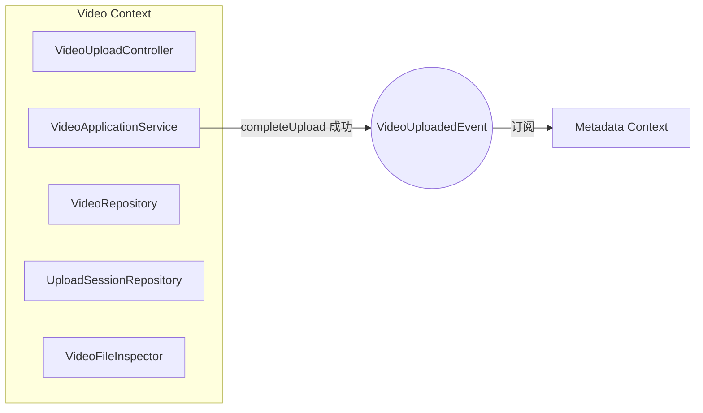
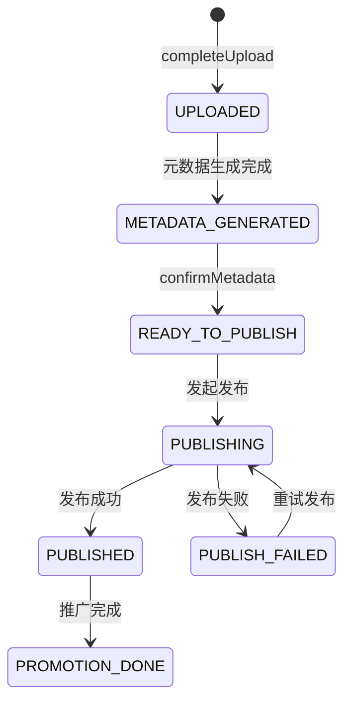
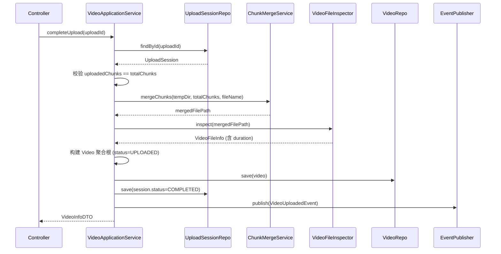

# 限界上下文：Video（视频）

> 依赖文档：[01-project-scaffolding.md](./01-project-scaffolding.md)、[02-shared-kernel.md](./02-shared-kernel.md)
> 被依赖：[04-context-metadata.md](./04-context-metadata.md)（通过 VideoUploadedEvent）、[08-dashboard-query.md](./08-dashboard-query.md)
> API 端点：B1-B6（参见 api.md §B）
> 需求映射：需求 1（验收标准 1.1-1.7）
> 包路径：`com.grace.platform.video`

---

## A. 上下文概览

Video 上下文负责视频文件的分片上传、文件合并、视频元信息提取和持久化。上传完成后发布 `VideoUploadedEvent`，触发 Metadata 上下文自动生成元数据。



**包结构清单：**

| 层 | 包路径 | 类 |
|----|-------|-----|
| interfaces | `video.interfaces` | `VideoUploadController` |
| interfaces | `video.interfaces.dto.request` | `UploadInitRequest`, `*` |
| interfaces | `video.interfaces.dto.response` | `UploadInitResponse`, `VideoInfoResponse`, `*` |
| application | `video.application` | `VideoApplicationService` |
| application | `video.application.command` | `UploadInitCommand`, `VideoQueryCommand` |
| application | `video.application.dto` | `UploadInitDTO`, `VideoInfoDTO`, `VideoDetailDTO`, `*` |
| domain | `video.domain` | `Video`, `UploadSession`, `VideoFileInfo`, `VideoFormat`, `VideoStatus`, `UploadSessionStatus` |
| domain | `video.domain` | `VideoFileInspector`, `ChunkMergeService`, `VideoRepository`, `UploadSessionRepository` |
| domain | `video.domain.event` | `VideoUploadedEvent` |
| infrastructure | `video.infrastructure.persistence` | `VideoMapper`, `VideoRepositoryImpl`, `UploadSessionMapper`, `UploadSessionRepositoryImpl` |
| infrastructure | `video.infrastructure.file` | `VideoFileInspectorImpl`, `ChunkMergeServiceImpl` |

---

## B. 领域模型

### B.1 聚合根：Video

| 字段 | 类型 | 约束 | 说明 |
|------|------|------|------|
| `id` | `VideoId` | PK, 非空 | 视频唯一标识 |
| `fileName` | `String` | 非空 | 原始文件名 |
| `fileSize` | `long` | > 0, ≤ 5GB | 文件字节数 |
| `format` | `VideoFormat` | 非空, ∈ {MP4,MOV,AVI,MKV} | 视频格式 |
| `duration` | `Duration` | ≥ 0 | 视频时长 |
| `filePath` | `String` | 非空 | 服务器存储路径 |
| `status` | `VideoStatus` | 非空 | 当前状态 |
| `createdAt` | `LocalDateTime` | 非空 | 创建时间 |
| `updatedAt` | `LocalDateTime` | 非空 | 最后更新时间 |

**VideoStatus 状态机：**



**状态转换规则表：**

| 当前状态 | 允许的目标状态 | 触发操作 | 所属上下文 |
|---------|-------------|---------|----------|
| — | UPLOADED | completeUpload | Video |
| UPLOADED | METADATA_GENERATED | 元数据生成完成 | Metadata |
| METADATA_GENERATED | READY_TO_PUBLISH | confirmMetadata | Metadata |
| READY_TO_PUBLISH | PUBLISHING | publish | Distribution |
| PUBLISHING | PUBLISHED | 发布成功回调 | Distribution |
| PUBLISHING | PUBLISH_FAILED | 发布失败 | Distribution |
| PUBLISH_FAILED | PUBLISHING | 重试发布 | Distribution |
| PUBLISHED | PROMOTION_DONE | 推广全部完成 | Promotion |

### B.2 实体：UploadSession

| 字段 | 类型 | 约束 | 说明 |
|------|------|------|------|
| `uploadId` | `String` | PK, 非空 | 上传会话 ID（`upl_` 前缀） |
| `fileName` | `String` | 非空 | 文件名 |
| `fileSize` | `long` | > 0 | 文件字节数 |
| `format` | `VideoFormat` | 非空 | 文件格式 |
| `totalChunks` | `int` | > 0 | 总分片数（= ceil(fileSize / chunkSize)） |
| `uploadedChunks` | `int` | ≥ 0 | 已上传分片数 |
| `tempDirectory` | `String` | 非空 | 分片临时存储目录路径 |
| `status` | `UploadSessionStatus` | 非空 | ACTIVE / COMPLETED / EXPIRED |
| `createdAt` | `LocalDateTime` | 非空 | 创建时间 |
| `expiresAt` | `LocalDateTime` | 非空 | 过期时间（创建时间 + session-ttl） |

### B.3 值对象与枚举

```java
public record VideoFileInfo(
    String fileName,
    long fileSize,
    VideoFormat format,
    Duration duration
) {}

public enum VideoFormat { MP4, MOV, AVI, MKV }

public enum VideoStatus {
    UPLOADED, METADATA_GENERATED, READY_TO_PUBLISH,
    PUBLISHING, PUBLISHED, PUBLISH_FAILED, PROMOTION_DONE
}

public enum UploadSessionStatus { ACTIVE, COMPLETED, EXPIRED }
```

### B.4 领域校验规则

| 规则 | 字段 | 条件 | 错误码 | 对应需求 |
|------|------|------|--------|---------|
| 格式校验 | `format` | ∈ {MP4, MOV, AVI, MKV} | 1001 | 1.3, 1.5 |
| 文件大小 | `fileSize` | ≤ 5,368,709,120 (5GB) | 1002 | 1.4 |
| 会话存在 | `uploadId` | 在 UploadSessionRepository 中存在 | 1003 | — |
| 会话未过期 | `expiresAt` | > now() | 1004 | — |
| 分片索引范围 | `chunkIndex` | 0 ≤ chunkIndex < totalChunks | 1005 | — |
| 分片不重复 | `chunkIndex` | 未被上传过 | 1006 | — |
| 上传完整 | `uploadedChunks` | == totalChunks | 1007 | — |

---

## C. 领域服务与领域事件

### C.1 VideoFileInspector 领域服务接口

```java
package com.grace.platform.video.domain;

import java.nio.file.Path;

public interface VideoFileInspector {
    VideoFileInfo inspect(Path filePath);
}
```

提取合并后视频文件的元信息（时长、分辨率等）。定义在 domain 层，由 infrastructure 层实现（可使用 FFprobe 或 JavaCV）。

### C.2 ChunkMergeService 领域服务接口

```java
package com.grace.platform.video.domain;

import java.nio.file.Path;

public interface ChunkMergeService {
    Path mergeChunks(Path tempDirectory, int totalChunks, String targetFileName);
}
```

将临时目录中的分片文件按索引顺序合并为完整视频文件。

### C.3 VideoUploadedEvent

```java
package com.grace.platform.video.domain.event;

import com.grace.platform.shared.domain.DomainEvent;
import com.grace.platform.shared.domain.id.VideoId;

public class VideoUploadedEvent extends DomainEvent {
    private final VideoId videoId;
    private final String fileName;
    private final long fileSize;
    private final String format;

    // constructor + getters
}
```

| 字段 | 类型 | 说明 |
|------|------|------|
| `videoId` | `VideoId` | 视频 ID |
| `fileName` | `String` | 文件名 |
| `fileSize` | `long` | 文件字节数 |
| `format` | `String` | 文件格式 |

**发布时机**：`VideoApplicationService.completeUpload()` 成功后。
**订阅方**：`MetadataApplicationService`（通过 `@EventListener`）自动触发 `generateMetadata`。

---

## D. 仓储接口

### D.1 VideoRepository

```java
package com.grace.platform.video.domain;

import com.grace.platform.shared.domain.id.VideoId;
import org.springframework.data.domain.Page;
import org.springframework.data.domain.Pageable;
import java.time.LocalDate;
import java.util.List;
import java.util.Optional;

public interface VideoRepository {
    Video save(Video video);
    Optional<Video> findById(VideoId id);
    Page<Video> findByCondition(String keyword, List<VideoStatus> statuses,
                                LocalDate startDate, LocalDate endDate, Pageable pageable);
    long count();
    long countByStatuses(List<VideoStatus> statuses);
    List<Video> findTop5ByOrderByCreatedAtDesc();
}
```

| 方法 | 参数 | 返回值 | 说明 |
|------|------|--------|------|
| `save` | `Video` | `Video` | 新增或更新 |
| `findById` | `VideoId` | `Optional<Video>` | 按 ID 查询 |
| `findByCondition` | keyword, statuses, dateRange, pageable | `Page<Video>` | 分页条件查询（B5） |
| `count` | — | `long` | 视频总数（Dashboard） |
| `countByStatuses` | statuses 列表 | `long` | 按状态计数（Dashboard） |
| `findTop5ByOrderByCreatedAtDesc` | — | `List<Video>` | 最近5条（Dashboard） |

### D.2 UploadSessionRepository

```java
package com.grace.platform.video.domain;

import java.util.Optional;

public interface UploadSessionRepository {
    UploadSession save(UploadSession session);
    Optional<UploadSession> findById(String uploadId);
    void deleteExpiredSessions();
}
```

| 方法 | 说明 |
|------|------|
| `save` | 新增或更新会话 |
| `findById` | 按 uploadId 查询 |
| `deleteExpiredSessions` | 清理过期会话（可由定时任务调用） |

---

## E. 应用层服务

### E.1 VideoApplicationService

```java
package com.grace.platform.video.application;

@Service
@Transactional
public class VideoApplicationService {
    private final VideoRepository videoRepository;
    private final UploadSessionRepository uploadSessionRepository;
    private final VideoFileInspector videoFileInspector;
    private final ChunkMergeService chunkMergeService;
    private final DomainEventPublisher eventPublisher;

    // ... constructor injection
}
```

| 方法 | 参数 | 返回值 | 对应端点 | 编排逻辑 |
|------|------|--------|---------|---------|
| `initUpload` | `UploadInitCommand` | `UploadInitDTO` | B1 | 校验格式+大小 → 计算分片数 → 创建 UploadSession → 创建临时目录 |
| `uploadChunk` | uploadId, chunkIndex, chunk | `ChunkUploadDTO` | B2 | 查 Session → 校验索引+重复 → 存分片 → 更新 uploadedChunks |
| `completeUpload` | uploadId | `VideoInfoDTO` | B3 | 查 Session → 校验完整 → 合并分片 → 提取信息 → 保存 Video → 发布 VideoUploadedEvent |
| `getUploadProgress` | uploadId | `UploadProgressDTO` | B4 | 查 Session → 计算进度百分比 |
| `listVideos` | `VideoQueryCommand` | `PageDTO<VideoListItemDTO>` | B5 | 委托 Repository 条件查询 |
| `getVideoDetail` | videoId | `VideoDetailDTO` | B6 | 查 Video + 关联 Metadata + 关联 PublishRecords |

### E.2 completeUpload 编排流程



---

## F. REST 控制器

### F.1 VideoUploadController 端点映射

```java
package com.grace.platform.video.interfaces;

@RestController
@RequestMapping("/api/videos")
public class VideoUploadController {
    private final VideoApplicationService videoApplicationService;
    // ... constructor injection
}
```

| HTTP 方法 | 路径 | 方法名 | api.md 编号 | Content-Type |
|----------|------|--------|------------|-------------|
| POST | `/api/videos/upload/init` | `initUpload` | B1 | application/json |
| POST | `/api/videos/upload/{uploadId}/chunk` | `uploadChunk` | B2 | multipart/form-data |
| POST | `/api/videos/upload/{uploadId}/complete` | `completeUpload` | B3 | — |
| GET | `/api/videos/upload/{uploadId}/progress` | `getUploadProgress` | B4 | — |
| GET | `/api/videos` | `listVideos` | B5 | — |
| GET | `/api/videos/{videoId}` | `getVideoDetail` | B6 | — |

### F.2 Request/Response DTO

**UploadInitRequest (B1)：**

| 字段 | 类型 | 必填 | 说明 |
|------|------|------|------|
| `fileName` | String | 是 | 文件名含扩展名 |
| `fileSize` | long | 是 | 文件字节数，最大 5GB |
| `format` | String | 是 | `MP4` / `MOV` / `AVI` / `MKV` |

**UploadInitResponse (B1)：**

| 字段 | 类型 | 说明 |
|------|------|------|
| `uploadId` | String | 上传会话 ID |
| `totalChunks` | int | 总分片数 |
| `chunkSize` | long | 建议分片大小 |
| `expiresAt` | String | 过期时间 ISO 8601 |

**VideoInfoResponse (B3)：**

| 字段 | 类型 | 说明 |
|------|------|------|
| `videoId` | String | 视频 ID |
| `fileName` | String | 文件名 |
| `fileSize` | long | 字节数 |
| `format` | String | 格式 |
| `duration` | String | ISO 8601 Duration |
| `status` | String | 固定 `UPLOADED` |
| `createdAt` | String | ISO 8601 |

**VideoDetailResponse (B6)** — 完整字段参见 api.md §B6，包含 `metadata` 对象和 `publishRecords` 数组。

---

## G. 基础设施层实现

### G.1 MyBatis Mapper 与数据库列映射

**video 表 → Video 领域对象映射：**

| 数据库列 | 类型 | 领域字段 | 说明 |
|---------|------|---------|------|
| `id` | `VARCHAR(64)` PK | `Video.id` (VideoId) | TypeHandler 自动转换 |
| `file_name` | `VARCHAR(500)` | `Video.fileName` | camelCase 自动映射 |
| `file_size` | `BIGINT` | `Video.fileSize` | |
| `format` | `VARCHAR(10)` | `Video.format` (枚举 name) | EnumTypeHandler |
| `duration_seconds` | `BIGINT` | `Video.duration` (转秒) | |
| `file_path` | `VARCHAR(1000)` | `Video.filePath` | |
| `status` | `VARCHAR(30)` | `Video.status` (枚举 name) | EnumTypeHandler |
| `created_at` | `TIMESTAMP` | `Video.createdAt` | |
| `updated_at` | `TIMESTAMP` | `Video.updatedAt` | |

**upload_session 表** — 字段与 UploadSession 一一对应，映射规则相同。

### G.2 VideoMapper（MyBatis Mapper 接口）

```java
package com.grace.platform.video.infrastructure.persistence;

@Mapper
public interface VideoMapper {
    Video findById(@Param("id") String id);
    List<Video> findByCondition(@Param("status") String status,
                                @Param("keyword") String keyword,
                                @Param("offset") int offset,
                                @Param("limit") int limit);
    long countByCondition(@Param("status") String status, @Param("keyword") String keyword);
    long countByStatusIn(@Param("statuses") List<String> statuses);
    List<Video> findTop5ByCreatedAtDesc();
    void insert(Video video);
    void update(Video video);
}
```

**XML 映射文件路径：** `src/main/resources/mapper/video/VideoMapper.xml`

```xml
<!-- ResultMap：利用 mybatis.configuration.map-underscore-to-camel-case=true 自动映射 -->
<!-- 仅需对 TypeHandler 类型的字段显式声明 -->
<resultMap id="videoResultMap" type="com.grace.platform.video.domain.Video">
    <id property="id" column="id" typeHandler="com.grace.platform.shared.infrastructure.persistence.typehandler.VideoIdTypeHandler"/>
    <result property="format" column="format" typeHandler="org.apache.ibatis.type.EnumTypeHandler"/>
    <result property="status" column="status" typeHandler="org.apache.ibatis.type.EnumTypeHandler"/>
</resultMap>
```

使用 MyBatis 动态 SQL `<where>` + `<if>` 实现 `findByCondition` 的动态条件查询。

### G.3 VideoRepositoryImpl

```java
package com.grace.platform.video.infrastructure.persistence;

@Repository
public class VideoRepositoryImpl implements VideoRepository {
    private final VideoMapper videoMapper;

    // 实现所有 VideoRepository 方法
    // MyBatis 直接映射到领域对象，无需 Entity ↔ Domain 转换
}
```

### G.4 VideoFileInspectorImpl

```java
package com.grace.platform.video.infrastructure.file;

@Component
public class VideoFileInspectorImpl implements VideoFileInspector {
    // 使用 ProcessBuilder 调用 ffprobe 或 JavaCV 提取视频信息
    // 返回 VideoFileInfo(fileName, fileSize, format, duration)
}
```

### G.4 ChunkMergeServiceImpl

```java
package com.grace.platform.video.infrastructure.file;

@Component
public class ChunkMergeServiceImpl implements ChunkMergeService {
    // 按分片索引 (0, 1, 2, ...) 顺序读取分片文件
    // 使用 FileChannel 合并为目标文件
    // 合并完成后删除临时分片文件
}
```

### G.5 文件存储路径约定

| 路径类型 | 配置项 | 模板 | 示例 |
|---------|-------|------|------|
| 分片临时目录 | `grace.storage.temp-dir` | `{temp-dir}/{uploadId}/` | `./data/temp/upl_x7k9m2/` |
| 分片文件 | — | `{temp-dir}/{uploadId}/chunk_{index}` | `./data/temp/upl_x7k9m2/chunk_0` |
| 合并后视频 | `grace.storage.video-dir` | `{video-dir}/{videoId}.{ext}` | `./data/videos/vid_abc123.mp4` |

---

## H. 错误处理

| 错误码 | HTTP Status | 异常类 | 触发条件 | 对应需求 |
|--------|-------------|--------|---------|---------|
| 1001 | 400 | `BusinessRuleViolationException` | 文件格式不在 MP4/MOV/AVI/MKV 中 | 1.3, 1.5 |
| 1002 | 400 | `BusinessRuleViolationException` | 文件大小 > 5GB | 1.4 |
| 1003 | 404 | `EntityNotFoundException` | uploadId 不存在 | — |
| 1004 | 400 | `BusinessRuleViolationException` | 上传会话已过期 | — |
| 1005 | 400 | `BusinessRuleViolationException` | chunkIndex 超出范围 | — |
| 1006 | 400 | `BusinessRuleViolationException` | 重复上传相同分片 | — |
| 1007 | 400 | `BusinessRuleViolationException` | 尚有分片未上传就调 complete | — |
| 1008 | 404 | `EntityNotFoundException` | 视频 ID 不存在 | — |

---

## I. 数据库 Schema

### I.1 VIDEO 表

```sql
CREATE TABLE video (
    id              VARCHAR(64)   PRIMARY KEY,
    file_name       VARCHAR(500)  NOT NULL,
    file_size       BIGINT        NOT NULL,
    format          VARCHAR(10)   NOT NULL,
    duration_seconds BIGINT       DEFAULT 0,
    file_path       VARCHAR(1000) NOT NULL,
    status          VARCHAR(30)   NOT NULL DEFAULT 'UPLOADED',
    created_at      TIMESTAMP     NOT NULL DEFAULT CURRENT_TIMESTAMP,
    updated_at      TIMESTAMP     NOT NULL DEFAULT CURRENT_TIMESTAMP ON UPDATE CURRENT_TIMESTAMP,

    INDEX idx_video_status (status),
    INDEX idx_video_created_at (created_at),
    INDEX idx_video_file_name (file_name(100))
) ENGINE=InnoDB DEFAULT CHARSET=utf8mb4 COLLATE=utf8mb4_unicode_ci;
```

### I.2 UPLOAD_SESSION 表

```sql
CREATE TABLE upload_session (
    upload_id       VARCHAR(64)   PRIMARY KEY,
    file_name       VARCHAR(500)  NOT NULL,
    file_size       BIGINT        NOT NULL,
    format          VARCHAR(10)   NOT NULL,
    total_chunks    INT           NOT NULL,
    uploaded_chunks INT           NOT NULL DEFAULT 0,
    temp_directory  VARCHAR(1000) NOT NULL,
    status          VARCHAR(20)   NOT NULL DEFAULT 'ACTIVE',
    created_at      TIMESTAMP     NOT NULL DEFAULT CURRENT_TIMESTAMP,
    expires_at      TIMESTAMP     NOT NULL,

    INDEX idx_upload_session_status (status),
    INDEX idx_upload_session_expires_at (expires_at)
) ENGINE=InnoDB DEFAULT CHARSET=utf8mb4 COLLATE=utf8mb4_unicode_ci;
```
