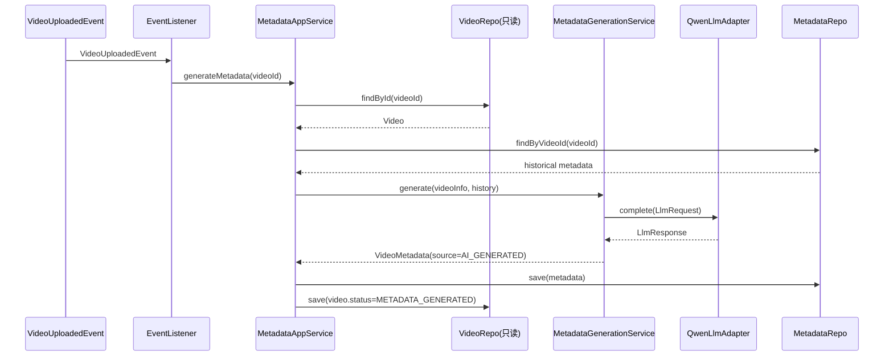
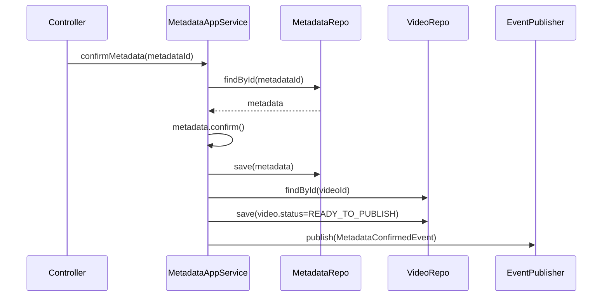

# 限界上下文：Metadata（元数据）

> 依赖文档：[01-project-scaffolding.md](./01-project-scaffolding.md)、[02-shared-kernel.md](./02-shared-kernel.md)
> 上游事件：`VideoUploadedEvent`（来自 [03-context-video.md](./03-context-video.md)）
> 下游事件：`MetadataConfirmedEvent`（发往 [05-context-distribution.md](./05-context-distribution.md)）
> API 端点：C1-C5（参见 api.md §C）
> 需求映射：需求 2（2.1-2.7）、需求 3（3.1-3.6）
> 包路径：`com.grace.platform.metadata`
> 设计模式：Adapter（LLM 集成）

---

## A. 上下文概览

Metadata 上下文负责：
1. 监听 `VideoUploadedEvent`，自动调用阿里云 LLM 生成视频元数据（标题/描述/标签）
2. 提供用户编辑、重新生成、确认元数据的能力
3. 确认后发布 `MetadataConfirmedEvent`，通知 Distribution 上下文视频已就绪

```mermaid
graph LR
    VE((VideoUploadedEvent)) -->|@EventListener| MAS[MetadataAppService]
    MAS -->|调用| MGS[MetadataGenerationService]
    MGS -->|delegate| LLM[LlmService / QwenAdapter]
    MAS -->|confirmMetadata| MCE((MetadataConfirmedEvent))
    MCE --> DC[Distribution Context]
```

**包结构清单：**

| 层 | 包路径 | 类 |
|----|-------|-----|
| interfaces | `metadata.interfaces` | `MetadataController` |
| interfaces | `metadata.interfaces.dto.request` | `GenerateMetadataRequest`, `UpdateMetadataRequest` |
| interfaces | `metadata.interfaces.dto.response` | `VideoMetadataResponse` |
| application | `metadata.application` | `MetadataApplicationService` |
| application | `metadata.application.command` | `UpdateMetadataCommand` |
| application | `metadata.application.dto` | `VideoMetadataDTO` |
| application | `metadata.application.listener` | `VideoUploadedEventListener` |
| domain | `metadata.domain` | `VideoMetadata`, `MetadataSource`, `MetadataGenerationService`, `VideoMetadataRepository` |
| domain | `metadata.domain.event` | `MetadataConfirmedEvent` |
| infrastructure | `metadata.infrastructure.llm` | `LlmService`, `LlmRequest`, `LlmResponse`, `QwenLlmServiceAdapter`, `MetadataGenerationServiceImpl` |
| infrastructure | `metadata.infrastructure.persistence` | `VideoMetadataMapper`, `VideoMetadataRepositoryImpl` |

---

## B. 领域模型

### B.1 聚合根：VideoMetadata

| 字段 | 类型 | 约束 | 说明 |
|------|------|------|------|
| `id` | `MetadataId` | PK, 非空 | 元数据唯一标识 |
| `videoId` | `VideoId` | 非空, FK | 关联视频 ID |
| `title` | `String` | 非空, ≤ 100 字符 | 视频标题 |
| `description` | `String` | ≤ 5000 字符 | 视频描述 |
| `tags` | `List<String>` | 5-15 个 | 标签列表 |
| `source` | `MetadataSource` | 非空 | 来源：AI_GENERATED / MANUAL / AI_EDITED |
| `confirmed` | `boolean` | — | 是否已确认（确认后不可再编辑） |
| `createdAt` | `LocalDateTime` | 非空 | 创建时间 |
| `updatedAt` | `LocalDateTime` | 非空 | 更新时间 |

**领域方法：**

```java
public class VideoMetadata {
    public void validate() {
        if (title == null || title.isBlank() || title.length() > 100)
            throw new BusinessRuleViolationException(ErrorCode.INVALID_METADATA, "标题不能为空且不超过100字符");
        if (description != null && description.length() > 5000)
            throw new BusinessRuleViolationException(ErrorCode.INVALID_METADATA, "描述不超过5000字符");
        if (tags == null || tags.size() < 5 || tags.size() > 15)
            throw new BusinessRuleViolationException(ErrorCode.INVALID_METADATA, "标签数量需在5-15之间");
    }

    public void update(String title, String description, List<String> tags) {
        if (this.confirmed)
            throw new BusinessRuleViolationException(ErrorCode.METADATA_ALREADY_CONFIRMED, "已确认的元数据不可再编辑");
        if (title != null) this.title = title;
        if (description != null) this.description = description;
        if (tags != null) this.tags = tags;
        this.source = (this.source == MetadataSource.AI_GENERATED) ? MetadataSource.AI_EDITED : this.source;
        this.updatedAt = LocalDateTime.now();
        validate();
    }

    public void confirm() {
        if (this.confirmed)
            throw new BusinessRuleViolationException(ErrorCode.METADATA_ALREADY_CONFIRMED, "元数据已被确认");
        validate();
        this.confirmed = true;
        this.updatedAt = LocalDateTime.now();
    }
}
```

### B.2 枚举

```java
public enum MetadataSource { AI_GENERATED, MANUAL, AI_EDITED }
```

### B.3 领域不变量

| 不变量 | 条件 | 错误码 |
|-------|------|--------|
| 标题非空且 ≤ 100 字符 | `title != null && title.length() <= 100` | 2001 |
| 描述 ≤ 5000 字符 | `description == null || description.length() <= 5000` | 2001 |
| 标签 5-15 个 | `5 <= tags.size() <= 15` | 2001 |
| 已确认不可编辑 | `confirmed == false` | 2003 |

---

## C. 领域服务与领域事件

### C.1 MetadataGenerationService 领域服务接口

```java
package com.grace.platform.metadata.domain;

import com.grace.platform.video.domain.VideoFileInfo;
import java.util.List;

public interface MetadataGenerationService {
    VideoMetadata generate(VideoFileInfo videoInfo, List<VideoMetadata> historicalMetadata);
}
```

定义在 domain 层，由 infrastructure 层的 `MetadataGenerationServiceImpl` 实现（内部调用 `LlmService`）。

### C.2 VideoUploadedEvent 监听器

```java
package com.grace.platform.metadata.application.listener;

import com.grace.platform.video.domain.event.VideoUploadedEvent;
import org.springframework.context.event.EventListener;
import org.springframework.stereotype.Component;

@Component
public class VideoUploadedEventListener {
    private final MetadataApplicationService metadataApplicationService;

    @EventListener
    public void handle(VideoUploadedEvent event) {
        metadataApplicationService.generateMetadata(event.getVideoId());
    }
}
```

### C.3 MetadataConfirmedEvent

```java
package com.grace.platform.metadata.domain.event;

import com.grace.platform.shared.domain.DomainEvent;
import com.grace.platform.shared.domain.id.MetadataId;
import com.grace.platform.shared.domain.id.VideoId;

public class MetadataConfirmedEvent extends DomainEvent {
    private final VideoId videoId;
    private final MetadataId metadataId;
    // constructor + getters
}
```

| 字段 | 类型 | 说明 |
|------|------|------|
| `videoId` | `VideoId` | 视频 ID |
| `metadataId` | `MetadataId` | 元数据 ID |

**发布时机**：`MetadataApplicationService.confirmMetadata()` 成功后。

---

## D. 仓储接口

### D.1 VideoMetadataRepository

```java
package com.grace.platform.metadata.domain;

import com.grace.platform.shared.domain.id.MetadataId;
import com.grace.platform.shared.domain.id.VideoId;
import java.util.List;
import java.util.Optional;

public interface VideoMetadataRepository {
    VideoMetadata save(VideoMetadata metadata);
    Optional<VideoMetadata> findById(MetadataId id);
    Optional<VideoMetadata> findLatestByVideoId(VideoId videoId);
    List<VideoMetadata> findByVideoId(VideoId videoId);
}
```

| 方法 | 说明 |
|------|------|
| `save` | 新增或更新 |
| `findById` | 按 ID 查询 |
| `findLatestByVideoId` | 按 videoId 查询最新元数据（C5） |
| `findByVideoId` | 按 videoId 查询全部历史（用于 LLM 生成时参考风格） |

---

## E. 应用层服务

### E.1 MetadataApplicationService

| 方法 | 参数 | 返回值 | 对应端点 | 编排逻辑 |
|------|------|--------|---------|---------|
| `generateMetadata` | `VideoId` | `VideoMetadataDTO` | C1 | 查 Video → 查历史元数据 → 调 MetadataGenerationService → 保存 → 更新 Video 状态为 METADATA_GENERATED |
| `updateMetadata` | id, command | `VideoMetadataDTO` | C2 | 查 Metadata → 调 update() → 保存 |
| `regenerateMetadata` | `MetadataId` | `VideoMetadataDTO` | C3 | 查 Metadata → 校验未确认 → 重新调 LLM → 覆盖保存 |
| `confirmMetadata` | `MetadataId` | `VideoMetadataDTO` | C4 | 查 Metadata → 调 confirm() → 更新 Video 状态为 READY_TO_PUBLISH → 发布 MetadataConfirmedEvent |
| `getMetadataByVideoId` | `VideoId` | `VideoMetadataDTO` | C5 | 查最新元数据 |

### E.2 generateMetadata 编排流程



### E.3 confirmMetadata 编排流程



---

## F. REST 控制器

### F.1 MetadataController 端点映射

| HTTP 方法 | 路径 | 方法名 | api.md 编号 |
|----------|------|--------|------------|
| POST | `/api/metadata/generate` | `generateMetadata` | C1 |
| PUT | `/api/metadata/{id}` | `updateMetadata` | C2 |
| POST | `/api/metadata/{id}/regenerate` | `regenerateMetadata` | C3 |
| POST | `/api/metadata/{id}/confirm` | `confirmMetadata` | C4 |
| GET | `/api/metadata/video/{videoId}` | `getMetadataByVideoId` | C5 |

### F.2 Request/Response DTO

**GenerateMetadataRequest (C1)：**

| 字段 | 类型 | 必填 | 说明 |
|------|------|------|------|
| `videoId` | String | 是 | 视频 ID |

**UpdateMetadataRequest (C2)：**

| 字段 | 类型 | 必填 | 说明 |
|------|------|------|------|
| `title` | String | 否 | 新标题 ≤ 100 字符 |
| `description` | String | 否 | 新描述 ≤ 5000 字符 |
| `tags` | List\<String\> | 否 | 新标签 5-15 个 |

**VideoMetadataResponse (C1-C5 通用)：**

| 字段 | 类型 | 说明 |
|------|------|------|
| `metadataId` | String | 元数据 ID |
| `videoId` | String | 视频 ID |
| `title` | String | 标题 |
| `description` | String | 描述 |
| `tags` | List\<String\> | 标签 |
| `source` | String | `AI_GENERATED` / `MANUAL` / `AI_EDITED` |
| `createdAt` | String | ISO 8601 |
| `updatedAt` | String | ISO 8601 |

---

## G. 基础设施层实现

### G.1 LLM Adapter（Adapter 模式）

#### G.1.1 LlmService 通用接口

```java
package com.grace.platform.metadata.infrastructure.llm;

public interface LlmService {
    LlmResponse complete(LlmRequest request);
}

public record LlmRequest(
    String model,
    String systemPrompt,
    String userPrompt,
    double temperature,
    int maxTokens
) {}

public record LlmResponse(
    String content,
    int promptTokens,
    int completionTokens
) {}
```

`LlmService` 接口定义在 infrastructure 层（因为它本身就是外部服务的抽象），可被 Metadata 和 Promotion 两个上下文共用。

#### G.1.2 QwenLlmServiceAdapter（阿里云通义千问实现）

```java
package com.grace.platform.metadata.infrastructure.llm;

@Component
public class QwenLlmServiceAdapter implements LlmService {
    // 注入 grace.llm.* 配置
    // 调用阿里云 DashScope SDK
    // 实现指数退避重试（1s, 2s, 4s，最多3次）

    @Override
    public LlmResponse complete(LlmRequest request) {
        // 1. 构建 DashScope API 请求
        // 2. 调用 API
        // 3. 失败时重试（指数退避）
        // 4. 最终失败抛出 ExternalServiceException(ErrorCode.LLM_SERVICE_UNAVAILABLE)
        // 5. 成功时映射为 LlmResponse
    }
}
```

#### G.1.3 MetadataGenerationServiceImpl

```java
package com.grace.platform.metadata.infrastructure.llm;

@Component
public class MetadataGenerationServiceImpl implements MetadataGenerationService {
    private final LlmService llmService;

    @Override
    public VideoMetadata generate(VideoFileInfo videoInfo, List<VideoMetadata> history) {
        // 1. 构建 systemPrompt（角色设定：美食视频元数据生成专家）
        // 2. 构建 userPrompt（包含文件名、历史元数据风格样例）
        // 3. 调用 llmService.complete()
        // 4. 解析 LLM 返回的 JSON（title, description, tags）
        // 5. 构建 VideoMetadata(source=AI_GENERATED)
        // 6. 调用 validate() 确保字段约束
    }
}
```

**Prompt 模板：**

| 类型 | 内容 |
|------|------|
| System Prompt | "你是一位专业的美食视频内容运营专家。根据提供的视频文件信息和用户历史风格，生成适合 YouTube 发布的视频元数据。" |
| User Prompt 模板 | "视频文件名：{fileName}\n历史标题风格参考：{historySample}\n\n请生成 JSON 格式的元数据：{\"title\": \"...(≤100字符)\", \"description\": \"...(≤5000字符)\", \"tags\": [\"标签1\", ...(5-15个)]}" |
| Temperature | 0.7 |
| Max Tokens | 2048 |

**LLM 响应解析：**

LLM 返回 JSON 字符串，解析映射关系：

| LLM JSON 字段 | VideoMetadata 字段 |
|--------------|-------------------|
| `title` | `title` |
| `description` | `description` |
| `tags` (array) | `tags` |

### G.2 MyBatis Mapper 与数据库列映射

**VideoMetadataMapper：**

| 数据库列 | 类型 | 领域字段 | 说明 |
|---------|------|---------|------|
| `id` | `VARCHAR(64)` PK | `MetadataId` | TypeHandler 自动转换 |
| `video_id` | `VARCHAR(64)` FK | `VideoId` | TypeHandler 自动转换 |
| `title` | `VARCHAR(200)` | `title` | |
| `description` | `TEXT` | `description` | |
| `tags_json` | `TEXT` | `tags`（JSON 数组序列化） | 自定义 JsonStringListTypeHandler |
| `source` | `VARCHAR(20)` | `MetadataSource` 枚举名 | EnumTypeHandler |
| `confirmed` | `BOOLEAN` | `confirmed` | |
| `created_at` | `TIMESTAMP` | `createdAt` | |
| `updated_at` | `TIMESTAMP` | `updatedAt` | |

`tags` 字段在数据库中以 JSON 字符串存储（`["标签1", "标签2", ...]`），通过自定义 `JsonStringListTypeHandler` 在 MyBatis ResultMap 中进行序列化/反序列化。

```java
@Mapper
public interface VideoMetadataMapper {
    VideoMetadata findById(@Param("id") String id);
    VideoMetadata findByVideoId(@Param("videoId") String videoId);
    void insert(VideoMetadata metadata);
    void update(VideoMetadata metadata);
}
```

**XML 映射文件路径：** `src/main/resources/mapper/metadata/VideoMetadataMapper.xml`

---

## H. 错误处理

| 错误码 | HTTP Status | 异常类 | 触发条件 | 对应需求 |
|--------|-------------|--------|---------|---------|
| 2001 | 400 | `BusinessRuleViolationException` | 元数据字段约束校验失败 | 2.2-2.5 |
| 2002 | 404 | `EntityNotFoundException` | 元数据 ID 不存在 | — |
| 2003 | 409 | `BusinessRuleViolationException` | 已确认元数据不可再编辑 | 3.5 |
| 2004 | 400 | `BusinessRuleViolationException` | 视频尚未上传完成 | — |
| 9001 | 503 | `ExternalServiceException` | 阿里云 LLM 调用失败 | 2.6 |

**LLM 降级策略：**
1. 调用 LLM 失败时自动重试 3 次（指数退避：1s, 2s, 4s）
2. 3 次均失败后，抛出 `ExternalServiceException(9001)`
3. 前端收到 9001 后引导用户手动填写元数据

---

## I. 数据库 Schema

```sql
CREATE TABLE video_metadata (
    id          VARCHAR(64)   PRIMARY KEY,
    video_id    VARCHAR(64)   NOT NULL,
    title       VARCHAR(200)  NOT NULL,
    description TEXT,
    tags_json   TEXT          NOT NULL,
    source      VARCHAR(20)   NOT NULL DEFAULT 'AI_GENERATED',
    confirmed   BOOLEAN       NOT NULL DEFAULT FALSE,
    created_at  TIMESTAMP     NOT NULL DEFAULT CURRENT_TIMESTAMP,
    updated_at  TIMESTAMP     NOT NULL DEFAULT CURRENT_TIMESTAMP ON UPDATE CURRENT_TIMESTAMP,

    INDEX idx_metadata_video_id (video_id),
    CONSTRAINT fk_metadata_video FOREIGN KEY (video_id) REFERENCES video(id)
) ENGINE=InnoDB DEFAULT CHARSET=utf8mb4 COLLATE=utf8mb4_unicode_ci;
```
