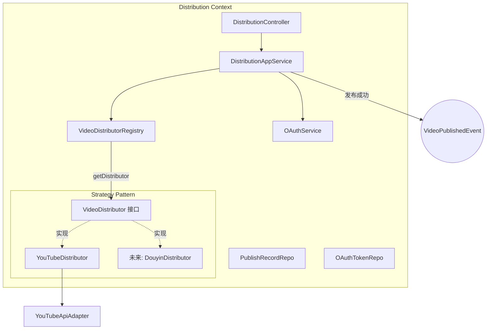
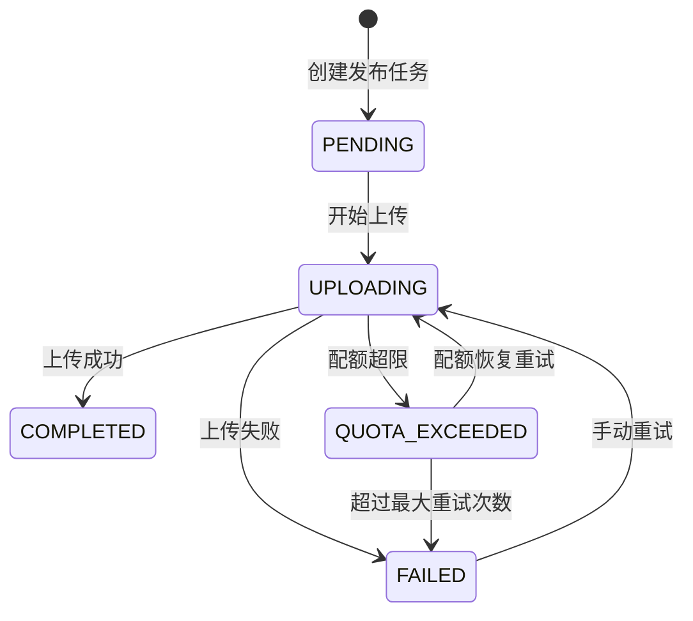
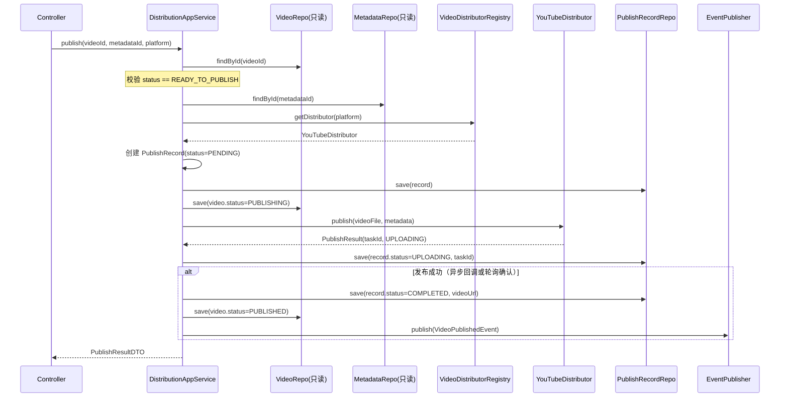
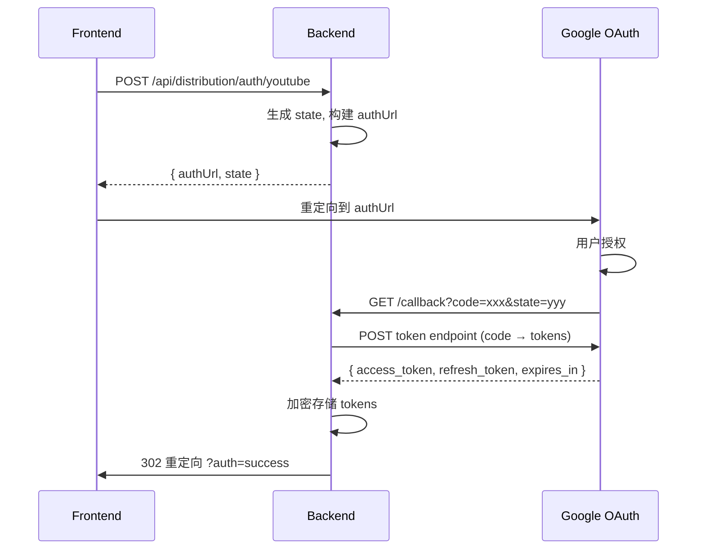

# 限界上下文：Distribution（分发）

> 依赖文档：[01-project-scaffolding.md](./01-project-scaffolding.md)、[02-shared-kernel.md](./02-shared-kernel.md)
> 上游事件：`MetadataConfirmedEvent`（来自 [04-context-metadata.md](./04-context-metadata.md)）
> 下游事件：`VideoPublishedEvent`（发往 [06-context-promotion.md](./06-context-promotion.md)）
> API 端点：D1-D6（参见 api.md §D）
> 需求映射：需求 4（4.1-4.7）、需求 8（8.1-8.7）
> 包路径：`com.grace.platform.distribution`
> 设计模式：**Strategy + Registry + Adapter + Template Method**

**本文档是设计模式最密集的上下文，Strategy + Registry 模式是平台可扩展架构的核心。**

---

## A. 上下文概览

Distribution 上下文负责：
1. 通过 Strategy + Registry 模式实现平台无关的视频发布
2. YouTube OAuth 2.0 授权管理
3. 发布状态跟踪与断点续传
4. 配额超限自动重试
5. 发布成功后发布 `VideoPublishedEvent`



**包结构清单：**

| 层 | 包路径 | 类 |
|----|-------|-----|
| interfaces | `distribution.interfaces` | `DistributionController` |
| interfaces | `distribution.interfaces.dto.request` | `PublishRequest`, `AuthRequest` |
| interfaces | `distribution.interfaces.dto.response` | `PublishResultResponse`, `UploadStatusResponse`, `PlatformInfoResponse`, `AuthUrlResponse` |
| application | `distribution.application` | `DistributionApplicationService` |
| application | `distribution.application.command` | `PublishCommand` |
| application | `distribution.application.dto` | `PublishResultDTO`, `UploadStatusDTO`, `PlatformInfoDTO` |
| application | `distribution.application.listener` | `MetadataConfirmedEventListener` |
| application | `distribution.application.scheduler` | `QuotaRetryScheduler` |
| domain | `distribution.domain` | `PublishRecord`, `OAuthToken`, `PublishStatus`, `PublishResult`, `UploadStatus` |
| domain | `distribution.domain` | `VideoDistributor`, `ResumableVideoDistributor`, `VideoDistributorRegistry` |
| domain | `distribution.domain` | `OAuthService`, `PublishRecordRepository`, `OAuthTokenRepository` |
| domain | `distribution.domain.event` | `VideoPublishedEvent` |
| infrastructure | `distribution.infrastructure.youtube` | `YouTubeDistributor`, `YouTubeApiAdapter`, `YouTubeOAuthServiceImpl` |
| infrastructure | `distribution.infrastructure.persistence` | `PublishRecordMapper`, `OAuthTokenMapper`, `*RepositoryImpl` |

---

## B. 领域模型

### B.1 聚合根：PublishRecord

| 字段 | 类型 | 约束 | 说明 |
|------|------|------|------|
| `id` | `PublishRecordId` | PK, 非空 | 发布记录 ID |
| `videoId` | `VideoId` | 非空 | 视频 ID |
| `metadataId` | `MetadataId` | 非空 | 使用的元数据版本 |
| `platform` | `String` | 非空 | 平台标识（如 `"youtube"`） |
| `status` | `PublishStatus` | 非空 | 发布状态 |
| `videoUrl` | `String` | 可空 | 发布后视频链接 |
| `uploadTaskId` | `String` | 可空 | 平台上传任务 ID |
| `progressPercent` | `int` | 0-100 | 上传进度百分比 |
| `errorMessage` | `String` | 可空 | 错误信息 |
| `retryCount` | `int` | ≥ 0 | 配额超限重试次数 |
| `publishedAt` | `LocalDateTime` | 可空 | 发布完成时间 |
| `createdAt` | `LocalDateTime` | 非空 | 创建时间 |

**PublishStatus 状态机：**



### B.2 实体：OAuthToken

| 字段 | 类型 | 约束 | 说明 |
|------|------|------|------|
| `id` | `OAuthTokenId` | PK, 非空 | Token ID |
| `platform` | `String` | 非空, UNIQUE | 平台标识 |
| `accessToken` | `String` | 非空 | 加密存储（AES-256-GCM） |
| `refreshToken` | `String` | 非空 | 加密存储（AES-256-GCM） |
| `expiresAt` | `LocalDateTime` | 非空 | Token 过期时间 |
| `createdAt` | `LocalDateTime` | 非空 | 创建时间 |
| `updatedAt` | `LocalDateTime` | 非空 | 更新时间 |

```java
public boolean isExpired() {
    return LocalDateTime.now().isAfter(expiresAt);
}
```

### B.3 枚举

```java
public enum PublishStatus {
    PENDING, UPLOADING, COMPLETED, FAILED, QUOTA_EXCEEDED
}
```

---

## C. 领域服务与领域事件 + 设计模式

### C.1 设计模式详解：Strategy + Registry

#### C.1.1 VideoDistributor 策略接口（Strategy Pattern）

```java
package com.grace.platform.distribution.domain;

public interface VideoDistributor {
    /** 返回平台标识，如 "youtube" */
    String platform();

    /** 发布视频到平台，返回发布结果 */
    PublishResult publish(VideoFile videoFile, VideoMetadata metadata);

    /** 查询上传状态 */
    UploadStatus getUploadStatus(String taskId);
}
```

每个视频平台实现此接口。接口定义在 **domain 层**，实现在 **infrastructure 层**。

#### C.1.2 ResumableVideoDistributor 扩展接口

```java
package com.grace.platform.distribution.domain;

public interface ResumableVideoDistributor extends VideoDistributor {
    /** 从中断位置恢复上传 */
    PublishResult resumeUpload(String taskId);
}
```

支持断点续传的平台实现此扩展接口（YouTube 支持）。

#### C.1.3 VideoDistributorRegistry（Registry Pattern）

```java
package com.grace.platform.distribution.domain;

import java.util.List;
import java.util.Map;
import java.util.function.Function;
import java.util.stream.Collectors;

public class VideoDistributorRegistry {
    private final Map<String, VideoDistributor> distributors;

    /**
     * Spring 自动装配：所有 @Component 标注的 VideoDistributor 实现
     * 自动注入为 List，构造器转为 Map<platform, distributor>
     */
    public VideoDistributorRegistry(List<VideoDistributor> distributorList) {
        this.distributors = distributorList.stream()
                .collect(Collectors.toMap(VideoDistributor::platform, Function.identity()));
    }

    public VideoDistributor getDistributor(String platform) {
        VideoDistributor distributor = distributors.get(platform);
        if (distributor == null) {
            throw new BusinessRuleViolationException(
                ErrorCode.UNSUPPORTED_PLATFORM,
                "不支持的分发平台: " + platform + "。支持的平台: " + distributors.keySet()
            );
        }
        return distributor;
    }

    public List<PlatformInfo> listPlatforms() {
        return distributors.values().stream()
                .map(d -> new PlatformInfo(d.platform(), d.displayName(), d.isEnabled()))
                .toList();
    }
}
```

**Registry 行为表：**

| 方法 | 参数 | 返回值 | 异常 |
|------|------|--------|------|
| `getDistributor` | `String platform` | `VideoDistributor` | `BusinessRuleViolationException(3001)` 当平台未注册 |
| `listPlatforms` | — | `List<PlatformInfo>` | 无 |

**Registry 注册为 Spring Bean：**

```java
@Configuration
public class DistributionConfig {
    @Bean
    public VideoDistributorRegistry videoDistributorRegistry(List<VideoDistributor> distributors) {
        return new VideoDistributorRegistry(distributors);
    }
}
```

#### C.1.4 扩展指南：新增视频平台

新增平台（如抖音）只需 3 步，无需修改任何已有代码：

1. 创建 `DouyinDistributor implements VideoDistributor`
2. 添加 `@Component` 注解
3. 实现 `platform()` 返回 `"douyin"`，实现 `publish()` 和 `getUploadStatus()`

Spring 自动装配机制会将新实现注入 `VideoDistributorRegistry` 的构造器参数 `List<VideoDistributor>`。**Controller、ApplicationService、Registry 代码无需修改**，实现开闭原则。

### C.2 Template Method 模式（可选增强）

```java
package com.grace.platform.distribution.domain;

public abstract class AbstractVideoDistributor implements VideoDistributor {

    /** 模板方法：定义发布流程骨架 */
    @Override
    public final PublishResult publish(VideoFile videoFile, VideoMetadata metadata) {
        validateToken();           // Step 1: 校验 OAuth Token
        String taskId = doUpload(videoFile, metadata);  // Step 2: 平台特定上传
        return buildResult(taskId);  // Step 3: 构建结果
    }

    protected abstract void validateToken();
    protected abstract String doUpload(VideoFile videoFile, VideoMetadata metadata);

    private PublishResult buildResult(String taskId) {
        return new PublishResult(taskId, PublishStatus.UPLOADING);
    }
}
```

子类只需实现 `validateToken()` 和 `doUpload()`，流程骨架由基类控制。

### C.3 OAuthService 领域服务接口

```java
package com.grace.platform.distribution.domain;

public interface OAuthService {
    /** 生成 OAuth 授权 URL */
    AuthorizationUrl initiateAuth(String platform, String redirectUri);

    /** 处理 OAuth 回调，交换 Token 并加密存储 */
    void handleCallback(String platform, String code, String state);

    /** 获取有效 Token（自动刷新过期 Token） */
    OAuthToken getValidToken(String platform);
}
```

### C.4 VideoPublishedEvent

```java
package com.grace.platform.distribution.domain.event;

public class VideoPublishedEvent extends DomainEvent {
    private final VideoId videoId;
    private final String platform;
    private final String videoUrl;
    // constructor + getters
}
```

| 字段 | 类型 | 说明 |
|------|------|------|
| `videoId` | `VideoId` | 视频 ID |
| `platform` | `String` | 平台标识 |
| `videoUrl` | `String` | 发布后的视频链接 |

**发布时机**：`publish` 操作确认成功后。

---

## D. 仓储接口

### D.1 PublishRecordRepository

| 方法 | 参数 | 返回值 | 说明 |
|------|------|--------|------|
| `save` | `PublishRecord` | `PublishRecord` | 新增或更新 |
| `findById` | `PublishRecordId` | `Optional<PublishRecord>` | 按 ID 查询 |
| `findByVideoId` | `VideoId` | `List<PublishRecord>` | 按视频查全部发布记录（D6） |
| `findByUploadTaskId` | `String` | `Optional<PublishRecord>` | 按任务 ID 查询（D2） |
| `findByStatus` | `PublishStatus` | `List<PublishRecord>` | 按状态查询（定时重试用） |
| `countGroupByStatus` | — | `Map<PublishStatus, Long>` | 状态分布计数（Dashboard） |

### D.2 OAuthTokenRepository

| 方法 | 参数 | 返回值 | 说明 |
|------|------|--------|------|
| `save` | `OAuthToken` | `OAuthToken` | 新增或更新 |
| `findByPlatform` | `String` | `Optional<OAuthToken>` | 按平台查询 |
| `deleteByPlatform` | `String` | `void` | 断开连接时删除 |
| `findAll` | — | `List<OAuthToken>` | 已连接账户列表（Settings） |

---

## E. 应用层服务

### E.1 DistributionApplicationService

| 方法 | 参数 | 返回值 | 对应端点 | 编排逻辑 |
|------|------|--------|---------|---------|
| `publish` | `PublishCommand` | `PublishResultDTO` | D1 | 校验视频状态 → Registry 获取 Distributor → 创建 PublishRecord → 调 distributor.publish() → 更新记录 → 发布事件 |
| `getUploadStatus` | taskId | `UploadStatusDTO` | D2 | 查 PublishRecord → 调 distributor.getUploadStatus() → 更新进度 |
| `initiateAuth` | platform, redirectUri | `AuthUrlDTO` | D3 | 委托 OAuthService |
| `handleAuthCallback` | platform, code, state | void | D4 | 委托 OAuthService |
| `listPlatforms` | — | `List<PlatformInfoDTO>` | D5 | Registry.listPlatforms() + 查 OAuthToken 补充授权状态 |
| `getPublishRecords` | videoId | `List<PublishRecordDTO>` | D6 | 委托 Repository |

### E.2 publish 编排流程



### E.3 定时任务：配额超限重试

```java
package com.grace.platform.distribution.application.scheduler;

@Component
public class QuotaRetryScheduler {
    private final PublishRecordRepository publishRecordRepository;
    private final VideoDistributorRegistry distributorRegistry;

    @Scheduled(fixedDelayString = "${grace.scheduler.quota-retry.fixed-delay}")
    public void retryQuotaExceededTasks() {
        // 1. 查询所有 QUOTA_EXCEEDED 状态的 PublishRecord
        // 2. 过滤 retryCount < maxRetries (5次)
        // 3. 对每条记录：获取 Distributor → 尝试恢复上传
        // 4. 成功 → 更新状态为 COMPLETED
        // 5. 仍超限 → retryCount++
        // 6. retryCount >= maxRetries → 状态改为 FAILED
    }
}
```

**重试策略：**

| 参数 | 值 | 说明 |
|------|---|------|
| 扫描间隔 | 30 分钟 | `@Scheduled(fixedDelay)` 上一次完成后再计时 |
| 最大重试 | 5 次 | 超过后标记 FAILED |
| 并发控制 | `fixedDelay` | 确保上一轮完成后再开始 |

---

## F. REST 控制器

### F.1 DistributionController 端点映射

| HTTP 方法 | 路径 | 方法名 | api.md 编号 |
|----------|------|--------|------------|
| POST | `/api/distribution/publish` | `publish` | D1 |
| GET | `/api/distribution/status/{taskId}` | `getUploadStatus` | D2 |
| POST | `/api/distribution/auth/{platform}` | `initiateAuth` | D3 |
| GET | `/api/distribution/auth/{platform}/callback` | `handleAuthCallback` | D4 |
| GET | `/api/distribution/platforms` | `listPlatforms` | D5 |
| GET | `/api/distribution/records/{videoId}` | `getPublishRecords` | D6 |

### F.2 Request/Response DTO

**PublishRequest (D1)：**

| 字段 | 类型 | 必填 | 说明 |
|------|------|------|------|
| `videoId` | String | 是 | 视频 ID |
| `metadataId` | String | 是 | 元数据 ID |
| `platform` | String | 是 | 平台标识（如 `youtube`） |
| `privacyStatus` | String | 否 | `public`(默认) / `unlisted` / `private` |

**PlatformInfoResponse (D5)：**

| 字段 | 类型 | 说明 |
|------|------|------|
| `platform` | String | 平台标识 |
| `displayName` | String | 显示名称 |
| `authorized` | boolean | 是否已 OAuth 授权 |
| `authExpired` | boolean | 授权是否过期 |
| `enabled` | boolean | 平台是否可用 |

---

## G. 基础设施层实现

### G.1 YouTubeDistributor（Adapter 模式）

```java
package com.grace.platform.distribution.infrastructure.youtube;

@Component
public class YouTubeDistributor implements ResumableVideoDistributor {
    private final YouTubeApiAdapter youTubeApiAdapter;
    private final OAuthService oAuthService;

    @Override
    public String platform() { return "youtube"; }

    @Override
    public PublishResult publish(VideoFile videoFile, VideoMetadata metadata) {
        // 1. 通过 OAuthService 获取有效 Token
        // 2. 调用 YouTubeApiAdapter 上传视频（断点续传协议）
        // 3. 设置标题、描述、标签、隐私状态
        // 4. 返回 PublishResult(taskId, videoUrl)
    }

    @Override
    public UploadStatus getUploadStatus(String taskId) {
        // 查询 YouTube 上传进度
    }

    @Override
    public PublishResult resumeUpload(String taskId) {
        // 从中断位置恢复上传
    }
}
```

### G.2 YouTubeApiAdapter

```java
package com.grace.platform.distribution.infrastructure.youtube;

public interface YouTubeApiAdapter {
    /** 使用断点续传协议上传视频 */
    YouTubeUploadResult uploadVideo(String accessToken, Path videoFile,
                                     String title, String description,
                                     List<String> tags, String privacyStatus);

    /** 查询上传进度 */
    YouTubeUploadProgress getUploadProgress(String accessToken, String uploadUri);

    /** 恢复中断的上传 */
    YouTubeUploadResult resumeUpload(String accessToken, String uploadUri, Path videoFile);
}
```

**YouTube API 配置表：**

| 参数 | 值 | 说明 |
|------|---|------|
| API Scope | `youtube.upload`, `youtube.readonly` | 上传和只读权限 |
| 上传协议 | Resumable Upload | 支持断点续传 |
| 每日配额 | 10,000 units | YouTube API 每日配额 |
| 上传消耗 | 1,600 units/次 | 单次上传配额消耗 |

### G.3 YouTubeOAuthServiceImpl

```java
package com.grace.platform.distribution.infrastructure.youtube;

@Component
public class YouTubeOAuthServiceImpl implements OAuthService {
    private final OAuthTokenRepository tokenRepository;
    private final EncryptionService encryptionService;
    // 注入 grace.youtube.* 配置

    // OAuth 2.0 Authorization Code Flow:
    // 1. initiateAuth: 构建 Google OAuth URL (含 client_id, redirect_uri, scope, state)
    // 2. handleCallback: 用 code 换 access_token + refresh_token → 加密存储
    // 3. getValidToken: 检查过期 → 用 refresh_token 刷新 → 更新存储
}
```

**OAuth 流程：**



### G.4 MyBatis Mapper 与数据库列映射

**PublishRecordMapper：**

| 数据库列 | 类型 | 领域字段 | 说明 |
|---------|------|---------|------|
| `id` | `VARCHAR(64)` PK | `PublishRecordId` | TypeHandler |
| `video_id` | `VARCHAR(64)` | `VideoId` | TypeHandler |
| `metadata_id` | `VARCHAR(64)` | `MetadataId` | TypeHandler |
| `platform` | `VARCHAR(30)` | platform | |
| `status` | `VARCHAR(30)` | `PublishStatus` | EnumTypeHandler |
| `video_url` | `VARCHAR(500)` | videoUrl | |
| `upload_task_id` | `VARCHAR(200)` | uploadTaskId | |
| `progress_percent` | `INT` | progressPercent | |
| `error_message` | `TEXT` | errorMessage | |
| `retry_count` | `INT` | retryCount | |
| `published_at` | `TIMESTAMP` | publishedAt | |
| `created_at` | `TIMESTAMP` | createdAt | |

```java
@Mapper
public interface PublishRecordMapper {
    PublishRecord findById(@Param("id") String id);
    List<PublishRecord> findByVideoId(@Param("videoId") String videoId);
    List<PublishRecord> findByStatus(@Param("status") String status);
    long countByStatus(@Param("status") String status);
    long countByStatusIn(@Param("statuses") List<String> statuses);
    void insert(PublishRecord record);
    void update(PublishRecord record);
}
```

```java
@Mapper
public interface OAuthTokenMapper {
    OAuthToken findById(@Param("id") String id);
    OAuthToken findByPlatform(@Param("platform") String platform);
    List<OAuthToken> findAll();
    void insert(OAuthToken token);
    void update(OAuthToken token);
    void deleteByPlatform(@Param("platform") String platform);
}
```

**OAuthTokenMapper** — `accessToken` 和 `refreshToken` 字段存储加密后的密文。在 RepositoryImpl 中读取时调用 `EncryptionService.decrypt()`，存储时调用 `encrypt()`。

**XML 映射文件路径：** `src/main/resources/mapper/distribution/PublishRecordMapper.xml`、`OAuthTokenMapper.xml`

---

## H. 错误处理

| 错误码 | HTTP Status | 异常类 | 触发条件 | 对应需求 |
|--------|-------------|--------|---------|---------|
| 3001 | 400 | `BusinessRuleViolationException` | 平台未注册 | 4.7 |
| 3002 | 401 | `ExternalServiceException` | OAuth token 过期且刷新失败 | — |
| 3003 | 400 | `BusinessRuleViolationException` | 平台未授权连接 | — |
| 3004 | 429 | `ExternalServiceException` | 平台 API 配额超限 | 4.5 |
| 3005 | 400 | `BusinessRuleViolationException` | 视频状态非 READY_TO_PUBLISH | — |
| 3006 | 404 | `EntityNotFoundException` | 发布任务 ID 不存在 | — |
| 3007 | 502 | `ExternalServiceException` | 平台 API 非预期错误 | 4.4 |

**YouTube API 错误映射：**

| YouTube API 错误 | 平台错误码 | 处理 |
|-----------------|----------|------|
| 401 Unauthorized | 3002 | Token 过期，引导重新授权 |
| 403 quotaExceeded | 3004 | 标记 QUOTA_EXCEEDED，定时重试 |
| 403 forbidden | 3007 | 权限不足 |
| 5xx Server Error | 3007 | YouTube 服务器错误 |

---

## I. 数据库 Schema

### I.1 PUBLISH_RECORD 表

```sql
CREATE TABLE publish_record (
    id              VARCHAR(64)   PRIMARY KEY,
    video_id        VARCHAR(64)   NOT NULL,
    metadata_id     VARCHAR(64)   NOT NULL,
    platform        VARCHAR(30)   NOT NULL,
    status          VARCHAR(30)   NOT NULL DEFAULT 'PENDING',
    video_url       VARCHAR(500),
    upload_task_id  VARCHAR(200),
    progress_percent INT          NOT NULL DEFAULT 0,
    error_message   TEXT,
    retry_count     INT           NOT NULL DEFAULT 0,
    published_at    TIMESTAMP     NULL,
    created_at      TIMESTAMP     NOT NULL DEFAULT CURRENT_TIMESTAMP,

    INDEX idx_pr_video_id (video_id),
    INDEX idx_pr_status (status),
    INDEX idx_pr_upload_task_id (upload_task_id),
    CONSTRAINT fk_pr_video FOREIGN KEY (video_id) REFERENCES video(id),
    CONSTRAINT fk_pr_metadata FOREIGN KEY (metadata_id) REFERENCES video_metadata(id)
) ENGINE=InnoDB DEFAULT CHARSET=utf8mb4 COLLATE=utf8mb4_unicode_ci;
```

### I.2 OAUTH_TOKEN 表

```sql
CREATE TABLE oauth_token (
    id                      VARCHAR(64)   PRIMARY KEY,
    platform                VARCHAR(30)   NOT NULL UNIQUE,
    encrypted_access_token  TEXT          NOT NULL,
    encrypted_refresh_token TEXT          NOT NULL,
    expires_at              TIMESTAMP     NOT NULL,
    created_at              TIMESTAMP     NOT NULL DEFAULT CURRENT_TIMESTAMP,
    updated_at              TIMESTAMP     NOT NULL DEFAULT CURRENT_TIMESTAMP ON UPDATE CURRENT_TIMESTAMP,

    INDEX idx_oauth_platform (platform)
) ENGINE=InnoDB DEFAULT CHARSET=utf8mb4 COLLATE=utf8mb4_unicode_ci;
```
