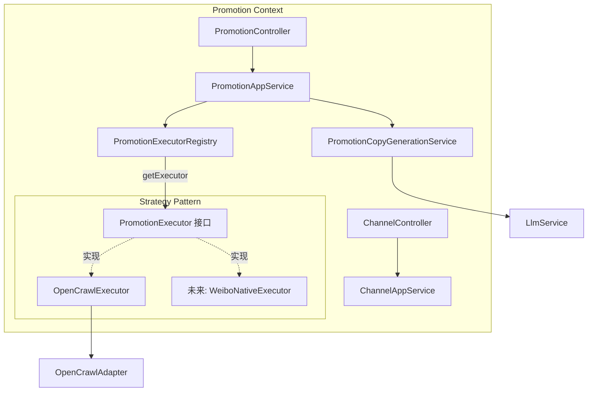
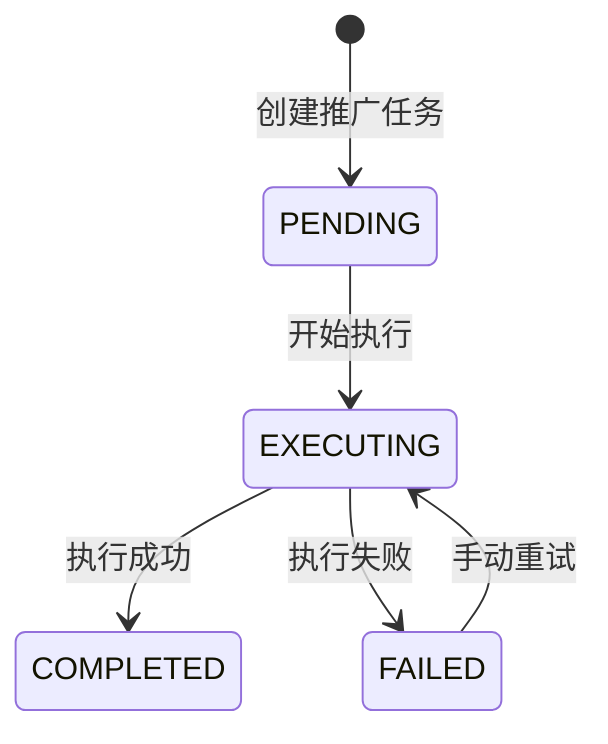
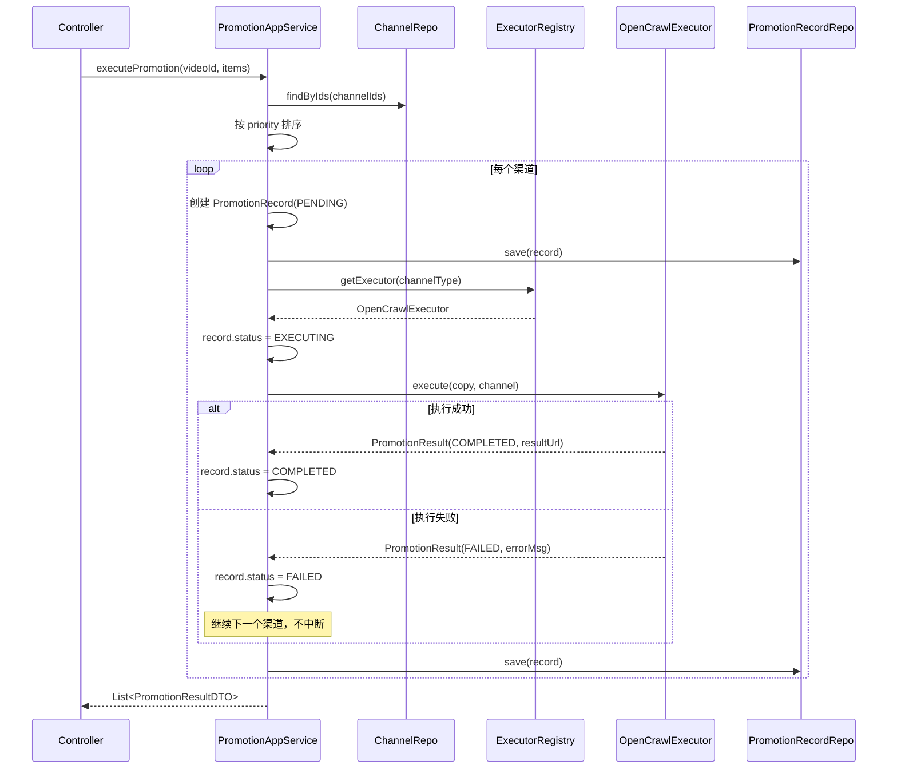

# 限界上下文：Promotion（推广）

> 依赖文档：[01-project-scaffolding.md](./01-project-scaffolding.md)、[02-shared-kernel.md](./02-shared-kernel.md)
> 上游事件：`VideoPublishedEvent`（来自 [05-context-distribution.md](./05-context-distribution.md)）— 可选自动触发
> API 端点：E1-E5（Channel）、F1-F5（Promotion）（参见 api.md §E, §F）
> 需求映射：需求 5（5.1-5.6）、需求 6（6.1-6.5）、需求 7（7.1-7.6）、需求 8（8.6）
> 包路径：`com.grace.platform.promotion`
> 设计模式：**Strategy + Registry + Adapter**（与 Distribution 对称）

---

## A. 上下文概览

Promotion 上下文承担双重职责：
1. **渠道管理**（Channel CRUD）— 管理推广渠道配置，API Key 加密存储
2. **推广执行**（Promotion）— AI 生成推广文案 + 通过 Strategy+Registry 批量执行推广



**包结构清单：**

| 层 | 包路径 | 类 |
|----|-------|-----|
| interfaces | `promotion.interfaces` | `ChannelController`, `PromotionController` |
| interfaces | `promotion.interfaces.dto.request` | `CreateChannelRequest`, `UpdateChannelRequest`, `GenerateCopyRequest`, `ExecutePromotionRequest`, `RetryPromotionRequest` |
| interfaces | `promotion.interfaces.dto.response` | `ChannelResponse`, `PromotionCopyResponse`, `PromotionResultResponse`, `PromotionRecordResponse`, `PromotionReportResponse` |
| application | `promotion.application` | `ChannelApplicationService`, `PromotionApplicationService` |
| application | `promotion.application.command` | `CreateChannelCommand`, `UpdateChannelCommand`, `ExecutePromotionCommand` |
| application | `promotion.application.dto` | `ChannelDTO`, `PromotionCopyDTO`, `PromotionResultDTO`, `PromotionReportDTO` |
| domain | `promotion.domain` | `PromotionChannel`, `PromotionRecord`, `ChannelType`, `ChannelStatus`, `PromotionMethod`, `PromotionStatus` |
| domain | `promotion.domain` | `PromotionExecutor`, `PromotionExecutorRegistry`, `PromotionCopyGenerationService` |
| domain | `promotion.domain` | `PromotionChannelRepository`, `PromotionRecordRepository` |
| domain | `promotion.domain.vo` | `PromotionCopy`, `PromotionReport`, `ChannelExecutionSummary` |
| infrastructure | `promotion.infrastructure.opencrawl` | `OpenCrawlPromotionExecutor`, `OpenCrawlAdapter` |
| infrastructure | `promotion.infrastructure.llm` | `PromotionCopyGenerationServiceImpl` |
| infrastructure | `promotion.infrastructure.persistence` | `PromotionChannelMapper`, `PromotionRecordMapper`, `*RepositoryImpl` |

---

## B. 领域模型

### B.1 聚合根：PromotionChannel

| 字段 | 类型 | 约束 | 说明 |
|------|------|------|------|
| `id` | `ChannelId` | PK, 非空 | 渠道 ID |
| `name` | `String` | 非空 | 渠道名称 |
| `type` | `ChannelType` | 非空 | 渠道类型 |
| `channelUrl` | `String` | 非空 | 渠道 URL |
| `encryptedApiKey` | `String` | 可空 | AES-256-GCM 加密后的 API Key |
| `priority` | `int` | 1-99, 默认 1 | 优先级（越小越高） |
| `status` | `ChannelStatus` | 非空 | ENABLED / DISABLED |
| `createdAt` | `LocalDateTime` | 非空 | 创建时间 |
| `updatedAt` | `LocalDateTime` | 非空 | 更新时间 |

**领域方法：**

```java
public class PromotionChannel {
    public void setApiKey(String rawApiKey, EncryptionService encryptionService) {
        this.encryptedApiKey = encryptionService.encrypt(rawApiKey);
    }

    public String getDecryptedApiKey(EncryptionService encryptionService) {
        return encryptedApiKey == null ? null : encryptionService.decrypt(encryptedApiKey);
    }

    public void enable() { this.status = ChannelStatus.ENABLED; }
    public void disable() { this.status = ChannelStatus.DISABLED; }
    public boolean isEnabled() { return this.status == ChannelStatus.ENABLED; }
}
```

### B.2 聚合根：PromotionRecord

| 字段 | 类型 | 约束 | 说明 |
|------|------|------|------|
| `id` | `PromotionRecordId` | PK, 非空 | 记录 ID |
| `videoId` | `VideoId` | 非空 | 视频 ID |
| `channelId` | `ChannelId` | 非空 | 渠道 ID |
| `promotionCopy` | `String` | 非空 | 推广文案（标题+正文合并） |
| `method` | `PromotionMethod` | 非空 | POST / COMMENT / SHARE |
| `status` | `PromotionStatus` | 非空 | PENDING / EXECUTING / COMPLETED / FAILED |
| `resultUrl` | `String` | 可空 | 推广发布链接 |
| `errorMessage` | `String` | 可空 | 错误信息 |
| `executedAt` | `LocalDateTime` | 可空 | 执行时间 |
| `createdAt` | `LocalDateTime` | 非空 | 创建时间 |

**PromotionStatus 状态机：**



### B.3 值对象

```java
public record PromotionCopy(
    ChannelId channelId,
    String channelName,
    String channelType,
    String promotionTitle,
    String promotionBody,
    PromotionMethod recommendedMethod,
    String methodReason
) {}

public record PromotionReport(
    VideoId videoId,
    String videoTitle,
    int totalChannels,
    int successCount,
    int failedCount,
    int pendingCount,
    double overallSuccessRate,
    List<ChannelExecutionSummary> channelSummaries
) {}

public record ChannelExecutionSummary(
    ChannelId channelId,
    String channelName,
    String channelType,
    PromotionMethod method,
    PromotionStatus status,
    String resultUrl,
    String errorMessage,
    LocalDateTime executedAt
) {}
```

### B.4 枚举

```java
public enum ChannelType { SOCIAL_MEDIA, FORUM, BLOG, OTHER }
public enum ChannelStatus { ENABLED, DISABLED }
public enum PromotionMethod { POST, COMMENT, SHARE }
public enum PromotionStatus { PENDING, EXECUTING, COMPLETED, FAILED }
```

---

## C. 领域服务与领域事件 + 设计模式

### C.1 设计模式详解：Strategy + Registry（与 Distribution 对称）

#### C.1.1 PromotionExecutor 策略接口

```java
package com.grace.platform.promotion.domain;

public interface PromotionExecutor {
    /** 返回渠道类型标识，如 "opencrawl" */
    String channelType();

    /** 执行推广，返回结果 */
    PromotionResult execute(PromotionCopy copy, PromotionChannel channel);
}

public record PromotionResult(
    PromotionStatus status,
    String resultUrl,
    String errorMessage
) {}
```

#### C.1.2 PromotionExecutorRegistry

```java
package com.grace.platform.promotion.domain;

import java.util.List;
import java.util.Map;
import java.util.function.Function;
import java.util.stream.Collectors;

public class PromotionExecutorRegistry {
    private final Map<String, PromotionExecutor> executors;

    public PromotionExecutorRegistry(List<PromotionExecutor> executorList) {
        this.executors = executorList.stream()
                .collect(Collectors.toMap(PromotionExecutor::channelType, Function.identity()));
    }

    public PromotionExecutor getExecutor(String channelType) {
        PromotionExecutor executor = executors.get(channelType);
        if (executor == null) {
            throw new BusinessRuleViolationException(
                ErrorCode.INVALID_CHANNEL_CONFIG,
                "不支持的推广渠道类型: " + channelType
            );
        }
        return executor;
    }
}
```

**注册为 Spring Bean：**

```java
@Configuration
public class PromotionConfig {
    @Bean
    public PromotionExecutorRegistry promotionExecutorRegistry(List<PromotionExecutor> executors) {
        return new PromotionExecutorRegistry(executors);
    }
}
```

#### C.1.3 扩展指南：新增推广方式

与 Distribution 对称，新增推广方式只需 3 步：

1. 创建 `WeiboNativeExecutor implements PromotionExecutor`
2. 添加 `@Component` 注解
3. 实现 `channelType()` 返回 `"weibo_native"`，实现 `execute()`

### C.2 PromotionCopyGenerationService 领域服务接口

```java
package com.grace.platform.promotion.domain;

public interface PromotionCopyGenerationService {
    /** 为指定渠道生成推广文案 */
    PromotionCopy generate(VideoMetadata metadata, PromotionChannel channel, String videoUrl);
}
```

定义在 domain 层，由 infrastructure 层实现（内部调用 `LlmService`）。

### C.3 批量执行策略

推广执行按以下规则：
1. 按渠道 `priority` 升序排序（数值小 = 优先级高）
2. 逐个渠道执行，**单个失败不中断**整体流程
3. 每个渠道执行完毕后立即保存 PromotionRecord
4. 全部完成后汇总生成 PromotionReport

---

## D. 仓储接口

### D.1 PromotionChannelRepository

| 方法 | 参数 | 返回值 | 说明 |
|------|------|--------|------|
| `save` | `PromotionChannel` | `PromotionChannel` | 新增或更新 |
| `findById` | `ChannelId` | `Optional<PromotionChannel>` | 按 ID 查询 |
| `findAll` | — | `List<PromotionChannel>` | 全部渠道 |
| `findByStatus` | `ChannelStatus` | `List<PromotionChannel>` | 按状态筛选 |
| `deleteById` | `ChannelId` | `void` | 删除 |
| `existsPromotionRecordByChannelId` | `ChannelId` | `boolean` | 检查是否有关联推广记录（决定软/硬删除） |

### D.2 PromotionRecordRepository

| 方法 | 参数 | 返回值 | 说明 |
|------|------|--------|------|
| `save` | `PromotionRecord` | `PromotionRecord` | 新增或更新 |
| `findById` | `PromotionRecordId` | `Optional<PromotionRecord>` | 按 ID 查询 |
| `findByVideoId` | videoId, pageable, filters | `Page<PromotionRecord>` | 分页历史（F3） |
| `findByVideoIdForReport` | `VideoId` | `List<PromotionRecord>` | 报告汇总（F4） |
| `getChannelSuccessRates` | dateRange | `List<ChannelSuccessRate>` | Dashboard 渠道成功率 |
| `countDistinctVideosByStatus` | `PromotionStatus` | `long` | Dashboard 推广中计数 |

---

## E. 应用层服务

### E.1 ChannelApplicationService

| 方法 | 参数 | 返回值 | 对应端点 | 编排逻辑 |
|------|------|--------|---------|---------|
| `createChannel` | command | `ChannelDTO` | E1 | 构建 Channel → 加密 API Key → 保存 |
| `updateChannel` | id, command | `ChannelDTO` | E2 | 查 Channel → 更新字段 → 重新加密 API Key（如有） → 保存 |
| `deleteChannel` | id | void | E3 | 查 Channel → 有关联记录则 disable，无则硬删 |
| `listChannels` | filters | `List<ChannelDTO>` | E4 | 委托 Repository |
| `getChannel` | id | `ChannelDTO` | E5 | 委托 Repository |

### E.2 PromotionApplicationService

| 方法 | 参数 | 返回值 | 对应端点 | 编排逻辑 |
|------|------|--------|---------|---------|
| `generateCopy` | videoId, channelIds | `List<PromotionCopyDTO>` | F1 | 查视频+元数据+渠道 → 逐渠道调 LLM 生成文案 |
| `executePromotion` | command | `List<PromotionResultDTO>` | F2 | 排序渠道 → 逐个执行 → 单失败不中断 → 保存记录 |
| `getPromotionHistory` | videoId, filters | `PageDTO<PromotionRecordDTO>` | F3 | 委托 Repository 分页查询 |
| `getPromotionReport` | videoId | `PromotionReportDTO` | F4 | 查全部记录 → 聚合统计 |
| `retryPromotion` | recordId, command | `PromotionResultDTO` | F5 | 查失败记录 → 可选更新文案 → 重新执行 |

### E.3 executePromotion 编排流程



---

## F. REST 控制器

### F.1 ChannelController 端点映射

| HTTP 方法 | 路径 | 方法名 | api.md 编号 |
|----------|------|--------|------------|
| POST | `/api/channels` | `createChannel` | E1 |
| PUT | `/api/channels/{id}` | `updateChannel` | E2 |
| DELETE | `/api/channels/{id}` | `deleteChannel` | E3 |
| GET | `/api/channels` | `listChannels` | E4 |
| GET | `/api/channels/{id}` | `getChannel` | E5 |

### F.2 PromotionController 端点映射

| HTTP 方法 | 路径 | 方法名 | api.md 编号 |
|----------|------|--------|------------|
| POST | `/api/promotions/generate-copy` | `generateCopy` | F1 |
| POST | `/api/promotions/execute` | `executePromotion` | F2 |
| GET | `/api/promotions/history/{videoId}` | `getPromotionHistory` | F3 |
| GET | `/api/promotions/report/{videoId}` | `getPromotionReport` | F4 |
| POST | `/api/promotions/{promotionRecordId}/retry` | `retryPromotion` | F5 |

### F.3 Request/Response DTO

**CreateChannelRequest (E1)：**

| 字段 | 类型 | 必填 | 说明 |
|------|------|------|------|
| `name` | String | 是 | 渠道名称 |
| `type` | String | 是 | `SOCIAL_MEDIA` / `FORUM` / `BLOG` / `OTHER` |
| `channelUrl` | String | 是 | 渠道 URL |
| `apiKey` | String | 否 | API Key 明文 |
| `priority` | int | 否 | 优先级 1-99，默认 1 |

**ChannelResponse (E1-E5)：**

| 字段 | 类型 | 说明 |
|------|------|------|
| `channelId` | String | 渠道 ID |
| `name` | String | 名称 |
| `type` | String | 类型 |
| `channelUrl` | String | URL |
| `hasApiKey` | boolean | 是否有 API Key（不返回明文） |
| `priority` | int | 优先级 |
| `status` | String | ENABLED / DISABLED |
| `createdAt` | String | ISO 8601 |
| `updatedAt` | String | ISO 8601 |

**ExecutePromotionRequest (F2)：**

| 字段 | 类型 | 必填 | 说明 |
|------|------|------|------|
| `videoId` | String | 是 | 视频 ID |
| `promotionItems` | List | 是 | 推广任务列表 |
| `promotionItems[].channelId` | String | 是 | 渠道 ID |
| `promotionItems[].promotionTitle` | String | 是 | 推广标题 |
| `promotionItems[].promotionBody` | String | 是 | 推广正文 |
| `promotionItems[].method` | String | 是 | `POST` / `COMMENT` / `SHARE` |

---

## G. 基础设施层实现

### G.1 OpenCrawlPromotionExecutor（Adapter 模式）

```java
package com.grace.platform.promotion.infrastructure.opencrawl;

@Component
public class OpenCrawlPromotionExecutor implements PromotionExecutor {
    private final OpenCrawlAdapter openCrawlAdapter;

    @Override
    public String channelType() { return "opencrawl"; }

    @Override
    public PromotionResult execute(PromotionCopy copy, PromotionChannel channel) {
        // 1. 从 channel 解密 API Key
        // 2. 构建 OpenCrawl API 请求（渠道 URL + 文案 + 方式）
        // 3. 调用 OpenCrawlAdapter
        // 4. 成功返回 PromotionResult(COMPLETED, resultUrl)
        // 5. 失败抛出 ExternalServiceException(9002) 或返回 FAILED
    }
}
```

### G.2 OpenCrawlAdapter

```java
package com.grace.platform.promotion.infrastructure.opencrawl;

public interface OpenCrawlAdapter {
    OpenCrawlResponse execute(OpenCrawlRequest request);
}
```

### G.3 PromotionCopyGenerationServiceImpl

```java
package com.grace.platform.promotion.infrastructure.llm;

@Component
public class PromotionCopyGenerationServiceImpl implements PromotionCopyGenerationService {
    private final LlmService llmService;  // 复用 Metadata 上下文的 LlmService

    @Override
    public PromotionCopy generate(VideoMetadata metadata, PromotionChannel channel, String videoUrl) {
        // 1. 根据 ChannelType 选择 Prompt 模板
        // 2. 构建包含视频元数据+渠道特征+videoUrl 的 Prompt
        // 3. 调用 LLM
        // 4. 解析返回的 JSON (title, body, method, reason)
        // 5. 构建 PromotionCopy
    }
}
```

**推广文案 Prompt 模板（按渠道类型区分）：**

| ChannelType | Prompt 风格指导 |
|-------------|---------------|
| SOCIAL_MEDIA | "生成简短精炼的社交媒体推广文案，不超过280字符，包含话题标签" |
| FORUM | "生成详细深入的论坛讨论帖，结构化排版，引导互动" |
| BLOG | "生成博客引流文案，包含视频亮点摘要和观看链接" |
| OTHER | "生成通用推广文案，突出视频核心卖点" |

### G.4 MyBatis Mapper 与数据库列映射

**PromotionChannelMapper** — `encryptedApiKey` 直接存储加密后密文。RepositoryImpl 中读取时解密，存储时加密。

**PromotionRecordMapper** — 标准字段映射，`map-underscore-to-camel-case` 自动处理。

```java
@Mapper
public interface PromotionChannelMapper {
    PromotionChannel findById(@Param("id") String id);
    List<PromotionChannel> findAll();
    List<PromotionChannel> findByStatus(@Param("status") String status);
    void insert(PromotionChannel channel);
    void update(PromotionChannel channel);
    void deleteById(@Param("id") String id);
}
```

```java
@Mapper
public interface PromotionRecordMapper {
    PromotionRecord findById(@Param("id") String id);
    List<PromotionRecord> findByVideoId(@Param("videoId") String videoId,
                                         @Param("offset") int offset,
                                         @Param("limit") int limit);
    long countByVideoId(@Param("videoId") String videoId);
    long countDistinctVideoIdByStatus(@Param("status") String status);
    long countByCreatedAtAfter(@Param("since") LocalDateTime since);
    long countByStatusAndCreatedAtAfter(@Param("status") String status,
                                        @Param("since") LocalDateTime since);
    void insert(PromotionRecord record);
    void update(PromotionRecord record);
}
```

**XML 映射文件路径：** `src/main/resources/mapper/promotion/PromotionChannelMapper.xml`、`PromotionRecordMapper.xml`

---

## H. 错误处理

| 错误码 | HTTP Status | 异常类 | 触发条件 | 对应需求 |
|--------|-------------|--------|---------|---------|
| 4001 | 404 | `EntityNotFoundException` | 推广渠道 ID 不存在 | 5.2 |
| 4002 | 400 | `BusinessRuleViolationException` | 渠道配置校验失败 | 5.1 |
| 4003 | 400 | `BusinessRuleViolationException` | 渠道已禁用 | 5.4 |
| 4004 | 404 | `EntityNotFoundException` | 推广记录不存在 | — |
| 9002 | 502 | `ExternalServiceException` | OpenCrawl 执行失败 | 7.4 |
| 9003 | 500 | `EncryptionException` | AES 加解密异常 | — |

---

## I. 数据库 Schema

### I.1 PROMOTION_CHANNEL 表

```sql
CREATE TABLE promotion_channel (
    id              VARCHAR(64)   PRIMARY KEY,
    name            VARCHAR(200)  NOT NULL,
    type            VARCHAR(30)   NOT NULL,
    channel_url     VARCHAR(500)  NOT NULL,
    encrypted_api_key TEXT,
    priority        INT           NOT NULL DEFAULT 1,
    status          VARCHAR(20)   NOT NULL DEFAULT 'ENABLED',
    created_at      TIMESTAMP     NOT NULL DEFAULT CURRENT_TIMESTAMP,
    updated_at      TIMESTAMP     NOT NULL DEFAULT CURRENT_TIMESTAMP ON UPDATE CURRENT_TIMESTAMP,

    INDEX idx_channel_status (status),
    INDEX idx_channel_type (type)
) ENGINE=InnoDB DEFAULT CHARSET=utf8mb4 COLLATE=utf8mb4_unicode_ci;
```

### I.2 PROMOTION_RECORD 表

```sql
CREATE TABLE promotion_record (
    id              VARCHAR(64)   PRIMARY KEY,
    video_id        VARCHAR(64)   NOT NULL,
    channel_id      VARCHAR(64)   NOT NULL,
    promotion_copy  TEXT          NOT NULL,
    method          VARCHAR(20)   NOT NULL,
    status          VARCHAR(20)   NOT NULL DEFAULT 'PENDING',
    result_url      VARCHAR(500),
    error_message   TEXT,
    executed_at     TIMESTAMP     NULL,
    created_at      TIMESTAMP     NOT NULL DEFAULT CURRENT_TIMESTAMP,

    INDEX idx_promo_video_id (video_id),
    INDEX idx_promo_channel_id (channel_id),
    INDEX idx_promo_status (status),
    CONSTRAINT fk_promo_video FOREIGN KEY (video_id) REFERENCES video(id),
    CONSTRAINT fk_promo_channel FOREIGN KEY (channel_id) REFERENCES promotion_channel(id)
) ENGINE=InnoDB DEFAULT CHARSET=utf8mb4 COLLATE=utf8mb4_unicode_ci;
```
