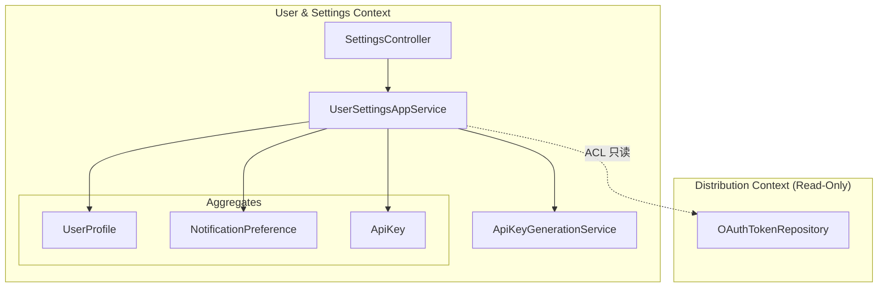

# 限界上下文：User & Settings（用户与设置）

> 依赖文档：[01-project-scaffolding.md](./01-project-scaffolding.md)、[02-shared-kernel.md](./02-shared-kernel.md)
> 跨上下文读取：OAuthToken（来自 [05-context-distribution.md](./05-context-distribution.md)）— 只读查询已连接账户
> API 端点：G1-G10（参见 api.md §G）
> 需求映射：需求 10（10.1-10.8）
> 包路径：`com.grace.platform.usersettings`
> 设计模式：**Value Object + Domain Service + 跨上下文 ACL（Anti-Corruption Layer）**

---

## A. 上下文概览

User & Settings 上下文管理用户个人资料、通知偏好和 API Key 生命周期。MVP 阶段为**单用户模式**（无多租户），所有实体通过固定 ID 关联。

本上下文的核心设计决策：
1. **API Key 安全**：明文密钥仅在创建时返回一次，持久化存储使用 BCrypt 单向哈希（不可逆）
2. **已连接账户**：通过 ACL 只读查询 Distribution 上下文的 OAuthToken，不直接依赖领域模型
3. **头像上传**：复用 Video 上下文的本地文件存储策略，存放在独立目录



**包结构清单：**

| 层 | 包路径 | 类 |
|----|-------|-----|
| domain.model | `usersettings.domain.model` | `UserProfile`, `NotificationPreference`, `ApiKey`, `UserProfileId`, `NotificationPreferenceId`, `ApiKeyId` |
| domain.service | `usersettings.domain.service` | `ApiKeyGenerationService` |
| domain.repository | `usersettings.domain.repository` | `UserProfileRepository`, `NotificationPreferenceRepository`, `ApiKeyRepository` |
| application | `usersettings.application` | `UserSettingsApplicationService` |
| application.dto | `usersettings.application.dto` | `ProfileResponse`, `UpdateProfileRequest`, `NotificationPreferenceResponse`, `UpdateNotificationRequest`, `CreateApiKeyRequest`, `ApiKeyCreatedResponse`, `ApiKeyResponse`, `ConnectedAccountResponse` |
| infrastructure.persistence | `usersettings.infrastructure.persistence` | `UserProfileMapper`, `NotificationPreferenceMapper`, `ApiKeyMapper`, `UserProfileRepositoryImpl`, `NotificationPreferenceRepositoryImpl`, `ApiKeyRepositoryImpl` |
| infrastructure.acl | `usersettings.infrastructure.acl` | `ConnectedAccountQueryService` |
| interfaces.rest | `usersettings.interfaces.rest` | `SettingsController` |

---

## B. 领域模型

### B1. 聚合根：UserProfile

```java
public class UserProfile {
    private UserProfileId id;
    private String displayName;
    private String email;          // nullable
    private String avatarUrl;      // nullable
    private LocalDateTime createdAt;
    private LocalDateTime updatedAt;

    // 工厂方法：创建默认用户（MVP 单用户模式，应用启动时初始化）
    public static UserProfile createDefault(UserProfileId id, String displayName) { ... }

    // 更新资料（部分更新语义）
    public void updateProfile(String displayName, String email) {
        if (displayName != null && !displayName.isBlank()) {
            this.displayName = displayName.trim();
        }
        if (email != null) {
            this.email = email.trim();
        }
        this.updatedAt = LocalDateTime.now();
    }

    // 更新头像 URL
    public void updateAvatar(String avatarUrl) {
        this.avatarUrl = Objects.requireNonNull(avatarUrl);
        this.updatedAt = LocalDateTime.now();
    }
}

public record UserProfileId(String value) {}
```

**领域规则：**

| 规则 | 约束 | 触发时机 |
|------|------|---------|
| displayName 非空 | `!isBlank()` | updateProfile |
| email 格式 | 如果非 null 则需符合基本邮箱格式 | updateProfile |
| avatarUrl 非空 | `requireNonNull` | updateAvatar |

### B2. 聚合根：NotificationPreference

```java
public class NotificationPreference {
    private NotificationPreferenceId id;
    private boolean uploadComplete;       // 上传完成时通知，默认 true
    private boolean promotionSuccess;     // 推广成功时通知，默认 true
    private boolean systemUpdates;        // 系统更新通知，默认 false
    private LocalDateTime updatedAt;

    // 工厂方法：创建默认偏好
    public static NotificationPreference createDefault(NotificationPreferenceId id) {
        // uploadComplete=true, promotionSuccess=true, systemUpdates=false
    }

    // 部分更新（传入 null 表示不修改该字段）
    public void update(Boolean uploadComplete, Boolean promotionSuccess, Boolean systemUpdates) {
        if (uploadComplete != null) this.uploadComplete = uploadComplete;
        if (promotionSuccess != null) this.promotionSuccess = promotionSuccess;
        if (systemUpdates != null) this.systemUpdates = systemUpdates;
        this.updatedAt = LocalDateTime.now();
    }
}

public record NotificationPreferenceId(String value) {}
```

### B3. 聚合根：ApiKey

```java
public class ApiKey {
    private ApiKeyId id;
    private String name;                  // 用途描述
    private String hashedKey;             // BCrypt 哈希存储（不可逆）
    private String prefix;                // 密钥前缀（如 "grc_a1b2...o5p6"），用于识别
    private LocalDateTime expiresAt;
    private LocalDateTime lastUsedAt;     // nullable
    private LocalDateTime createdAt;

    // 工厂方法：由 ApiKeyGenerationService 调用
    // rawKey 为明文密钥，hashedKey 为 BCrypt 哈希后的值
    public static ApiKey create(ApiKeyId id, String name, String hashedKey, 
                                 String prefix, LocalDateTime expiresAt) { ... }

    // 记录最后使用时间
    public void recordUsage() {
        this.lastUsedAt = LocalDateTime.now();
    }

    // 检查是否已过期
    public boolean isExpired() {
        return expiresAt != null && LocalDateTime.now().isAfter(expiresAt);
    }
}

public record ApiKeyId(String value) {}
```

**安全设计要点：**

| 要点 | 说明 |
|------|------|
| 明文仅返回一次 | `ApiKeyGenerationService.generate()` 返回包含 rawKey 的结果对象，持久化后丢弃明文 |
| BCrypt 哈希 | 使用 `ApiKeyHashService`（见 02-shared-kernel.md）进行单向哈希 |
| 前缀识别 | 存储格式 `grc_<前4位>...<后4位>`，用于用户在列表中识别不同 Key |
| 不可逆设计 | 数据库只存 `hashedKey`，无法从哈希值还原明文 |

---

## C. 领域服务

### C1. ApiKeyGenerationService

```java
public interface ApiKeyGenerationService {
    /**
     * 生成新的 API Key
     * @return GeneratedApiKey 包含 rawKey（明文，仅此一次）和 ApiKey 聚合（含哈希值）
     */
    GeneratedApiKey generate(String name, int expiresInDays);
}

// 生成结果值对象
public record GeneratedApiKey(
    String rawKey,          // 明文密钥，仅在创建响应中返回一次
    ApiKey apiKey           // 持久化用的聚合根（含 hashedKey）
) {}
```

### C2. ApiKeyGenerationServiceImpl

```java
@Service
public class ApiKeyGenerationServiceImpl implements ApiKeyGenerationService {
    
    private static final String KEY_PREFIX = "grc_";
    private static final int KEY_LENGTH = 32; // 32 字节 = 256 bit
    
    private final ApiKeyHashService apiKeyHashService;
    
    @Override
    public GeneratedApiKey generate(String name, int expiresInDays) {
        // 1. 使用 SecureRandom 生成随机字节
        byte[] randomBytes = new byte[KEY_LENGTH];
        new SecureRandom().nextBytes(randomBytes);
        
        // 2. Base62 编码 → rawKey = "grc_" + encoded
        String encoded = Base62.encode(randomBytes);
        String rawKey = KEY_PREFIX + encoded;
        
        // 3. 构造前缀：grc_<前4位>...<后4位>
        String prefix = rawKey.substring(0, 8) + "..." + rawKey.substring(rawKey.length() - 4);
        
        // 4. BCrypt 哈希
        String hashedKey = apiKeyHashService.hash(rawKey);
        
        // 5. 构造 ApiKey 聚合
        ApiKey apiKey = ApiKey.create(
            new ApiKeyId(UUID.randomUUID().toString()),
            name,
            hashedKey,
            prefix,
            LocalDateTime.now().plusDays(expiresInDays)
        );
        
        return new GeneratedApiKey(rawKey, apiKey);
    }
}
```

---

## D. 领域事件

本上下文不发布领域事件，也不监听其他上下文事件。所有操作为用户主动触发的 CRUD。

---

## E. 仓储接口

```java
public interface UserProfileRepository {
    Optional<UserProfile> findById(UserProfileId id);
    UserProfile save(UserProfile profile);
}

public interface NotificationPreferenceRepository {
    Optional<NotificationPreference> findById(NotificationPreferenceId id);
    NotificationPreference save(NotificationPreference preference);
}

public interface ApiKeyRepository {
    Optional<ApiKey> findById(ApiKeyId id);
    List<ApiKey> findAll();
    ApiKey save(ApiKey apiKey);
    void deleteById(ApiKeyId id);
}
```

**MVP 单用户模式说明：**

UserProfile 和 NotificationPreference 各只有一条记录，使用固定 ID：

```java
// 在 application.yml 或常量类中定义
public static final UserProfileId DEFAULT_USER_ID = new UserProfileId("default-user");
public static final NotificationPreferenceId DEFAULT_NOTIFICATION_ID = 
    new NotificationPreferenceId("default-notification");
```

---

## F. 应用服务

```java
@Service
@Transactional
public class UserSettingsApplicationService {
    
    private final UserProfileRepository userProfileRepository;
    private final NotificationPreferenceRepository notificationPreferenceRepository;
    private final ApiKeyRepository apiKeyRepository;
    private final ApiKeyGenerationService apiKeyGenerationService;
    private final ConnectedAccountQueryService connectedAccountQueryService;
    
    // --- 用户资料 ---
    
    // G1: 获取用户资料
    public ProfileResponse getProfile() {
        UserProfile profile = userProfileRepository.findById(DEFAULT_USER_ID)
            .orElseThrow(() -> new EntityNotFoundException("UserProfile", DEFAULT_USER_ID.value()));
        return ProfileResponse.from(profile);
    }
    
    // G2: 更新用户资料（部分更新）
    public ProfileResponse updateProfile(UpdateProfileRequest request) {
        UserProfile profile = userProfileRepository.findById(DEFAULT_USER_ID)
            .orElseThrow(() -> new EntityNotFoundException("UserProfile", DEFAULT_USER_ID.value()));
        profile.updateProfile(request.displayName(), request.email());
        userProfileRepository.save(profile);
        return ProfileResponse.from(profile);
    }
    
    // G3: 上传头像
    public String uploadAvatar(MultipartFile file) {
        // 1. 校验文件：类型 JPG/PNG，大小 ≤ 2MB
        // 2. 保存文件到 ${grace.storage.avatar-dir}/<userId>_<timestamp>.<ext>
        // 3. 更新 UserProfile.avatarUrl
        // 4. 返回新的 avatarUrl
    }
    
    // --- 已连接账户（跨上下文 ACL 只读查询）---
    
    // G4: 获取已连接账户列表
    public List<ConnectedAccountResponse> getConnectedAccounts() {
        return connectedAccountQueryService.queryConnectedAccounts();
    }
    
    // G5: 断开平台连接（委托给 Distribution 上下文）
    public void disconnectPlatform(String platform) {
        connectedAccountQueryService.disconnectPlatform(platform);
    }
    
    // --- 通知偏好 ---
    
    // G6: 获取通知偏好
    public NotificationPreferenceResponse getNotificationPreference() {
        NotificationPreference preference = notificationPreferenceRepository
            .findById(DEFAULT_NOTIFICATION_ID)
            .orElseThrow(() -> new EntityNotFoundException(
                "NotificationPreference", DEFAULT_NOTIFICATION_ID.value()));
        return NotificationPreferenceResponse.from(preference);
    }
    
    // G7: 更新通知偏好（部分更新）
    public NotificationPreferenceResponse updateNotificationPreference(
            UpdateNotificationRequest request) {
        NotificationPreference preference = notificationPreferenceRepository
            .findById(DEFAULT_NOTIFICATION_ID)
            .orElseThrow(() -> new EntityNotFoundException(
                "NotificationPreference", DEFAULT_NOTIFICATION_ID.value()));
        preference.update(
            request.uploadComplete(), 
            request.promotionSuccess(), 
            request.systemUpdates()
        );
        notificationPreferenceRepository.save(preference);
        return NotificationPreferenceResponse.from(preference);
    }
    
    // --- API Key ---
    
    // G8: 创建 API Key
    public ApiKeyCreatedResponse createApiKey(CreateApiKeyRequest request) {
        int expiresInDays = request.expiresInDays() != null ? request.expiresInDays() : 90;
        GeneratedApiKey generated = apiKeyGenerationService.generate(
            request.name(), expiresInDays);
        apiKeyRepository.save(generated.apiKey());
        // 返回包含 rawKey 的响应（明文仅此一次）
        return ApiKeyCreatedResponse.from(generated);
    }
    
    // G9: 列出所有 API Keys（不含明文）
    public List<ApiKeyResponse> listApiKeys() {
        return apiKeyRepository.findAll().stream()
            .map(ApiKeyResponse::from)
            .toList();
    }
    
    // G10: 撤销 API Key
    public void revokeApiKey(String apiKeyId) {
        ApiKeyId id = new ApiKeyId(apiKeyId);
        apiKeyRepository.findById(id)
            .orElseThrow(() -> new EntityNotFoundException("ApiKey", apiKeyId));
        apiKeyRepository.deleteById(id);
    }
}
```

---

## G. 接口层（Controller）

### G1-G10 端点映射

```java
@RestController
@RequestMapping("/api/settings")
public class SettingsController {

    private final UserSettingsApplicationService applicationService;
```

| 方法 | 端点 | 说明 | 应用服务方法 | 请求类型 |
|------|------|------|------------|---------|
| G1 | `GET /api/settings/profile` | 获取用户资料 | `getProfile()` | - |
| G2 | `PUT /api/settings/profile` | 更新用户资料 | `updateProfile(request)` | `UpdateProfileRequest` |
| G3 | `POST /api/settings/profile/avatar` | 上传头像 | `uploadAvatar(file)` | `MultipartFile` |
| G4 | `GET /api/settings/connected-accounts` | 已连接账户列表 | `getConnectedAccounts()` | - |
| G5 | `DELETE /api/settings/connected-accounts/{platform}` | 断开平台连接 | `disconnectPlatform(platform)` | - |
| G6 | `GET /api/settings/notifications` | 获取通知偏好 | `getNotificationPreference()` | - |
| G7 | `PUT /api/settings/notifications` | 更新通知偏好 | `updateNotificationPreference(request)` | `UpdateNotificationRequest` |
| G8 | `POST /api/settings/api-keys` | 创建 API Key | `createApiKey(request)` | `CreateApiKeyRequest` |
| G9 | `GET /api/settings/api-keys` | 列出 API Keys | `listApiKeys()` | - |
| G10 | `DELETE /api/settings/api-keys/{apiKeyId}` | 撤销 API Key | `revokeApiKey(apiKeyId)` | - |

### 请求/响应 DTO

**UpdateProfileRequest：**

| 字段 | 类型 | 必填 | 说明 |
|------|------|------|------|
| displayName | String | 否 | 显示名称 |
| email | String | 否 | 邮箱 |

**CreateApiKeyRequest：**

| 字段 | 类型 | 必填 | 说明 |
|------|------|------|------|
| name | String | 是 | Key 用途描述 |
| expiresInDays | Integer | 否 | 有效期天数（默认 90） |

**UpdateNotificationRequest：**

| 字段 | 类型 | 必填 | 说明 |
|------|------|------|------|
| uploadComplete | Boolean | 否 | 上传完成时通知 |
| promotionSuccess | Boolean | 否 | 推广成功时通知 |
| systemUpdates | Boolean | 否 | 系统更新通知 |

**ProfileResponse：**

| 字段 | 类型 | 说明 |
|------|------|------|
| userId | String | 用户 ID |
| displayName | String | 显示名称 |
| email | String | 邮箱（nullable） |
| avatarUrl | String | 头像 URL（nullable） |
| createdAt | String | ISO 8601 |

**ApiKeyCreatedResponse（仅创建时返回）：**

| 字段 | 类型 | 说明 |
|------|------|------|
| apiKeyId | String | API Key ID |
| name | String | 用途描述 |
| key | String | **明文密钥（仅此一次返回）** |
| prefix | String | 密钥前缀 |
| expiresAt | String | 过期时间 |
| createdAt | String | 创建时间 |

**ApiKeyResponse（列表查询用，不含明文）：**

| 字段 | 类型 | 说明 |
|------|------|------|
| apiKeyId | String | API Key ID |
| name | String | 用途描述 |
| prefix | String | 密钥前缀 |
| expiresAt | String | 过期时间 |
| lastUsedAt | String | 最后使用时间（nullable） |
| createdAt | String | 创建时间 |

**ConnectedAccountResponse：**

| 字段 | 类型 | 说明 |
|------|------|------|
| platform | String | 平台标识 |
| displayName | String | 平台显示名 |
| authorized | boolean | 是否已授权 |
| accountName | String | 连接的账户名（nullable） |
| connectedAt | String | 连接时间（nullable） |

---

## H. 基础设施层

### H1. 跨上下文 ACL：ConnectedAccountQueryService

已连接账户数据来源于 Distribution 上下文的 OAuthToken 表。通过 ACL（Anti-Corruption Layer）模式隔离上下文边界：

```java
@Service
public class ConnectedAccountQueryService {
    
    private final OAuthTokenRepository oAuthTokenRepository; // Distribution 上下文的仓储
    
    // 已知平台列表（可配置化）
    private static final List<PlatformInfo> KNOWN_PLATFORMS = List.of(
        new PlatformInfo("youtube", "YouTube"),
        new PlatformInfo("weibo", "Weibo"),
        new PlatformInfo("bilibili", "Bilibili")
    );
    
    /**
     * 查询已连接账户列表
     * 策略：遍历已知平台，检查 OAuthToken 是否存在且未过期
     */
    public List<ConnectedAccountResponse> queryConnectedAccounts() {
        List<OAuthToken> tokens = oAuthTokenRepository.findAll();
        Map<String, OAuthToken> tokenMap = tokens.stream()
            .collect(Collectors.toMap(OAuthToken::getPlatform, Function.identity()));
        
        return KNOWN_PLATFORMS.stream()
            .map(platform -> {
                OAuthToken token = tokenMap.get(platform.id());
                boolean authorized = token != null && !token.isExpired();
                return new ConnectedAccountResponse(
                    platform.id(),
                    platform.displayName(),
                    authorized,
                    authorized ? token.getAccountName() : null,
                    authorized ? token.getCreatedAt().toString() : null
                );
            })
            .toList();
    }
    
    /**
     * 断开平台连接 — 删除对应的 OAuthToken
     */
    public void disconnectPlatform(String platform) {
        oAuthTokenRepository.findByPlatform(platform)
            .ifPresent(token -> oAuthTokenRepository.delete(token));
    }
    
    private record PlatformInfo(String id, String displayName) {}
}
```

**设计说明：** ConnectedAccountQueryService 位于 User & Settings 上下文的 `infrastructure.acl` 包中，依赖 Distribution 上下文的仓储接口。这是有意的跨上下文直接读取（非事件驱动），因为已连接账户数据本质上是实时状态查询，不适合事件同步。

### H2. 头像文件存储

```yaml
# application.yml
grace:
  storage:
    avatar-dir: ${GRACE_AVATAR_DIR:./storage/avatars}
    avatar-max-size: 2MB
    avatar-allowed-types:
      - image/jpeg
      - image/png
```

头像存储路径规则：`${avatar-dir}/<userId>_<timestamp>.<ext>`

### H3. MyBatis Mapper 与数据库列映射

**UserProfileMapper：**

| 数据库列 | 类型 | 领域字段 |
|---------|------|---------|
| id | VARCHAR(36) PK | `UserProfileId.value` |
| display_name | VARCHAR(100) NOT NULL | `displayName` |
| email | VARCHAR(255) | `email` |
| avatar_url | VARCHAR(500) | `avatarUrl` |
| created_at | TIMESTAMP NOT NULL | `createdAt` |
| updated_at | TIMESTAMP NOT NULL | `updatedAt` |

**NotificationPreferenceMapper：**

| 数据库列 | 类型 | 领域字段 |
|---------|------|---------|
| id | VARCHAR(36) PK | `NotificationPreferenceId.value` |
| upload_complete | BOOLEAN NOT NULL DEFAULT TRUE | `uploadComplete` |
| promotion_success | BOOLEAN NOT NULL DEFAULT TRUE | `promotionSuccess` |
| system_updates | BOOLEAN NOT NULL DEFAULT FALSE | `systemUpdates` |
| updated_at | TIMESTAMP NOT NULL | `updatedAt` |

**ApiKeyMapper：**

| 数据库列 | 类型 | 领域字段 |
|---------|------|---------|
| id | VARCHAR(36) PK | `ApiKeyId.value` |
| name | VARCHAR(100) NOT NULL | `name` |
| hashed_key | VARCHAR(255) NOT NULL | `hashedKey` |
| prefix | VARCHAR(50) NOT NULL | `prefix` |
| expires_at | TIMESTAMP | `expiresAt` |
| last_used_at | TIMESTAMP | `lastUsedAt` |
| created_at | TIMESTAMP NOT NULL | `createdAt` |

```java
@Mapper
public interface UserProfileMapper {
    UserProfile findById(@Param("id") String id);
    void insert(UserProfile profile);
    void update(UserProfile profile);
}

@Mapper
public interface NotificationPreferenceMapper {
    NotificationPreference findById(@Param("id") String id);
    void insert(NotificationPreference preference);
    void update(NotificationPreference preference);
}

@Mapper
public interface ApiKeyMapper {
    ApiKey findById(@Param("id") String id);
    List<ApiKey> findAll();
    void insert(ApiKey apiKey);
    void deleteById(@Param("id") String id);
}
```

**XML 映射文件路径：** `src/main/resources/mapper/usersettings/UserProfileMapper.xml`、`NotificationPreferenceMapper.xml`、`ApiKeyMapper.xml`

`map-underscore-to-camel-case=true` 自动处理列名到字段名的映射，类型化 ID 通过 TypeHandler 自动转换。

### H4. 应用启动初始化

MVP 单用户模式需要在应用启动时创建默认用户数据：

```java
@Component
public class DefaultUserInitializer implements ApplicationRunner {
    
    private final UserProfileRepository userProfileRepository;
    private final NotificationPreferenceRepository notificationPreferenceRepository;
    
    @Override
    public void run(ApplicationArguments args) {
        // 如果默认用户不存在，创建之
        if (userProfileRepository.findById(DEFAULT_USER_ID).isEmpty()) {
            UserProfile profile = UserProfile.createDefault(DEFAULT_USER_ID, "Grace Chef");
            userProfileRepository.save(profile);
        }
        if (notificationPreferenceRepository.findById(DEFAULT_NOTIFICATION_ID).isEmpty()) {
            NotificationPreference preference = 
                NotificationPreference.createDefault(DEFAULT_NOTIFICATION_ID);
            notificationPreferenceRepository.save(preference);
        }
    }
}
```

---

## I. 错误码与 DDL

### I1. 错误码

| 错误码 | HTTP Status | 名称 | 触发条件 | 处理方式 |
|--------|-------------|------|---------|---------|
| 5001 | 404 | PROFILE_NOT_FOUND | 用户资料不存在 | 返回 404，提示资料未找到 |
| 5002 | 404 | API_KEY_NOT_FOUND | API Key 不存在 | 返回 404，提示 Key 未找到 |

**ErrorCode 常量追加（02-shared-kernel.md）：**

```java
// 设置上下文 5001-5099
public static final int PROFILE_NOT_FOUND = 5001;
public static final int API_KEY_NOT_FOUND = 5002;
```

### I2. DDL

```sql
-- 用户资料
CREATE TABLE user_profile (
    id          VARCHAR(36)  NOT NULL PRIMARY KEY,
    display_name VARCHAR(100) NOT NULL,
    email       VARCHAR(255),
    avatar_url  VARCHAR(500),
    created_at  TIMESTAMP    NOT NULL DEFAULT CURRENT_TIMESTAMP,
    updated_at  TIMESTAMP    NOT NULL DEFAULT CURRENT_TIMESTAMP ON UPDATE CURRENT_TIMESTAMP
) ENGINE=InnoDB DEFAULT CHARSET=utf8mb4 COLLATE=utf8mb4_unicode_ci;

-- 通知偏好
CREATE TABLE notification_preference (
    id                VARCHAR(36) NOT NULL PRIMARY KEY,
    upload_complete   BOOLEAN     NOT NULL DEFAULT TRUE,
    promotion_success BOOLEAN     NOT NULL DEFAULT TRUE,
    system_updates    BOOLEAN     NOT NULL DEFAULT FALSE,
    updated_at        TIMESTAMP   NOT NULL DEFAULT CURRENT_TIMESTAMP ON UPDATE CURRENT_TIMESTAMP
) ENGINE=InnoDB DEFAULT CHARSET=utf8mb4 COLLATE=utf8mb4_unicode_ci;

-- API Key
CREATE TABLE api_key (
    id           VARCHAR(36)  NOT NULL PRIMARY KEY,
    name         VARCHAR(100) NOT NULL,
    hashed_key   VARCHAR(255) NOT NULL,
    prefix       VARCHAR(50)  NOT NULL,
    expires_at   TIMESTAMP    NULL,
    last_used_at TIMESTAMP    NULL,
    created_at   TIMESTAMP    NOT NULL DEFAULT CURRENT_TIMESTAMP,
    INDEX idx_api_key_prefix (prefix)
) ENGINE=InnoDB DEFAULT CHARSET=utf8mb4 COLLATE=utf8mb4_unicode_ci;
```
