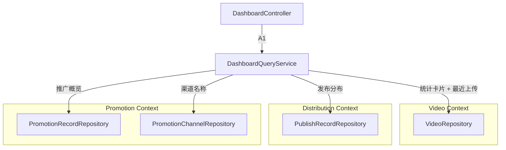

# 跨上下文聚合查询：Dashboard（仪表盘）

> 依赖文档：[01-project-scaffolding.md](./01-project-scaffolding.md)、[02-shared-kernel.md](./02-shared-kernel.md)
> 数据来源：Video（[03](./03-context-video.md)）、Metadata（[04](./04-context-metadata.md)）、Distribution（[05](./05-context-distribution.md)）、Promotion（[06](./06-context-promotion.md)）
> API 端点：A1（参见 api.md §A）
> 需求映射：需求 9（9.1-9.7）
> 包路径：`com.grace.platform.dashboard`
> 设计模式：**CQRS 读模型 + 聚合查询服务**

---

## A. 概述

Dashboard 不是一个独立的限界上下文，而是一个**跨上下文的只读查询层**。它通过 CQRS（Command Query Responsibility Segregation）的读侧模式，聚合来自 4 个限界上下文的数据，通过单一 API 端点返回仪表盘全部概览数据。

**核心设计约束：**
- 只读查询，不修改任何领域模型
- 一次请求返回全部概览数据（需求 9.7）
- 直接查询各上下文的 Repository，不通过领域事件同步物化视图（MVP 简化）



**包结构清单：**

| 层 | 包路径 | 类 |
|----|-------|-----|
| application | `dashboard.application` | `DashboardQueryService` |
| application.dto | `dashboard.application.dto` | `DashboardOverviewResponse`, `StatsDto`, `RecentUploadDto`, `PublishDistributionDto`, `PromotionOverviewDto`, `AnalyticsDto` |
| interfaces.rest | `dashboard.interfaces.rest` | `DashboardController` |

---

## B. 查询服务

### B1. DashboardQueryService

```java
@Service
@Transactional(readOnly = true)
public class DashboardQueryService {
    
    private final VideoRepository videoRepository;
    private final PublishRecordRepository publishRecordRepository;
    private final PromotionRecordRepository promotionRecordRepository;
    private final PromotionChannelRepository promotionChannelRepository;

    /**
     * 聚合查询仪表盘全部概览数据
     * @param dateRange 时间范围过滤：7d / 30d / 90d / all
     */
    public DashboardOverviewResponse getOverview(String dateRange) {
        LocalDateTime since = resolveDateRange(dateRange);
        
        return new DashboardOverviewResponse(
            queryStats(),
            queryRecentUploads(),
            queryPublishDistribution(),
            queryPromotionOverview(since),
            queryAnalytics(since)
        );
    }
    
    // --- 私有查询方法 ---
    
    private StatsDto queryStats() { ... }
    private List<RecentUploadDto> queryRecentUploads() { ... }
    private PublishDistributionDto queryPublishDistribution() { ... }
    private List<PromotionOverviewDto> queryPromotionOverview(LocalDateTime since) { ... }
    private AnalyticsDto queryAnalytics(LocalDateTime since) { ... }
    private LocalDateTime resolveDateRange(String dateRange) { ... }
}
```

### B2. 各查询方法数据来源映射

#### queryStats() — 统计卡片

| 字段 | 数据来源 | 查询逻辑 |
|------|---------|---------|
| totalVideos | `VideoRepository` | `COUNT(*)` |
| pendingReview | `VideoRepository` | `COUNT(*) WHERE status IN ('UPLOADED', 'METADATA_GENERATED')` |
| published | `VideoRepository` | `COUNT(*) WHERE status = 'PUBLISHED'` |
| promoting | `PromotionRecordRepository` | `COUNT(DISTINCT video_id) WHERE status = 'EXECUTING'` |

```java
private StatsDto queryStats() {
    long totalVideos = videoRepository.count();
    long pendingReview = videoRepository.countByStatusIn(
        List.of(VideoStatus.UPLOADED, VideoStatus.METADATA_GENERATED));
    long published = videoRepository.countByStatus(VideoStatus.PUBLISHED);
    long promoting = promotionRecordRepository.countDistinctVideoIdByStatus(
        PromotionStatus.EXECUTING);
    
    return new StatsDto(totalVideos, pendingReview, published, promoting);
}
```

#### queryRecentUploads() — 最近上传

| 字段 | 数据来源 | 查询逻辑 |
|------|---------|---------|
| recentUploads | `VideoRepository` | `ORDER BY created_at DESC LIMIT 5` |

```java
private List<RecentUploadDto> queryRecentUploads() {
    return videoRepository.findTop5ByOrderByCreatedAtDesc().stream()
        .map(video -> new RecentUploadDto(
            video.getId().value(),
            video.getFileName(),
            null, // thumbnailUrl — MVP 阶段暂不生成缩略图
            video.getStatus().name(),
            video.getCreatedAt().toString()
        ))
        .toList();
}
```

#### queryPublishDistribution() — 发布状态分布

| 字段 | 数据来源 | 查询逻辑 |
|------|---------|---------|
| published | `PublishRecordRepository` | `COUNT(*) WHERE status = 'COMPLETED'` |
| pending | `PublishRecordRepository` | `COUNT(*) WHERE status IN ('PENDING', 'UPLOADING')` |
| failed | `PublishRecordRepository` | `COUNT(*) WHERE status IN ('FAILED', 'QUOTA_EXCEEDED')` |

```java
private PublishDistributionDto queryPublishDistribution() {
    long published = publishRecordRepository.countByStatus(PublishStatus.COMPLETED);
    long pending = publishRecordRepository.countByStatusIn(
        List.of(PublishStatus.PENDING, PublishStatus.UPLOADING));
    long failed = publishRecordRepository.countByStatusIn(
        List.of(PublishStatus.FAILED, PublishStatus.QUOTA_EXCEEDED));
    
    return new PublishDistributionDto(published, pending, failed);
}
```

#### queryPromotionOverview(since) — 推广概览

| 字段 | 数据来源 | 查询逻辑 |
|------|---------|---------|
| promotionOverview | `PromotionRecordRepository` + `PromotionChannelRepository` | 按 channel_id 分组统计，JOIN 渠道名称 |

```java
private List<PromotionOverviewDto> queryPromotionOverview(LocalDateTime since) {
    // 1. 按 channel_id 分组统计：总执行次数、成功次数、失败次数
    // 2. 计算成功率 = successCount / totalExecutions
    // 3. JOIN PromotionChannel 获取渠道名称
    
    // 推荐使用自定义 JPQL 或原生 SQL：
    // SELECT pr.channel_id, COUNT(*) as total,
    //        SUM(CASE WHEN pr.status = 'COMPLETED' THEN 1 ELSE 0 END) as success,
    //        SUM(CASE WHEN pr.status = 'FAILED' THEN 1 ELSE 0 END) as failed
    // FROM promotion_record pr
    // WHERE pr.created_at >= :since
    // GROUP BY pr.channel_id
}
```

#### queryAnalytics(since) — 分析数据

| 字段 | 数据来源 | 说明 |
|------|---------|------|
| avgEngagementRate | 计算值 | MVP 阶段：`successCount / totalPromotions` 作为近似互动率 |
| totalImpressions | 计算值 | MVP 阶段：成功推广次数作为近似曝光量 |

```java
private AnalyticsDto queryAnalytics(LocalDateTime since) {
    // MVP 阶段近似计算
    long totalPromotions = promotionRecordRepository.countByCreatedAtAfter(since);
    long successCount = promotionRecordRepository.countByStatusAndCreatedAtAfter(
        PromotionStatus.COMPLETED, since);
    
    double avgEngagementRate = totalPromotions > 0 
        ? (double) successCount / totalPromotions 
        : 0.0;
    
    return new AnalyticsDto(avgEngagementRate, successCount);
}
```

### B3. 时间范围解析

```java
private LocalDateTime resolveDateRange(String dateRange) {
    if (dateRange == null) dateRange = "30d";
    return switch (dateRange) {
        case "7d"  -> LocalDateTime.now().minusDays(7);
        case "30d" -> LocalDateTime.now().minusDays(30);
        case "90d" -> LocalDateTime.now().minusDays(90);
        case "all" -> LocalDateTime.of(2000, 1, 1, 0, 0); // 实际等效无限制
        default    -> LocalDateTime.now().minusDays(30);
    };
}
```

---

## C. 响应 DTO

### DashboardOverviewResponse

```java
public record DashboardOverviewResponse(
    StatsDto stats,
    List<RecentUploadDto> recentUploads,
    PublishDistributionDto publishDistribution,
    List<PromotionOverviewDto> promotionOverview,
    AnalyticsDto analytics
) {}
```

### StatsDto

| 字段 | 类型 | 说明 |
|------|------|------|
| totalVideos | long | 视频总数 |
| pendingReview | long | 待审核数量 |
| published | long | 已发布数量 |
| promoting | long | 推广中数量 |

### RecentUploadDto

| 字段 | 类型 | 说明 |
|------|------|------|
| videoId | String | 视频 ID |
| fileName | String | 文件名 |
| thumbnailUrl | String | 缩略图 URL（nullable） |
| status | String | 视频状态枚举值 |
| createdAt | String | ISO 8601 上传时间 |

### PublishDistributionDto

| 字段 | 类型 | 说明 |
|------|------|------|
| published | long | 已发布数 |
| pending | long | 处理中数 |
| failed | long | 失败数 |

### PromotionOverviewDto

| 字段 | 类型 | 说明 |
|------|------|------|
| channelId | String | 渠道 ID |
| channelName | String | 渠道名称 |
| totalExecutions | long | 总执行次数 |
| successCount | long | 成功次数 |
| failedCount | long | 失败次数 |
| successRate | double | 成功率（0.0-1.0） |

### AnalyticsDto

| 字段 | 类型 | 说明 |
|------|------|------|
| avgEngagementRate | double | 平均互动率 |
| totalImpressions | long | 总曝光量 |

---

## D. 接口层（Controller）

```java
@RestController
@RequestMapping("/api/dashboard")
public class DashboardController {
    
    private final DashboardQueryService dashboardQueryService;
    
    /**
     * A1. GET /api/dashboard/overview
     * 聚合查询仪表盘全部概览数据
     */
    @GetMapping("/overview")
    public ApiResponse<DashboardOverviewResponse> getOverview(
            @RequestParam(defaultValue = "30d") String dateRange) {
        DashboardOverviewResponse overview = dashboardQueryService.getOverview(dateRange);
        return ApiResponse.success(overview);
    }
}
```

---

## E. MyBatis Mapper 扩展方法

Dashboard 查询需要以下各上下文 Mapper 提供的额外查询方法。这些方法应在对应上下文的 Mapper 接口中声明，对应 SQL 写在各 Mapper XML 中：

### VideoMapper 扩展（03-context-video.md）

```java
// 统计相关
long count();
long countByStatus(@Param("status") String status);
long countByStatusIn(@Param("statuses") List<String> statuses);

// 最近上传
List<Video> findTop5ByCreatedAtDesc();
```

### PublishRecordMapper 扩展（05-context-distribution.md）

```java
long countByStatus(@Param("status") String status);
long countByStatusIn(@Param("statuses") List<String> statuses);
```

### PromotionRecordMapper 扩展（06-context-promotion.md）

```java
long countDistinctVideoIdByStatus(@Param("status") String status);
long countByCreatedAtAfter(@Param("since") LocalDateTime since);
long countByStatusAndCreatedAtAfter(@Param("status") String status,
                                    @Param("since") LocalDateTime since);

// 按渠道分组统计（MyBatis XML 自定义 SQL）
List<ChannelPromotionStats> countGroupByChannelId(@Param("since") LocalDateTime since);
```

**ChannelPromotionStats 投影接口：**

```java
public interface ChannelPromotionStats {
    String getChannelId();
    long getTotalExecutions();
    long getSuccessCount();
    long getFailedCount();
}
```

---

## F. 性能考量

| 关注点 | 策略 |
|-------|------|
| 一次请求聚合 | 所有统计在同一个 `@Transactional(readOnly = true)` 事务中完成，保证数据一致性快照 |
| 查询优化 | 使用 `COUNT` 聚合而非加载全部实体到内存 |
| 索引依赖 | 依赖各表的 `status` 和 `created_at` 列索引（见各上下文 DDL） |
| 未来优化 | 当数据量增大，可引入物化视图或定时聚合缓存（当前 MVP 阶段不需要） |
